# AWS Fundamentals - Mermaid Diagrams

## AWS Global Infrastructure

### Regions and Availability Zones Architecture

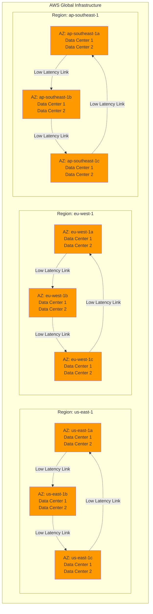

### Edge Locations and CloudFront Distribution

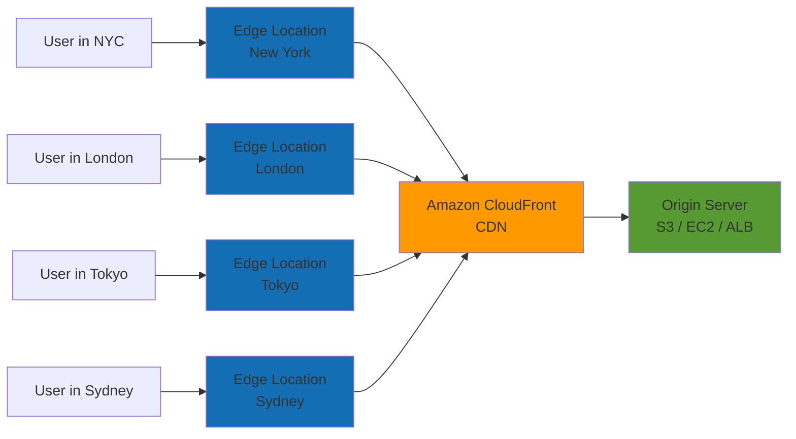

### Region Selection Decision Flow

```mermaid
flowchart TD
    Start([Start: Need to Choose Region]) --> Q1{"Data Sovereignty<br/>Requirements?"}
    Q1 -->|Yes| RegionCompliance["Choose Region<br/>Based on Compliance"]
    Q1 -->|No| Q2{"Where are<br/>your users?"}
    
    Q2 --> Proximity["Choose Closest Region<br/>for Low Latency"]
    
    Proximity --> Q3{"Service Available<br/>in Region?"}
    Q3 -->|Yes| Q4{Check Pricing}
    Q3 -->|No| AltRegion["Choose Alternative<br/>Region"]
    
    Q4 --> Final[Selected Region]
    RegionCompliance --> Final
    AltRegion --> Q3
    
    classDef style1 fill:#232F3E
    class Start style1
    classDef style2 fill:#569A31
    class Final style2
    classDef style3 fill:#FF9900
    class Q1 style3
    classDef style4 fill:#FF9900
    class Q2 style4
    classDef style5 fill:#FF9900
    class Q3 style5
    classDef style6 fill:#FF9900
    class Q4 style6
```

## AWS Well-Architected Framework

### Six Pillars Overview

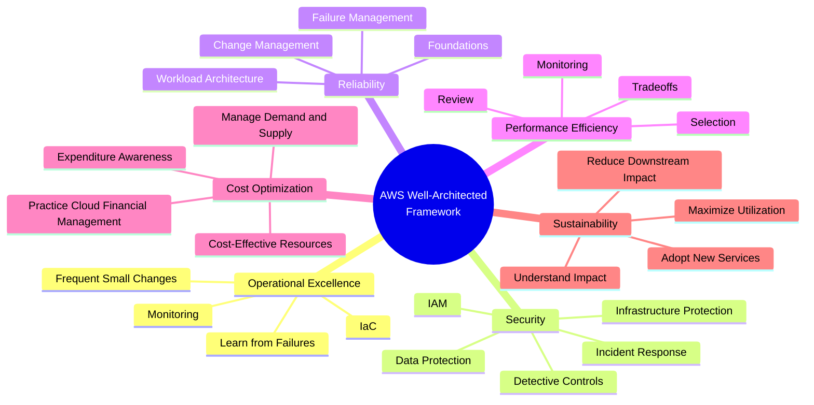

### Well-Architected Framework Pillars Details

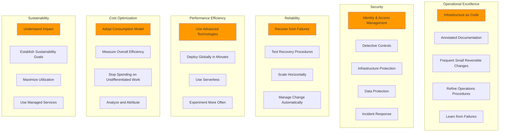

## Shared Responsibility Model

### Security Responsibility Division

```mermaid
graph TB
    subgraph Customer_Responsibility_br_Security_IN_the_Cloud_Group["Customer Responsibility&lt;&lt;&lt;BRTAG&gt;&gt;&gt;(Security IN the Cloud)"]
        C1[Customer Data]
        C2[Platform, Applications, IAM]
        C3["Operating System, Network,<br/>Firewall Configuration"]
        C4[Client-Side Data Encryption]
        C5[Server-Side Encryption]
        C6[Network Traffic Protection]
    end
    
    subgraph AWS_Responsibility_br_Security_OF_the_Cloud_Group["AWS Responsibility&lt;&lt;&lt;BRTAG&gt;&gt;&gt;(Security OF the Cloud)"]
        A1["Hardware/AWS Global Infrastructure"]
        A2[Regions, AZs, Edge Locations]
        A3["Compute, Storage, Database,<br/>Networking"]
        A4[Software - Managed Services]
        A5[Physical Security of Data Centers]
    end
    
    C1 --> Line[Shared Responsibility Line]
    Line --> A1
    
    classDef style1 fill:#FF9900
    class C1 style1
    classDef style2 fill:#FF9900
    class C2 style2
    classDef style3 fill:#FF9900
    class C3 style3
    classDef style4 fill:#146EB4
    class A1 style4
    classDef style5 fill:#146EB4
    class A2 style5
    classDef style6 fill:#146EB4
    class A3 style6
    classDef style7 fill:#232F3E
    class Line style7
```

### Service-Specific Responsibility Model

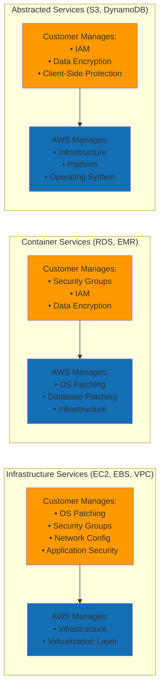

## AWS Management Tools

### Management Console Access Flow

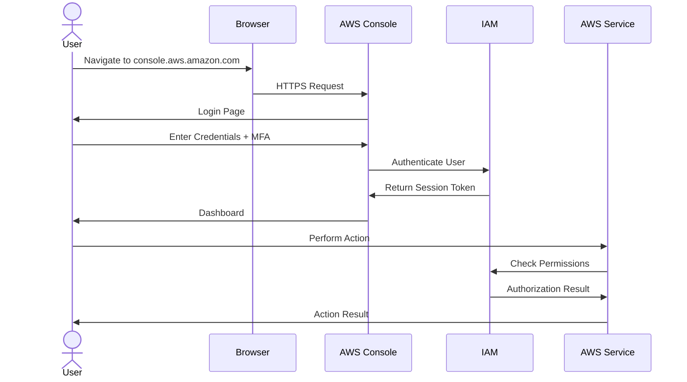

### AWS CLI and SDK Architecture

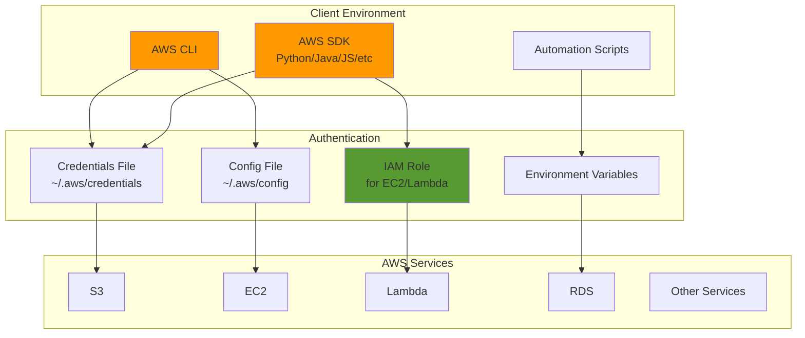

## AWS Service Categories

### Service Categories Map

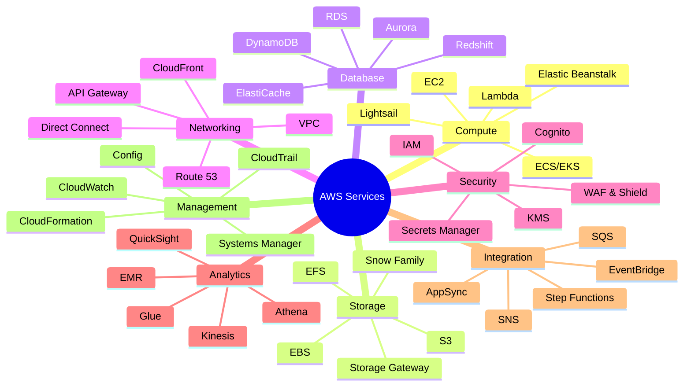

### Service Selection Decision Tree

```mermaid
flowchart TD
    Start([What do you need?]) --> Type{Service Type?}
    
    Type -->|Compute| Compute{Workload Type?}
    Type -->|Storage| Storage{Data Type?}
    Type -->|Database| Database{Data Model?}
    Type -->|Network| Network{Use Case?}
    
    Compute -->|Traditional| EC2[EC2]
    Compute -->|Serverless| Lambda[Lambda]
    Compute -->|Containers| Container{Managed?}
    Container -->|Yes| Fargate[Fargate]
    Container -->|No| ECS["ECS/EKS"]
    
    Storage -->|Object| S3[S3]
    Storage -->|Block| EBS[EBS]
    Storage -->|File| File{Protocol?}
    File -->|NFS| EFS[EFS]
    File -->|SMB/Windows| FSx[FSx]
    
    Database -->|Relational| RDS["RDS/Aurora"]
    Database -->|NoSQL| NoSQL{Key-Value?}
    NoSQL -->|Yes| DynamoDB[DynamoDB]
    NoSQL -->|Document| DocumentDB[DocumentDB]
    
    Network -->|Isolation| VPC[VPC]
    Network -->|DNS| Route53[Route 53]
    Network -->|CDN| CloudFront[CloudFront]
    
    classDef style1 fill:#232F3E
    class Start style1
    classDef style2 fill:#FF9900
    class EC2 style2
    classDef style3 fill:#FF9900
    class Lambda style3
    classDef style4 fill:#FF9900
    class S3 style4
    classDef style5 fill:#FF9900
    class RDS style5
    classDef style6 fill:#FF9900
    class VPC style6
```

## AWS Account Management

### Account Structure with AWS Organizations

```mermaid
graph TB
    Root["Root Account<br/>Management Account"]
    
    Root --> OU1["Organizational Unit:<br/>Production"]
    Root --> OU2["Organizational Unit:<br/>Development"]
    Root --> OU3["Organizational Unit:<br/>Security"]
    
    OU1 --> ProdAcct1[Production Account 1]
    OU1 --> ProdAcct2[Production Account 2]
    
    OU2 --> DevAcct1[Dev Account 1]
    OU2 --> DevAcct2[Dev Account 2]
    
    OU3 --> SecAcct1[Security Account]
    OU3 --> SecAcct2[Audit Account]
    
    SCP1["Service Control Policy<br/>Deny S3 Public Access"] -.Applies to.-> OU1
    SCP2["Service Control Policy<br/>Restrict Regions"] -.Applies to.-> OU2
    
    classDef style1 fill:#232F3E
    class Root style1
    classDef style2 fill:#FF9900
    class OU1 style2
    classDef style3 fill:#FF9900
    class OU2 style3
    classDef style4 fill:#FF9900
    class OU3 style4
    classDef style5 fill:#146EB4
    class SCP1 style5
    classDef style6 fill:#146EB4
    class SCP2 style6
```

### Billing and Cost Management Flow

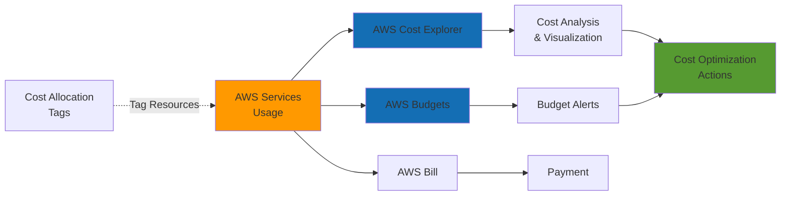

### Multi-Account Strategy

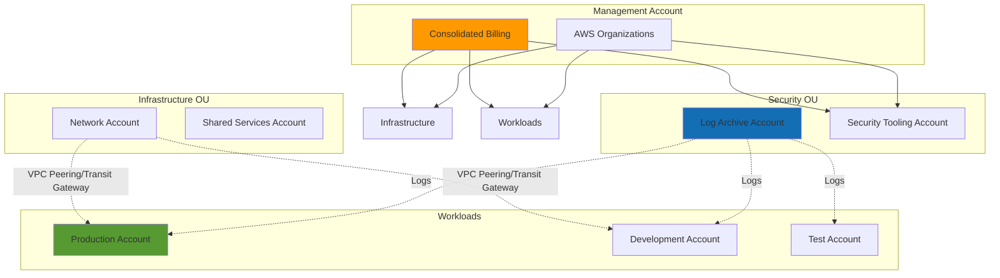

## High Availability Multi-AZ Deployment

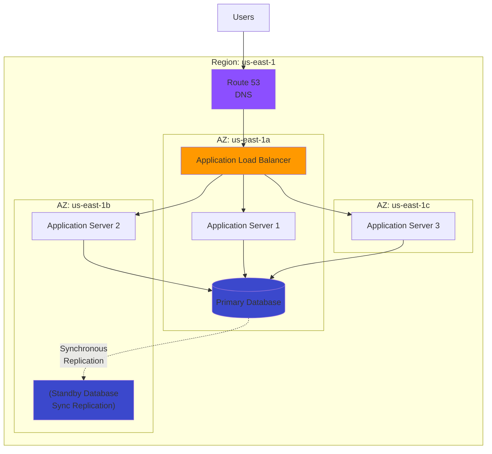

