# IAM - Mermaid Diagrams

## IAM Components Overview

### IAM Core Components Relationship

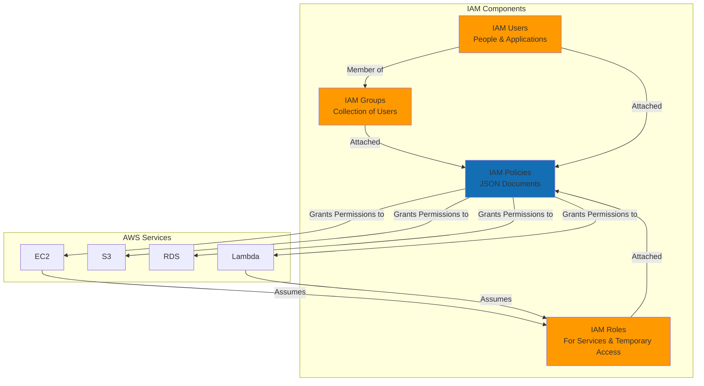

### IAM Hierarchy and Structure

```mermaid
graph TB
    Root["AWS Account Root User<br/>⚠️ Complete Access"]
    
    Root --> AdminGroup[Administrators Group]
    Root --> DevGroup[Developers Group]
    Root --> OpsGroup[Operations Group]
    
    AdminGroup --> AdminPolicy["AdministratorAccess<br/>Policy"]
    DevGroup --> DevPolicy["Developer Policy<br/>Limited EC2, S3, RDS"]
    OpsGroup --> OpsPolicy["Operations Policy<br/>Read-Only + CloudWatch"]
    
    AdminGroup --> User1[Alice]
    AdminGroup --> User2[Bob]
    
    DevGroup --> User3[Charlie]
    DevGroup --> User4[Diana]
    
    OpsGroup --> User5[Eve]
    
    User1 -.Additional Policy.-> MFAPolicy[MFA Policy]
    
    classDef style1 fill:#C00
    class Root style1
    classDef style2 fill:#FF9900
    class AdminGroup style2
    classDef style3 fill:#FF9900
    class DevGroup style3
    classDef style4 fill:#FF9900
    class OpsGroup style4
    classDef style5 fill:#146EB4
    class AdminPolicy style5
```

## IAM Users and Authentication

### User Authentication Flow

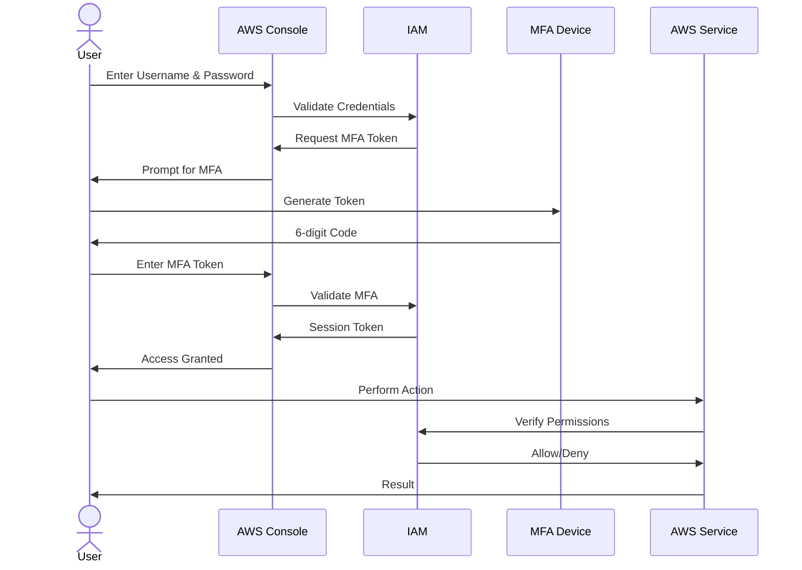

### Access Keys for Programmatic Access

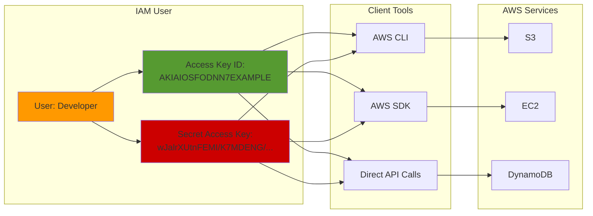

## IAM Groups

### Groups Management Pattern

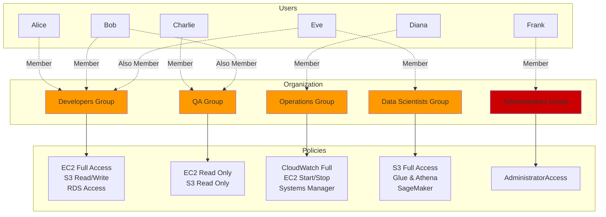

## IAM Roles

### IAM Role Assumption Flow

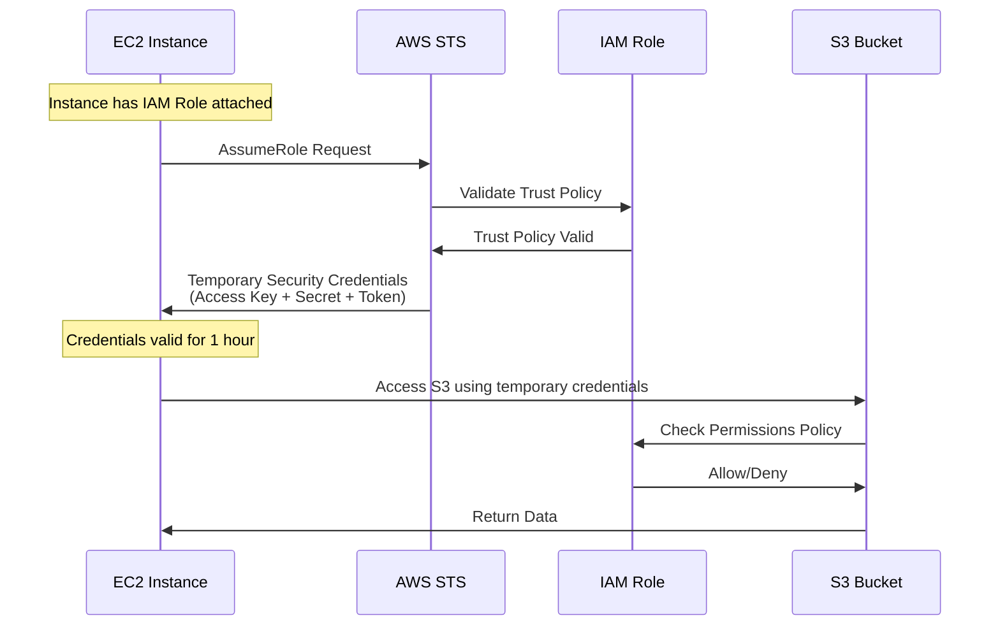

### Common Role Use Cases

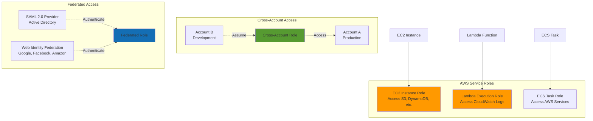

### Role Trust Policy vs Permission Policy

```mermaid
graph LR
    subgraph IAM_Role_Components_Group["IAM Role Components"]
        TrustPolicy["Trust Policy<br/>WHO can assume this role?"]
        PermPolicy["Permission Policy<br/>WHAT can they do?"]
    end
    
    subgraph Trust_Policy_Example_Group["Trust Policy Example"]
        TP1["Trusted Entity:&lt;&lt;&lt;BRTAG&gt;&gt;&gt;• EC2 Service&lt;&lt;&lt;BRTAG&gt;&gt;&gt;• Another AWS Account&lt;&lt;&lt;BRTAG&gt;&gt;&gt;• SAML Provider&lt;&lt;&lt;BRTAG&gt;&gt;&gt;• Web Identity"]
    end
    
    subgraph Permission_Policy_Example_Group["Permission Policy Example"]
        PP1["Allowed Actions:&lt;&lt;&lt;BRTAG&gt;&gt;&gt;• s3:GetObject&lt;&lt;&lt;BRTAG&gt;&gt;&gt;• s3:PutObject&lt;&lt;&lt;BRTAG&gt;&gt;&gt;• dynamodb:Query&lt;&lt;&lt;BRTAG&gt;&gt;&gt;• logs:CreateLogGroup"]
    end
    
    TrustPolicy --> TP1
    PermPolicy --> PP1
    
    Entity["EC2/User/Service"] -->|1. Can I assume?| TrustPolicy
    TrustPolicy -->|2. Assume Role| STS[AWS STS]
    STS -->|3. Temporary Credentials| Entity
    Entity -->|4. What can I do?| PermPolicy
    PermPolicy -->|5. Allow/Deny| Action[AWS Service Action]
    
    classDef style1 fill:#FF9900
    class TrustPolicy style1
    classDef style2 fill:#146EB4
    class PermPolicy style2
    classDef style3 fill:#569A31
    class STS style3
```

## IAM Policies

### Policy Types Overview

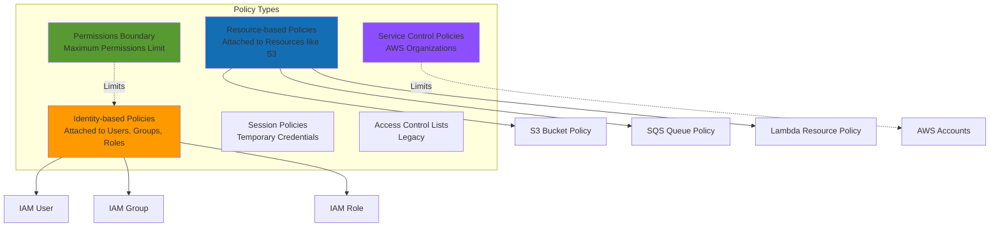

### Policy Evaluation Logic

```mermaid
flowchart TD
    Start([API Request]) --> Default{Default Deny}
    
    Default --> Explicit{"Explicit Deny<br/>Exists?"}
    Explicit -->|Yes| Deny(["❌ DENY"])
    Explicit -->|No| SCP{"SCP<br/>Allows?"}
    
    SCP -->|No| Deny
    SCP -->|Yes| Boundary{"Permission Boundary<br/>Allows?"}
    
    Boundary -->|No| Deny
    Boundary -->|Yes| Identity{"Identity Policy<br/>Allows?"}
    
    Identity -->|No| Resource{"Resource Policy<br/>Allows?"}
    Identity -->|Yes| Allow(["✅ ALLOW"])
    
    Resource -->|Yes| Allow
    Resource -->|No| Deny
    
    classDef style1 fill:#232F3E
    class Start style1
    classDef style2 fill:#569A31
    class Allow style2
    classDef style3 fill:#C00
    class Deny style3
    classDef style4 fill:#FF9900
    class Explicit style4
```

### Policy Structure Example

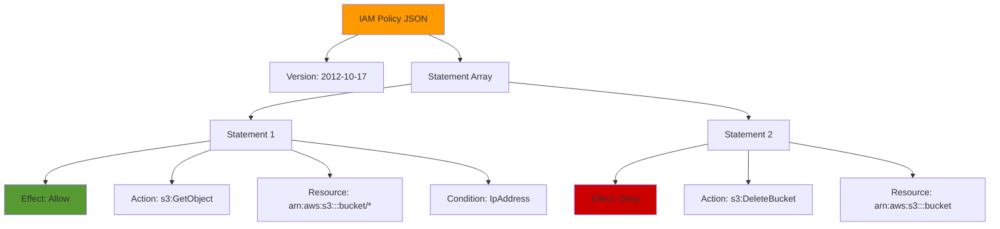

## Multi-Factor Authentication (MFA)

### MFA Authentication Process

```mermaid
sequenceDiagram
    actor User
    participant Device as MFA Device
    participant AWS
    participant IAM
    
    User->>AWS: Login with Password
    AWS->>IAM: Validate Password
    IAM->>AWS: Password Valid
    AWS->>User: Request MFA Token
    User->>Device: Request Token
    Device->>Device: Generate Time-based Token
    Device->>User: Display 6-digit Code
    User->>AWS: Enter MFA Code
    AWS->>IAM: Validate MFA Token
    IAM->>AWS: MFA Valid
    AWS->>User: Access Granted ✅
    
```

### MFA Device Types

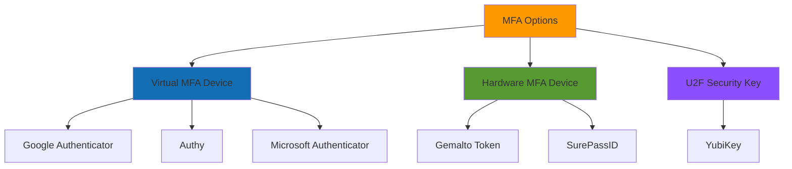

## Cross-Account Access

### Cross-Account Role Assumption

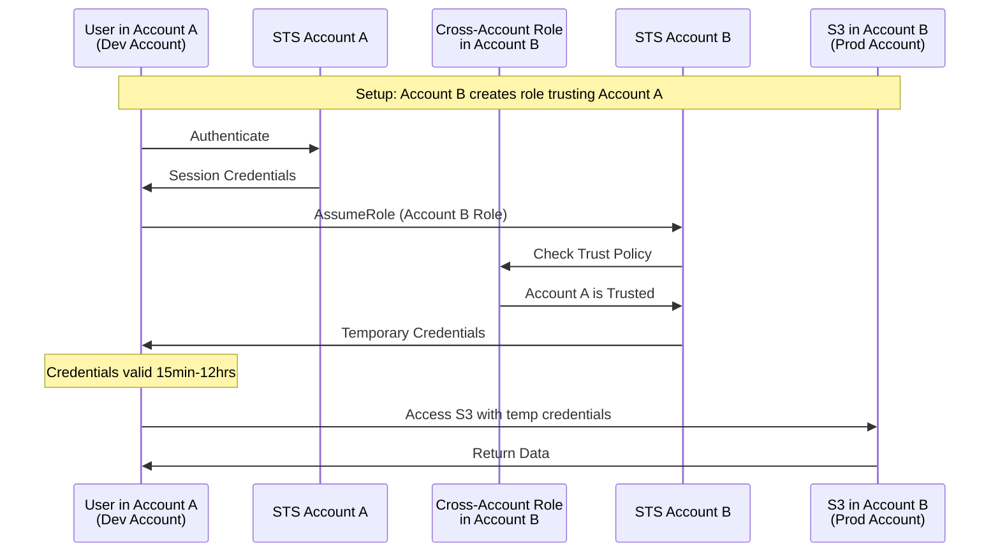

### Cross-Account Architecture

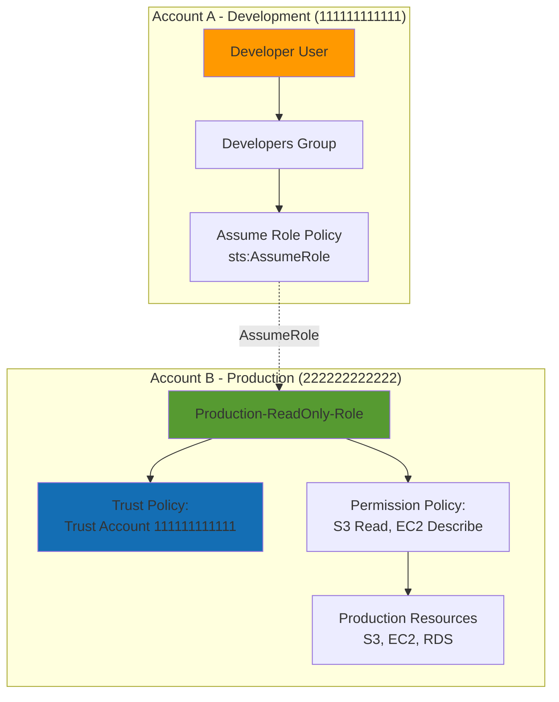

## Identity Federation

### SAML 2.0 Federation Flow

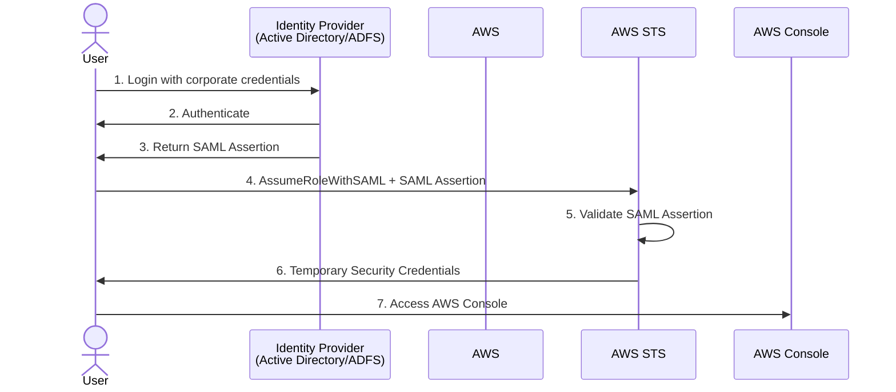

### Web Identity Federation (Cognito)

```mermaid
graph TB
    User["Mobile/Web User"]
    
    User --> Social{Choose Provider}
    
    Social --> Google[Google]
    Social --> Facebook[Facebook]
    Social --> Amazon[Amazon]
    Social --> Apple[Apple]
    
    Google --> Cognito[Amazon Cognito]
    Facebook --> Cognito
    Amazon --> Cognito
    Apple --> Cognito
    
    Cognito --> STS[AWS STS]
    STS --> TempCreds[Temporary AWS Credentials]
    
    TempCreds --> S3[Access S3]
    TempCreds --> DynamoDB[Access DynamoDB]
    TempCreds --> Lambda[Invoke Lambda]
    
    classDef style1 fill:#232F3E
    class User style1
    classDef style2 fill:#FF9900
    class Cognito style2
    classDef style3 fill:#146EB4
    class STS style3
    classDef style4 fill:#569A31
    class TempCreds style4
```

## IAM Best Practices

### Security Best Practices Flow

```mermaid
flowchart TD
    Start([IAM Best Practices]) --> Root["🔐 Secure Root Account"]
    
    Root --> RootMFA[Enable MFA on Root]
    Root --> RootNoUse[Don't use Root for daily tasks]
    Root --> RootKeys[Delete Root Access Keys]
    
    RootNoUse --> Users[Create Individual IAM Users]
    Users --> Groups[Use Groups for Permissions]
    Groups --> LeastPriv[Apply Least Privilege]
    
    LeastPriv --> Policies[Use AWS Managed Policies]
    Policies --> Review[Regular Access Review]
    
    Review --> MFA[Enable MFA for All Users]
    MFA --> Rotate[Rotate Credentials Regularly]
    Rotate --> Conditions[Use Policy Conditions]
    
    Conditions --> Roles[Use Roles for Applications]
    Roles --> Monitor[Monitor with CloudTrail]
    Monitor --> End(["Secure IAM Setup ✅"])
    
    classDef style1 fill:#232F3E
    class Start style1
    classDef style2 fill:#C00
    class Root style2
    classDef style3 fill:#569A31
    class End style3
    classDef style4 fill:#FF9900
    class LeastPriv style4
```

### Permission Boundary Pattern

```mermaid
graph TB
    subgraph Permission_Evaluation_Group["Permission Evaluation"]
        MaxPerm["Maximum Permissions<br/>Permission Boundary"]
        IdentityPerm["Identity Policy<br/>What user can do"]
        Effective["Effective Permissions<br/>Intersection"]
        
        MaxPerm --> Effective
        IdentityPerm --> Effective
    end
    
    subgraph Example_Group["Example"]
        Boundary["Boundary Policy:&lt;&lt;&lt;BRTAG&gt;&gt;&gt;• Allow: EC2, S3, RDS&lt;&lt;&lt;BRTAG&gt;&gt;&gt;• Region: us-east-1"]
        
        UserPolicy["User Policy:&lt;&lt;&lt;BRTAG&gt;&gt;&gt;• Allow: EC2:*&lt;&lt;&lt;BRTAG&gt;&gt;&gt;• Allow: S3:*&lt;&lt;&lt;BRTAG&gt;&gt;&gt;• Allow: Lambda:*&lt;&lt;&lt;BRTAG&gt;&gt;&gt;• All Regions"]
        
        Result["Effective Permission:&lt;&lt;&lt;BRTAG&gt;&gt;&gt;• Allow: EC2:* (us-east-1)&lt;&lt;&lt;BRTAG&gt;&gt;&gt;• Allow: S3:* (us-east-1)&lt;&lt;&lt;BRTAG&gt;&gt;&gt;❌ No RDS (not in user policy)&lt;&lt;&lt;BRTAG&gt;&gt;&gt;❌ No Lambda (not in boundary)"]
    end
    
    Boundary -.AND.-> Result
    UserPolicy -.AND.-> Result
    
    classDef style1 fill:#569A31
    class Effective style1
    classDef style2 fill:#FF9900
    class Result style2
```

## IAM Access Analyzer

### Access Analyzer Architecture

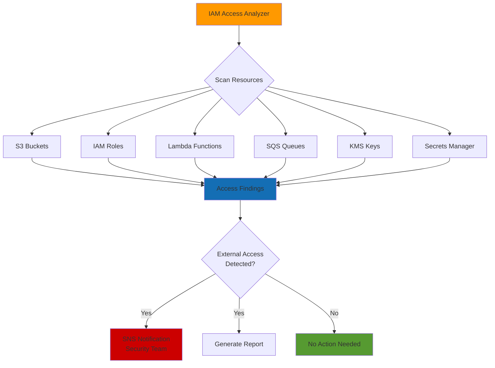

## IAM Database Authentication

### RDS IAM Authentication Flow

```mermaid
sequenceDiagram
    participant App as Application
    participant IAM
    participant RDS as RDS MySQL/PostgreSQL
    
    Note over App: Has IAM Role with rds-db:connect permission
    
    App->>IAM: Request Authentication Token
    IAM->>IAM: Verify IAM Credentials
    IAM->>App: Return Auth Token (15 min validity)
    
    App->>RDS: Connect with username + auth token
    RDS->>IAM: Validate Token
    IAM->>RDS: Token Valid
    RDS->>App: Connection Established
    
    Note over App,RDS: Benefits: No password storage, IAM centralized auth, SSL enforced
    
```

