# Compute Services - Mermaid Diagrams

## EC2 Overview

### EC2 Instance Lifecycle

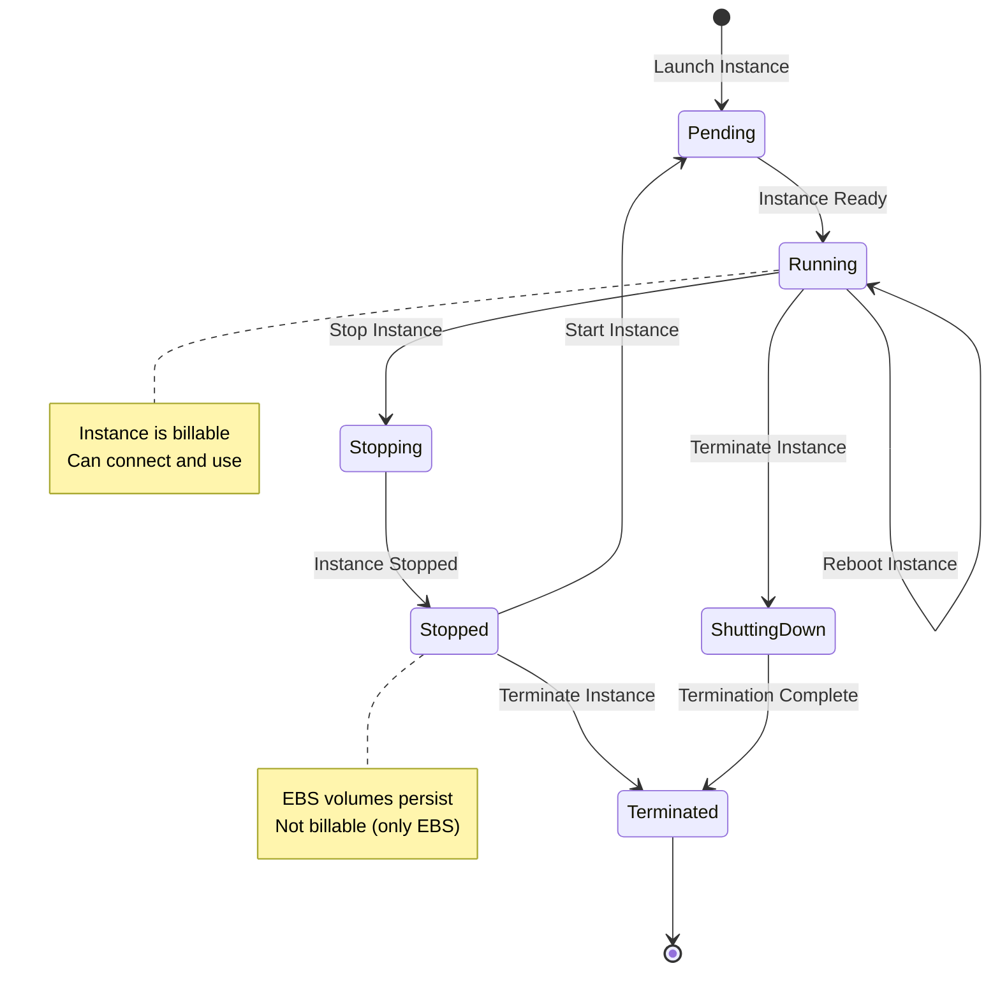

### EC2 Instance Types (CRAM FACTS)

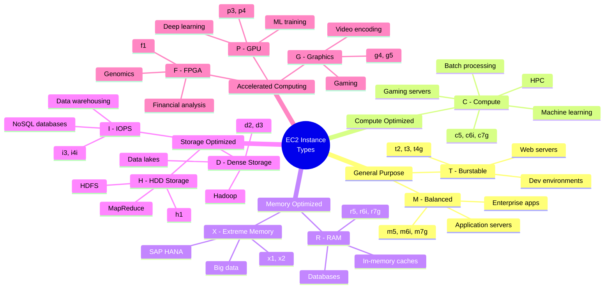

### EC2 Pricing Models Comparison

```mermaid
graph TB
    subgraph Pricing_Models_Group["Pricing Models"]
        OnDemand["On-Demand<br/>💰 No Discount<br/>⏱️ Pay by hour/second<br/>📊 Flexible"]
        Reserved["Reserved Instances<br/>💰 Up to 72% Discount<br/>⏱️ 1 or 3 years<br/>📊 Steady workloads"]
        Savings["Savings Plans<br/>💰 Up to 66% Discount<br/>⏱️ 1 or 3 years<br/>📊 Flexible instance type"]
        Spot["Spot Instances<br/>💰 Up to 90% Discount<br/>⏱️ Can be terminated<br/>📊 Fault-tolerant"]
        Dedicated["Dedicated Hosts<br/>💰 No Discount<br/>⏱️ Physical server<br/>📊 Compliance/Licensing"]
    end
    
    subgraph Use_Cases_Group["Use Cases"]
        OnDemand --> UC1["Short-term workloads<br/>Unpredictable patterns<br/>Development/Testing"]
        Reserved --> UC2["Production databases<br/>Steady-state applications<br/>Predictable usage"]
        Savings --> UC3["Flexible compute needs<br/>Commitment without lock-in<br/>Mixed workloads"]
        Spot --> UC4["Batch jobs<br/>Data analysis<br/>Background processing<br/>CI/CD"]
        Dedicated --> UC5["Regulatory requirements<br/>License restrictions<br/>Multi-tenant isolation"]
    end
    
    classDef style1 fill:#FF9900
    class OnDemand style1
    classDef style2 fill:#146EB4
    class Reserved style2
    classDef style3 fill:#569A31
    class Spot style3
```

### EC2 Placement Groups

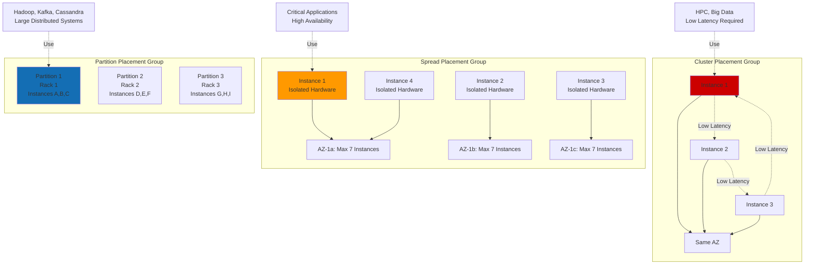

## Auto Scaling

### Auto Scaling Architecture

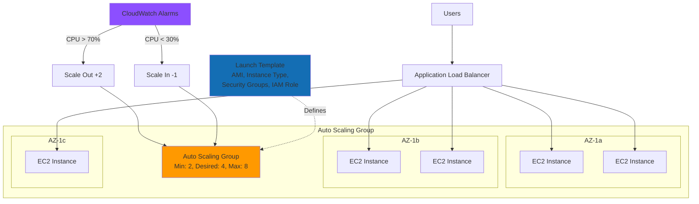

### Auto Scaling Policies

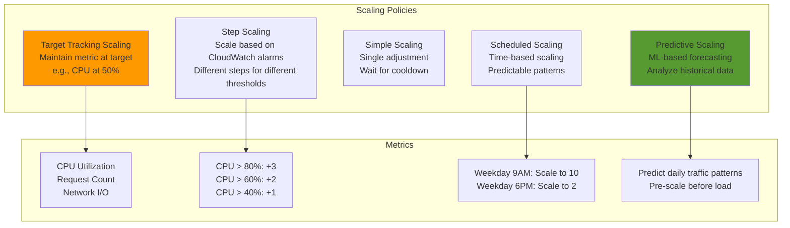

### Auto Scaling Lifecycle

```mermaid
sequenceDiagram
    participant ASG as Auto Scaling Group
    participant LC as Launch Template
    participant EC2
    participant ELB as Load Balancer
    participant CW as CloudWatch
    
    Note over ASG: Scale Out Event Triggered
    
    ASG->>LC: Request Instance Configuration
    LC->>ASG: Instance Details (AMI, Type, etc)
    ASG->>EC2: Launch New Instance
    EC2->>EC2: Pending → Running
    
    opt Lifecycle Hook
        EC2->>ASG: Pending:Wait
        Note over EC2: Run bootstrap scripts
        EC2->>ASG: Complete Lifecycle Action
    end
    
    EC2->>ELB: Register Instance
    ELB->>EC2: Health Check
    EC2->>ELB: Healthy
    ELB->>ASG: Instance InService
    
    Note over EC2: Instance now serving traffic
    
    EC2->>CW: Send Metrics
    CW->>ASG: Monitor Metrics
    
    alt Scale In Needed
        ASG->>ELB: Deregister Instance
        ELB->>ELB: Connection Draining (300s)
        ASG->>EC2: Terminate Instance
    end
    
```

## Elastic Load Balancing

### Load Balancer Types Comparison

```mermaid
graph TB
    subgraph Application_Load_Balancer_ALB_Group["Application Load Balancer (ALB)"]
        ALB["Layer 7 - HTTP/HTTPS"]
        ALB --> ALBFeatures["• Path-based routing<br/>• Host-based routing<br/>• Lambda targets<br/>• WebSocket support<br/>• HTTP/2 support"]
        ALBFeatures --> ALBUse["Microservices<br/>Containers<br/>Web Applications"]
    end
    
    subgraph Network_Load_Balancer_NLB_Group["Network Load Balancer (NLB)"]
        NLB["Layer 4 - TCP/UDP/TLS"]
        NLB --> NLBFeatures["• Ultra-high performance<br/>• Static IP addresses<br/>• Preserve source IP<br/>• Millions of req/sec"]
        NLBFeatures --> NLBUse["Gaming<br/>IoT<br/>TCP/UDP traffic"]
    end
    
    subgraph Gateway_Load_Balancer_GWLB_Group["Gateway Load Balancer (GWLB)"]
        GWLB[Layer 3 - IP Packets]
        GWLB --> GWLBFeatures["• Deploy virtual appliances<br/>• Transparent to applications<br/>• GENEVE protocol"]
        GWLBFeatures --> GWLBUse["Firewalls<br/>IDS/IPS<br/>Deep packet inspection"]
    end
    
    subgraph Classic_Load_Balancer_CLB_Group["Classic Load Balancer (CLB)"]
        CLB[Layer 4 & 7 - Legacy]
        CLB --> CLBNote["❌ Not recommended<br/>For new applications"]
    end
    
    classDef style1 fill:#FF9900
    class ALB style1
    classDef style2 fill:#146EB4
    class NLB style2
    classDef style3 fill:#569A31
    class GWLB style3
    classDef style4 fill:#999
    class CLB style4
```

### ALB Request Routing

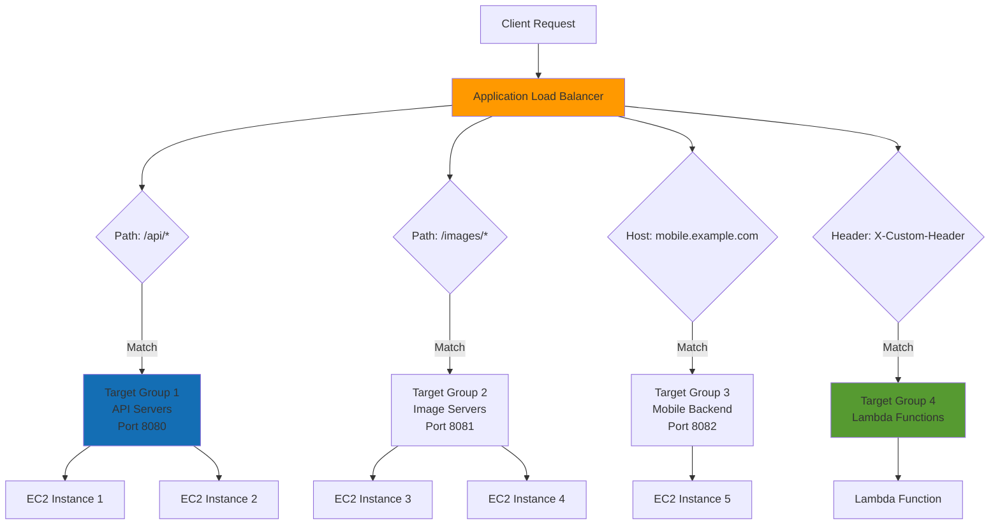

### Load Balancer with Health Checks

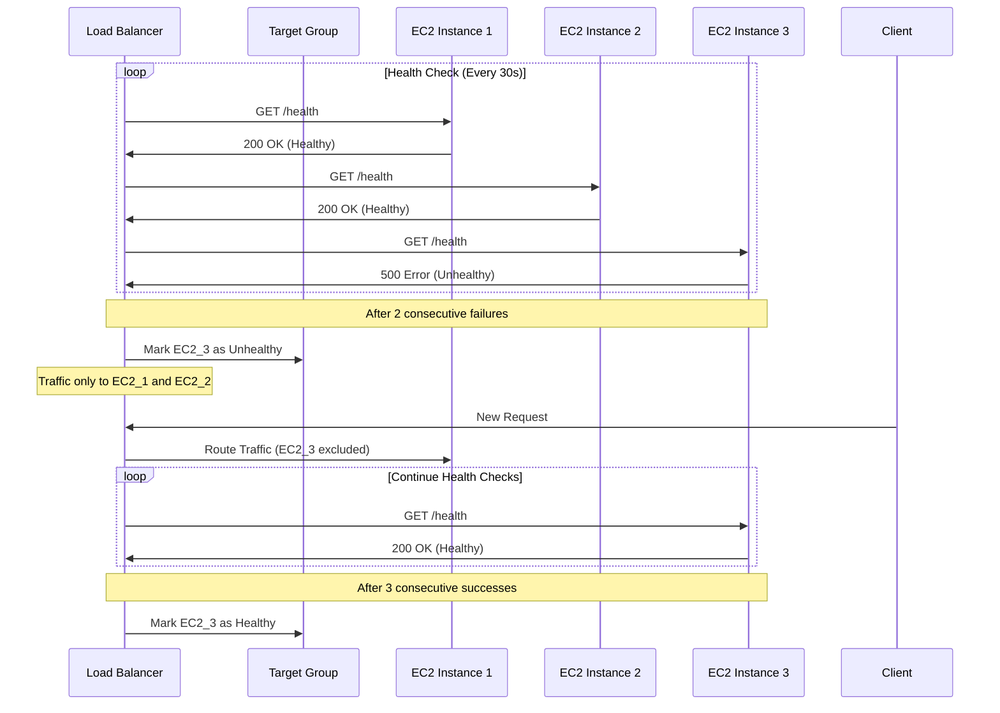

### Cross-Zone Load Balancing

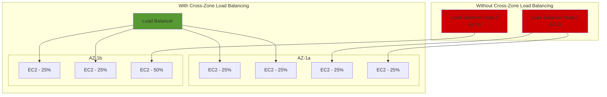

## AWS Lambda

### Lambda Execution Model

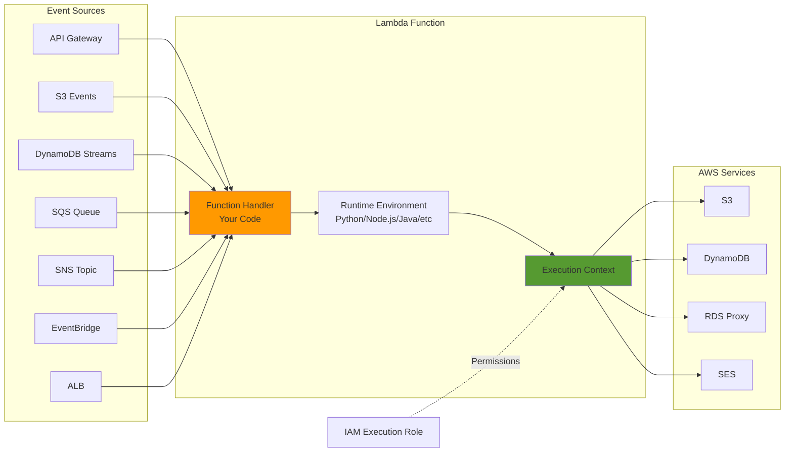

### Lambda Invocation Types

```mermaid
graph TB
    subgraph Synchronous_Invocation_Group["Synchronous Invocation"]
        Client1[Client] -->|Invoke| Lambda1[Lambda Function]
        Lambda1 -->|Return Response| Client1
        Examples1["Examples:<br/>• API Gateway<br/>• ALB<br/>• CLI invoke"]
        
        Note1["⏱️ Wait for response<br/>🔁 Retry 0 times<br/>❌ Client handles errors"]
    end
    
    subgraph Asynchronous_Invocation_Group["Asynchronous Invocation"]
        Client2[Event Source] -->|Send Event| Queue[Event Queue]
        Queue -->|Process| Lambda2[Lambda Function]
        Lambda2 -.Success.-> Success[Success]
        Lambda2 -.Failure.-> Retry[Retry 2x]
        Retry -.Still Fails.-> DLQ["Dead Letter Queue<br/>SQS/SNS"]
        
        Examples2["Examples:<br/>• S3<br/>• SNS<br/>• EventBridge<br/>• CloudWatch Events"]
        
        Note2["⚡ Returns immediately<br/>🔁 Retry 2 times<br/>☠️ DLQ for failures"]
    end
    
    subgraph Event_Source_Mapping_Group["Event Source Mapping"]
        Stream["Stream/Queue"] -.Poll.-> Lambda3[Lambda Function]
        
        Kinesis[Kinesis Streams]
        DynamoDB[DynamoDB Streams]
        SQS2[SQS Queue]
        
        Kinesis --> Stream
        DynamoDB --> Stream
        SQS2 --> Stream
        
        Lambda3 --> Batch[Process Batch]
        
        Note3["📦 Batch processing<br/>🔁 Retry entire batch<br/>⏸️ Can pause polling"]
    end
    
    classDef style1 fill:#FF9900
    class Lambda1 style1
    classDef style2 fill:#146EB4
    class Lambda2 style2
    classDef style3 fill:#569A31
    class Lambda3 style3
```

### Lambda Architecture Limits

```mermaid
graph TB
    subgraph Lambda_Limits_Group["Lambda Limits"]
        Memory["Memory<br/>128 MB - 10 GB<br/>⚙️ Configurable in 1 MB increments"]
        
        Timeout["Timeout<br/>⏱️ 15 minutes maximum<br/>⚙️ Default: 3 seconds"]
        
        Concurrent["Concurrent Executions<br/>🔢 1,000 default per region<br/>📈 Can request increase"]
        
        EnvVars["Environment Variables<br/>📝 4 KB total<br/>🔐 Can encrypt with KMS"]
        
        Deployment["Deployment Package<br/>📦 50 MB zipped<br/>📂 250 MB unzipped<br/>💾 /tmp storage: 512 MB - 10 GB"]
        
        Layers["Lambda Layers<br/>📚 5 layers per function<br/>📦 50 MB per layer"]
    end
    
    subgraph Performance_Tips_Group["Performance Tips"]
        Memory --> Perf1["More Memory =<br/>More CPU Power"]
        Timeout --> Perf2["Set realistic timeout<br/>to avoid waste"]
        Concurrent --> Perf3["Reserve concurrent<br/>for critical functions"]
        Deployment --> Perf4["Use layers for<br/>shared dependencies"]
    end
    
    classDef style1 fill:#FF9900
    class Memory style1
    classDef style2 fill:#146EB4
    class Concurrent style2
```

### Lambda Cold Start vs Warm Start

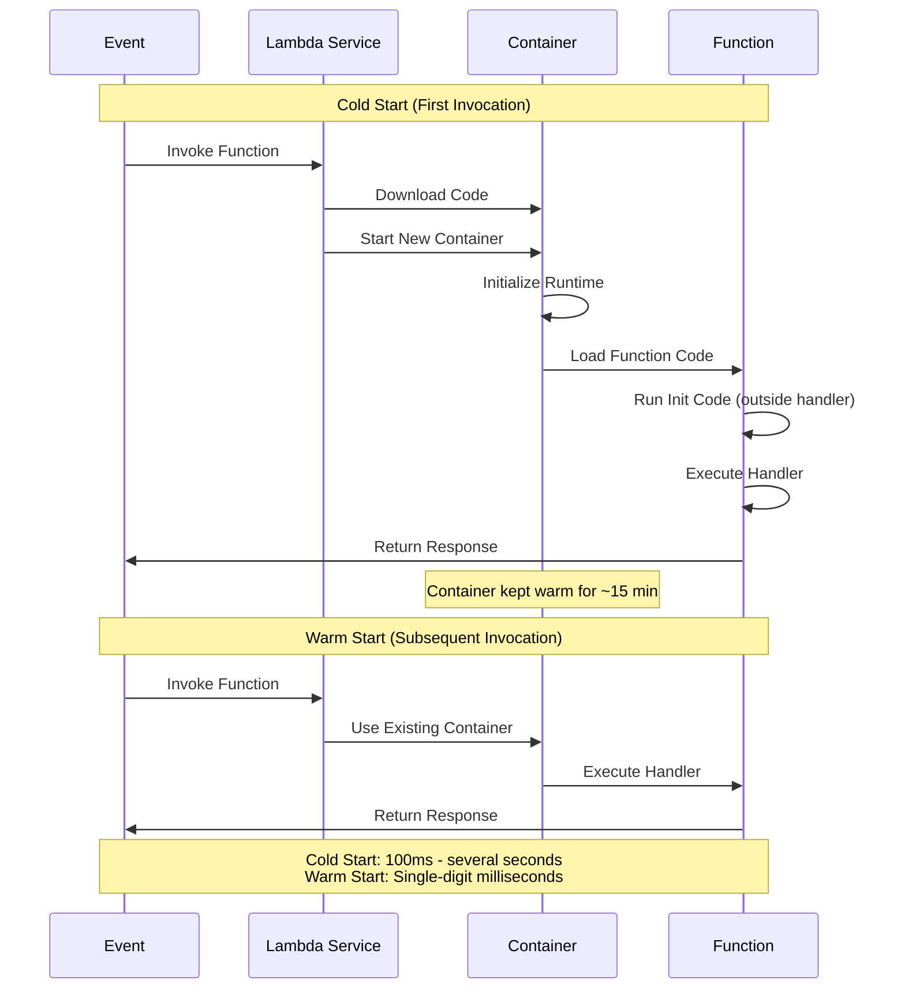

## Container Services

### ECS Architecture

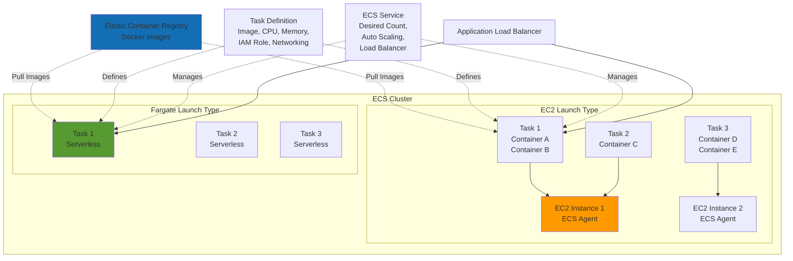

### ECS vs EKS vs Fargate

```mermaid
graph TB
    subgraph Amazon_ECS_Group["Amazon ECS"]
        ECS[Elastic Container Service]
        ECS --> ECSFeatures["• AWS-native<br/>• Simple setup<br/>• Deep AWS integration<br/>• ECS Agent"]
        ECSFeatures --> ECSUse["Use when:<br/>AWS-focused<br/>Simpler orchestration<br/>Tight AWS integration"]
    end
    
    subgraph Amazon_EKS_Group["Amazon EKS"]
        EKS[Elastic Kubernetes Service]
        EKS --> EKSFeatures["• Kubernetes-native<br/>• Standard K8s API<br/>• Portable workloads<br/>• Complex but powerful"]
        EKSFeatures --> EKSUse["Use when:<br/>Already using Kubernetes<br/>Multi-cloud strategy<br/>Complex orchestration"]
    end
    
    subgraph AWS_Fargate_Group["AWS Fargate"]
        Fargate[Fargate]
        Fargate --> FargateFeatures["• Serverless containers<br/>• No server management<br/>• Works with ECS & EKS<br/>• Pay per task"]
        FargateFeatures --> FargateUse["Use when:<br/>Don't want to manage servers<br/>Unpredictable workloads<br/>Quick deployment"]
    end
    
    Both[ECS & EKS] -.Can use.-> Fargate
    
    classDef style1 fill:#FF9900
    class ECS style1
    classDef style2 fill:#146EB4
    class EKS style2
    classDef style3 fill:#569A31
    class Fargate style3
```

### Container Task Networking (awsvpc Mode)

```mermaid
graph TB
    subgraph VPC_Group["VPC"]
        subgraph Subnet_Group["Subnet"]
            ENI1["ENI 1<br/>Private IP: 10.0.1.10"]
            ENI2["ENI 2<br/>Private IP: 10.0.1.11"]
            ENI3["ENI 3<br/>Private IP: 10.0.1.12"]
            
            Task1["ECS Task 1<br/>Container App"] --> ENI1
            Task2["ECS Task 2<br/>Container App"] --> ENI2
            Task3["ECS Task 3<br/>Container App"] --> ENI3
        end
        
        SG["Security Group<br/>Port 80, 443"]
        
        ENI1 --> SG
        ENI2 --> SG
        ENI3 --> SG
    end
    
    ALB[Load Balancer] --> ENI1
    ALB --> ENI2
    ALB --> ENI3
    
    Note["✅ Each task has own ENI<br/>✅ Full VPC networking<br/>✅ Security Groups per task<br/>✅ Required for Fargate"]
    
    classDef style1 fill:#FF9900
    class Task1 style1
    classDef style2 fill:#146EB4
    class SG style2
```

## Elastic Beanstalk

### Beanstalk Architecture

```mermaid
graph TB
    Developer[Developer] -->|Upload Code| EB[Elastic Beanstalk]
    
    EB --> Components{Components Provisioned}
    
    Components --> EC2["EC2 Instances<br/>Auto Scaling Group"]
    Components --> ELB[Elastic Load Balancer]
    Components --> RDS["RDS Database<br/>Optional"]
    Components --> S3["S3 Bucket<br/>Code Storage"]
    Components --> CloudWatch["CloudWatch<br/>Monitoring"]
    
    subgraph Deployment_Options_Group["Deployment Options"]
        AllAtOnce["All at Once<br/>⚡ Fastest<br/>❌ Downtime"]
        Rolling["Rolling<br/>⚙️ Batch updates<br/>✅ No downtime<br/>⚠️ Reduced capacity"]
        RollingExtra["Rolling with Extra Batch<br/>⚙️ Launch new batch first<br/>✅ Full capacity"]
        Immutable["Immutable<br/>🆕 New ASG<br/>✅ Zero downtime<br/>💰 Double capacity temp"]
        BlueGreen["Blue/Green<br/>🔄 Separate environment<br/>✅ Instant rollback<br/>💰 Double cost"]
    end
    
    EB -.Deployment Strategy.-> AllAtOnce
    EB -.Deployment Strategy.-> Immutable
    
    classDef style1 fill:#FF9900
    class EB style1
    classDef style2 fill:#569A31
    class Immutable style2
```

### Beanstalk Environments

```mermaid
graph LR
    subgraph Web_Server_Environment_Group["Web Server Environment"]
        WEB[Web Server Tier]
        WEB --> WEBComponents["• ELB<br/>• Auto Scaling Group<br/>• EC2 Instances<br/>• Security Groups"]
        WEBComponents --> WEBUse["Traditional web apps<br/>REST APIs<br/>HTTP/HTTPS traffic"]
    end
    
    subgraph Worker_Environment_Group["Worker Environment"]
        WORKER[Worker Tier]
        WORKER --> WORKERComponents["• SQS Queue<br/>• Auto Scaling Group<br/>• EC2 Instances<br/>• IAM Roles"]
        WORKERComponents --> WORKERUse["Background processing<br/>Batch jobs<br/>Async tasks"]
    end
    
    Client[Client] --> WEB
    WEB -->|Send tasks| WORKER
    
    classDef style1 fill:#FF9900
    class WEB style1
    classDef style2 fill:#146EB4
    class WORKER style2
```

## Instance Metadata Service (IMDS)

### IMDS Access Pattern

```mermaid
sequenceDiagram
    participant App as Application on EC2
    participant IMDS as Instance Metadata Service
    participant IAM
    
    Note over App,IMDS: IMDSv2 (Session-based, more secure)
    
    App->>IMDS: PUT /latest/api/token<br/>X-aws-ec2-metadata-token-ttl-seconds: 21600
    IMDS->>App: Return Session Token
    
    App->>IMDS: GET /latest/meta-data/instance-id<br/>X-aws-ec2-metadata-token: [token]
    IMDS->>App: i-1234567890abcdef0
    
    App->>IMDS: GET /latest/meta-data/iam/security-credentials/role-name<br/>X-aws-ec2-metadata-token: [token]
    IMDS->>IAM: Retrieve temporary credentials
    IAM->>IMDS: Access Key, Secret, Token
    IMDS->>App: Return Credentials
    
    Note over App: Use credentials to access AWS services
    
    App->>IMDS: GET /latest/user-data<br/>X-aws-ec2-metadata-token: [token]
    IMDS->>App: Bootstrap script content
    
```

### Common IMDS Endpoints

```mermaid
mindmap
    root((IMDS Endpoints<br/>169.254.169.254))
        /latest/meta-data/
            instance-id
            instance-type
            local-ipv4
            public-ipv4
            security-groups
            iam/security-credentials/
            placement/availability-zone
            network/interfaces/
        /latest/user-data/
            Bootstrap scripts
            Configuration data
        /latest/dynamic/
            instance-identity/document
            instance-identity/signature
```

