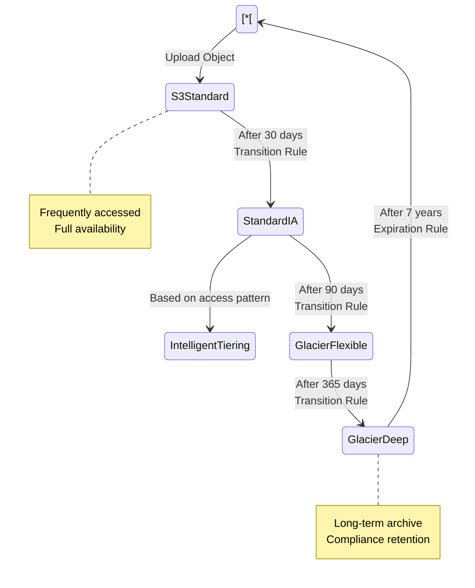
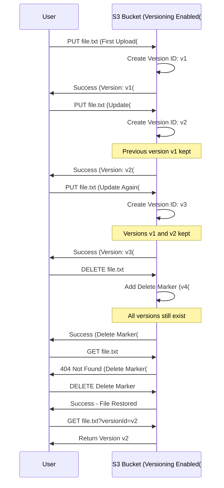
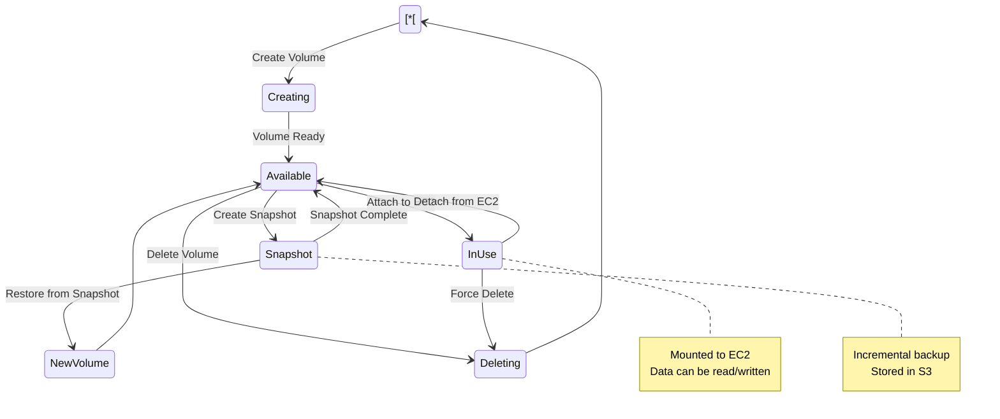
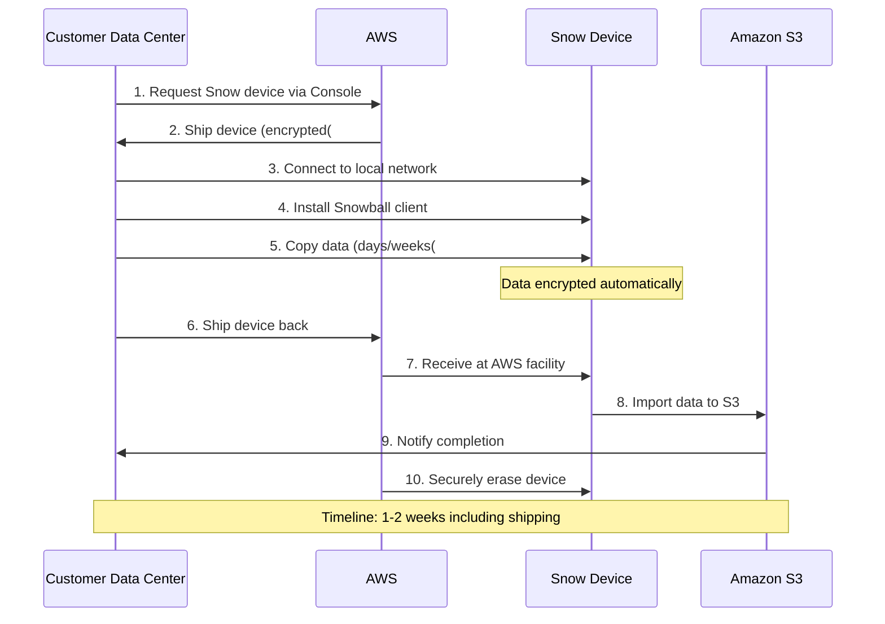

# Storage Services - Mermaid Diagrams

## Amazon S3 Overview

### S3 Storage Classes Hierarchy

```mermaid
graph TB
    S3["Amazon S3 Storage Classes[
    
    S3 --> Standard["S3 Standard&lt;&lt;&lt;BR_SLASH&gt;&gt;&gt;💰 Most Expensive&lt;&lt;&lt;BR_SLASH&gt;&gt;&gt;⚡ Frequent Access&lt;&lt;&lt;BR_SLASH&gt;&gt;&gt;📊 99.99% Availability&lt;&lt;&lt;BR_SLASH&gt;&gt;&gt;🛡️ 11 9's Durability"[
    
    S3 --> Intelligent["S3 Intelligent-Tiering&lt;&lt;&lt;BR_SLASH&gt;&gt;&gt;🤖 Auto-optimization&lt;&lt;&lt;BR_SLASH&gt;&gt;&gt;📊 Unknown access patterns&lt;&lt;&lt;BR_SLASH&gt;&gt;&gt;💰 Small monitoring fee"[
    
    S3 --> IA[Infrequent Access Tier[
    IA --> StandardIA["S3 Standard-IA&lt;&lt;&lt;BR_SLASH&gt;&gt;&gt;💰 Lower cost&lt;&lt;&lt;BR_SLASH&gt;&gt;&gt;⏱️ Min 30 days&lt;&lt;&lt;BR_SLASH&gt;&gt;&gt;📊 99.9% Availability"[
    IA --> OneZoneIA["S3 One Zone-IA&lt;&lt;&lt;BR_SLASH&gt;&gt;&gt;💰 20% cheaper than Standard-IA&lt;&lt;&lt;BR_SLASH&gt;&gt;&gt;⚠️ Single AZ&lt;&lt;&lt;BR_SLASH&gt;&gt;&gt;📊 99.5% Availability"[
    
    S3 --> Glacier[Archive Tier[
    Glacier --> GlacierInstant["S3 Glacier Instant Retrieval&lt;&lt;&lt;BR_SLASH&gt;&gt;&gt;⏱️ Millisecond retrieval&lt;&lt;&lt;BR_SLASH&gt;&gt;&gt;💰 Archive pricing&lt;&lt;&lt;BR_SLASH&gt;&gt;&gt;📅 Min 90 days"[
    Glacier --> GlacierFlexible["S3 Glacier Flexible Retrieval&lt;&lt;&lt;BR_SLASH&gt;&gt;&gt;⏱️ Minutes to hours&lt;&lt;&lt;BR_SLASH&gt;&gt;&gt;💰 Very low cost&lt;&lt;&lt;BR_SLASH&gt;&gt;&gt;📅 Min 90 days"[
    Glacier --> GlacierDeep["S3 Glacier Deep Archive&lt;&lt;&lt;BR_SLASH&gt;&gt;&gt;⏱️ 12-48 hours&lt;&lt;&lt;BR_SLASH&gt;&gt;&gt;💰 Lowest cost&lt;&lt;&lt;BR_SLASH&gt;&gt;&gt;📅 Min 180 days"[
    
    classDef style1 fill:#FF9900
    class Standard style1
    classDef style2 fill:#146EB4
    class Intelligent style2
    classDef style3 fill:#569A31
    class StandardIA style3
    classDef style4 fill:#8C4FFF
    class GlacierDeep style4
```

### S3 Lifecycle Policy Flow



### S3 Data Flow and Access

```mermaid
graph TB
    subgraph Clients_Group["Clients"[
        App[Application[
        User[End User[
        CLI[AWS CLI[
    end
    
    subgraph Amazon_S3_Group["Amazon S3"[
        Bucket["S3 Bucket&lt;&lt;&lt;BR_SLASH&gt;&gt;&gt;my-bucket"[
        
        subgraph Objects_Group["Objects"[
            Obj1["File1.jpg&lt;&lt;&lt;BR_SLASH&gt;&gt;&gt;Key: photos/2024/file1.jpg"[
            Obj2["Data.csv&lt;&lt;&lt;BR_SLASH&gt;&gt;&gt;Key: data/2024/data.csv"[
            Obj3["Video.mp4&lt;&lt;&lt;BR_SLASH&gt;&gt;&gt;Key: videos/video.mp4"[
        end
        
        Versioning[Versioning: Enabled[
        Encryption[Encryption: SSE-S3[
        
        Bucket --> Obj1
        Bucket --> Obj2
        Bucket --> Obj3
        Bucket --> Versioning
        Bucket --> Encryption
    end
    
    subgraph Access_Control_Group["Access Control"[
        BucketPolicy["Bucket Policy&lt;&lt;&lt;BR_SLASH&gt;&gt;&gt;Resource-based"[
        IAMPolicy["IAM Policy&lt;&lt;&lt;BR_SLASH&gt;&gt;&gt;Identity-based"[
        ACL["ACL&lt;&lt;&lt;BR_SLASH&gt;&gt;&gt;Legacy"[
        BlockPublic[Block Public Access[
    end
    
    App --> IAMPolicy
    IAMPolicy --> Bucket
    BucketPolicy --> Bucket
    BlockPublic -.Prevents.-> Bucket
    
    CloudFront[CloudFront CDN[ --> Bucket
    
    classDef style1 fill:#569A31
    class Bucket style1
    classDef style2 fill:#FF9900
    class BucketPolicy style2
    classDef style3 fill:#146EB4
    class CloudFront style3
```

### S3 Versioning



### S3 Replication (CRR & SRR)

```mermaid
graph LR
    subgraph Source_Region_us_east_1_Group["Source Region: us-east-1"[
        SourceBucket["Source S3 Bucket&lt;&lt;&lt;BR_SLASH&gt;&gt;&gt;Versioning: Enabled"[
        SourceData[Objects[
        
        SourceData --> SourceBucket
    end
    
    subgraph Destination_Region_eu_west_1_Group["Destination Region: eu-west-1"[
        DestBucket["Destination S3 Bucket&lt;&lt;&lt;BR_SLASH&gt;&gt;&gt;Versioning: Enabled"[
        ReplicatedData[Replicated Objects[
        
        ReplicatedData --> DestBucket
    end
    
    SourceBucket -->|Cross-Region Replication<br/>CRR| DestBucket
    
    Requirements["Requirements:&lt;&lt;&lt;BR_SLASH&gt;&gt;&gt;✅ Versioning enabled on both&lt;&lt;&lt;BR_SLASH&gt;&gt;&gt;✅ IAM role for replication&lt;&lt;&lt;BR_SLASH&gt;&gt;&gt;✅ Different regions (CRR[<br/>✅ Same region (SRR(""]
    
    UseCases["Use Cases:&lt;&lt;&lt;BR_SLASH&gt;&gt;&gt;• Compliance&lt;&lt;&lt;BR_SLASH&gt;&gt;&gt;• Lower latency&lt;&lt;&lt;BR_SLASH&gt;&gt;&gt;• Disaster recovery&lt;&lt;&lt;BR_SLASH&gt;&gt;&gt;• Replication across accounts"[
    
    SourceBucket -.Requires.-> Requirements
    DestBucket -.Use Cases.-> UseCases
    
    Note1["📝 Only new objects replicated&lt;&lt;&lt;BR_SLASH&gt;&gt;&gt;📝 Delete markers optional&lt;&lt;&lt;BR_SLASH&gt;&gt;&gt;📝 No chaining"[
    
    classDef style1 fill:#FF9900
    class SourceBucket style1
    classDef style2 fill:#569A31
    class DestBucket style2
```

### S3 Encryption Options

```mermaid
graph TB
    S3Encryption[S3 Encryption Methods[
    
    S3Encryption --> ServerSide["Server-Side Encryption&lt;&lt;&lt;BR_SLASH&gt;&gt;&gt;Encrypted at rest"[
    S3Encryption --> ClientSide["Client-Side Encryption&lt;&lt;&lt;BR_SLASH&gt;&gt;&gt;Encrypted before upload"[
    
    ServerSide --> SSE_S3["SSE-S3&lt;&lt;&lt;BR_SLASH&gt;&gt;&gt;🔑 AWS Managed Keys&lt;&lt;&lt;BR_SLASH&gt;&gt;&gt;🔒 AES-256&lt;&lt;&lt;BR_SLASH&gt;&gt;&gt;✅ Default option&lt;&lt;&lt;BR_SLASH&gt;&gt;&gt;Header: x-amz-server-side-encryption: AES256"[
    
    ServerSide --> SSE_KMS["SSE-KMS&lt;&lt;&lt;BR_SLASH&gt;&gt;&gt;🔑 AWS KMS Keys&lt;&lt;&lt;BR_SLASH&gt;&gt;&gt;✅ Audit trail via CloudTrail&lt;&lt;&lt;BR_SLASH&gt;&gt;&gt;✅ User control&lt;&lt;&lt;BR_SLASH&gt;&gt;&gt;⚠️ KMS quota limits&lt;&lt;&lt;BR_SLASH&gt;&gt;&gt;Header: x-amz-server-side-encryption: aws:kms"[
    
    ServerSide --> SSE_C["SSE-C&lt;&lt;&lt;BR_SLASH&gt;&gt;&gt;🔑 Customer-Provided Keys&lt;&lt;&lt;BR_SLASH&gt;&gt;&gt;✅ Full control&lt;&lt;&lt;BR_SLASH&gt;&gt;&gt;⚠️ HTTPS required&lt;&lt;&lt;BR_SLASH&gt;&gt;&gt;⚠️ Keys not stored by AWS"[
    
    ClientSide --> ClientLib["Encrypt using client libraries&lt;&lt;&lt;BR_SLASH&gt;&gt;&gt;Upload encrypted data&lt;&lt;&lt;BR_SLASH&gt;&gt;&gt;Decrypt on download&lt;&lt;&lt;BR_SLASH&gt;&gt;&gt;Full client control"[
    
    classDef style1 fill:#569A31
    class SSE_S3 style1
    classDef style2 fill:#FF9900
    class SSE_KMS style2
    classDef style3 fill:#146EB4
    class SSE_C style3
```

### S3 Access Points

```mermaid
graph TB
    subgraph S3_Bucket_company_data_Group["S3 Bucket: company-data"[
        Data1["/finance/* objects"[
        Data2["/hr/* objects"[
        Data3["/engineering/* objects"[
    end
    
    subgraph S3_Access_Points_Group["S3 Access Points"[
        AP1["Finance Access Point&lt;&lt;&lt;BR_SLASH&gt;&gt;&gt;finance-ap&lt;&lt;&lt;BR_SLASH&gt;&gt;&gt;Policy: Allow finance/*"[
        AP2["HR Access Point&lt;&lt;&lt;BR_SLASH&gt;&gt;&gt;hr-ap&lt;&lt;&lt;BR_SLASH&gt;&gt;&gt;Policy: Allow hr/*"[
        AP3["Engineering Access Point&lt;&lt;&lt;BR_SLASH&gt;&gt;&gt;engineering-ap&lt;&lt;&lt;BR_SLASH&gt;&gt;&gt;Policy: Allow engineering/*"[
    end
    
    subgraph Users_Applications_Group["Users/Applications"[
        FinanceApp[Finance Application[ --> AP1
        HRApp[HR Application[ --> AP2
        EngApp[Engineering Application[ --> AP3
    end
    
    AP1 --> Data1
    AP2 --> Data2
    AP3 --> Data3
    
    VPC["VPC Access Point&lt;&lt;&lt;BR_SLASH&gt;&gt;&gt;Restrict to VPC only"[ -.VPC Access.-> AP1
    
    classDef style1 fill:#FF9900
    class AP1 style1
    classDef style2 fill:#FF9900
    class AP2 style2
    classDef style3 fill:#FF9900
    class AP3 style3
```

### S3 Event Notifications

```mermaid
graph TB
    S3[S3 Bucket[ --> Events{Event Types{
    
    Events --> Create["Object Created&lt;&lt;&lt;BR_SLASH&gt;&gt;&gt;s3:ObjectCreated:*"[
    Events --> Delete["Object Removed&lt;&lt;&lt;BR_SLASH&gt;&gt;&gt;s3:ObjectRemoved:*"[
    Events --> Restore["Object Restore&lt;&lt;&lt;BR_SLASH&gt;&gt;&gt;s3:ObjectRestore:*"[
    Events --> Replication["Replication&lt;&lt;&lt;BR_SLASH&gt;&gt;&gt;s3:Replication:*"[
    
    Create --> Targets{Notification Targets{
    Delete --> Targets
    
    Targets --> SNS["SNS Topic&lt;&lt;&lt;BR_SLASH&gt;&gt;&gt;Email/SMS notifications"[
    Targets --> SQS["SQS Queue&lt;&lt;&lt;BR_SLASH&gt;&gt;&gt;Decouple processing"[
    Targets --> Lambda["Lambda Function&lt;&lt;&lt;BR_SLASH&gt;&gt;&gt;Process immediately"[
    Targets --> EventBridge["EventBridge&lt;&lt;&lt;BR_SLASH&gt;&gt;&gt;18+ AWS services&lt;&lt;&lt;BR_SLASH&gt;&gt;&gt;Advanced filtering"[
    
    Lambda --> Processing["Example:&lt;&lt;&lt;BR_SLASH&gt;&gt;&gt;• Image resize&lt;&lt;&lt;BR_SLASH&gt;&gt;&gt;• Video transcoding&lt;&lt;&lt;BR_SLASH&gt;&gt;&gt;• Data processing&lt;&lt;&lt;BR_SLASH&gt;&gt;&gt;• Trigger workflows"[
    
    classDef style1 fill:#569A31
    class S3 style1
    classDef style2 fill:#FF9900
    class Lambda style2
    classDef style3 fill:#8C4FFF
    class EventBridge style3
```

### S3 Performance Optimization

```mermaid
graph TB
    subgraph Upload_Optimization_Group["Upload Optimization"[
        Multipart["Multipart Upload&lt;&lt;&lt;BR_SLASH&gt;&gt;&gt;📦 &gt; 100 MB recommended&lt;&lt;&lt;BR_SLASH&gt;&gt;&gt;📦 Required for &gt; 5 GB&lt;&lt;&lt;BR_SLASH&gt;&gt;&gt;✅ Parallel uploads&lt;&lt;&lt;BR_SLASH&gt;&gt;&gt;✅ Resume capability"[
        
        TransferAcc["S3 Transfer Acceleration&lt;&lt;&lt;BR_SLASH&gt;&gt;&gt;🌐 Use CloudFront Edge&lt;&lt;&lt;BR_SLASH&gt;&gt;&gt;⚡ 50-500% faster&lt;&lt;&lt;BR_SLASH&gt;&gt;&gt;💰 Additional cost"[
    end
    
    subgraph Download_Optimization_Group["Download Optimization"[
        ByteRange["Byte-Range Fetches&lt;&lt;&lt;BR_SLASH&gt;&gt;&gt;📥 Parallel downloads&lt;&lt;&lt;BR_SLASH&gt;&gt;&gt;✅ Resilient to failures&lt;&lt;&lt;BR_SLASH&gt;&gt;&gt;✅ Partial file retrieval"[
        
        S3Select["S3 Select&lt;&lt;&lt;BR_SLASH&gt;&gt;&gt;📊 SQL on S3 objects&lt;&lt;&lt;BR_SLASH&gt;&gt;&gt;⚡ 400% faster&lt;&lt;&lt;BR_SLASH&gt;&gt;&gt;💰 80% cheaper&lt;&lt;&lt;BR_SLASH&gt;&gt;&gt;✅ Filter server-side"[
    end
    
    subgraph Request_Optimization_Group["Request Optimization"[
        Prefixes["Use Prefixes&lt;&lt;&lt;BR_SLASH&gt;&gt;&gt;3,500 PUT/s per prefix&lt;&lt;&lt;BR_SLASH&gt;&gt;&gt;5,500 GET/s per prefix&lt;&lt;&lt;BR_SLASH&gt;&gt;&gt;Spread across prefixes"[
        
        CloudFront["CloudFront Caching&lt;&lt;&lt;BR_SLASH&gt;&gt;&gt;🌐 Edge caching&lt;&lt;&lt;BR_SLASH&gt;&gt;&gt;⚡ Low latency&lt;&lt;&lt;BR_SLASH&gt;&gt;&gt;✅ Reduce S3 load"[
    end
    
    LargeFile[Large File Upload[ --> Multipart
    GlobalUsers[Global Users[ --> TransferAcc
    
    BigData[Big Data Analysis[ --> S3Select
    LargeDownload[Large File Download[ --> ByteRange
    
    HighTraffic[High Traffic[ --> Prefixes
    StaticContent[Static Content[ --> CloudFront
    
    classDef style1 fill:#569A31
    class Multipart style1
    classDef style2 fill:#FF9900
    class TransferAcc style2
    classDef style3 fill:#146EB4
    class S3Select style3
```

## Amazon EBS (Elastic Block Store)

### EBS Volume Types

```mermaid
graph TB
    EBS[EBS Volume Types[
    
    EBS --> SSD["SSD-backed&lt;&lt;&lt;BR_SLASH&gt;&gt;&gt;Small random I/O"[
    EBS --> HDD["HDD-backed&lt;&lt;&lt;BR_SLASH&gt;&gt;&gt;Large sequential I/O"[
    
    SSD --> GP3["gp3 - General Purpose SSD&lt;&lt;&lt;BR_SLASH&gt;&gt;&gt;💰 20% cheaper than gp2&lt;&lt;&lt;BR_SLASH&gt;&gt;&gt;📊 3,000-16,000 IOPS&lt;&lt;&lt;BR_SLASH&gt;&gt;&gt;💾 125-1,000 MB/s&lt;&lt;&lt;BR_SLASH&gt;&gt;&gt;✅ Predictable performance&lt;&lt;&lt;BR_SLASH&gt;&gt;&gt;Use: Boot volumes, dev/test"[
    
    SSD --> GP2["gp2 - General Purpose SSD&lt;&lt;&lt;BR_SLASH&gt;&gt;&gt;📊 3 IOPS per GB&lt;&lt;&lt;BR_SLASH&gt;&gt;&gt;💾 Max 16,000 IOPS&lt;&lt;&lt;BR_SLASH&gt;&gt;&gt;⚡ Burst to 3,000 IOPS&lt;&lt;&lt;BR_SLASH&gt;&gt;&gt;Use: Boot volumes"[
    
    SSD --> IO2["io2/io2 Block Express - Provisioned IOPS SSD&lt;&lt;&lt;BR_SLASH&gt;&gt;&gt;📊 Up to 256,000 IOPS&lt;&lt;&lt;BR_SLASH&gt;&gt;&gt;💾 Up to 4,000 MB/s&lt;&lt;&lt;BR_SLASH&gt;&gt;&gt;🛡️ 99.999% durability&lt;&lt;&lt;BR_SLASH&gt;&gt;&gt;Use: Critical databases, high performance"[
    
    SSD --> IO1["io1 - Provisioned IOPS SSD&lt;&lt;&lt;BR_SLASH&gt;&gt;&gt;📊 Up to 64,000 IOPS&lt;&lt;&lt;BR_SLASH&gt;&gt;&gt;💾 Up to 1,000 MB/s&lt;&lt;&lt;BR_SLASH&gt;&gt;&gt;Use: Databases"[
    
    HDD --> ST1["st1 - Throughput Optimized HDD&lt;&lt;&lt;BR_SLASH&gt;&gt;&gt;💾 Up to 500 MB/s&lt;&lt;&lt;BR_SLASH&gt;&gt;&gt;💰 Low cost&lt;&lt;&lt;BR_SLASH&gt;&gt;&gt;🚫 Cannot be boot volume&lt;&lt;&lt;BR_SLASH&gt;&gt;&gt;Use: Big data, data warehouses, log processing"[
    
    HDD --> SC1["sc1 - Cold HDD&lt;&lt;&lt;BR_SLASH&gt;&gt;&gt;💾 Up to 250 MB/s&lt;&lt;&lt;BR_SLASH&gt;&gt;&gt;💰 Lowest cost&lt;&lt;&lt;BR_SLASH&gt;&gt;&gt;🚫 Cannot be boot volume&lt;&lt;&lt;BR_SLASH&gt;&gt;&gt;Use: Infrequently accessed data"[
    
    classDef style1 fill:#569A31
    class GP3 style1
    classDef style2 fill:#FF9900
    class IO2 style2
    classDef style3 fill:#146EB4
    class ST1 style3
```

### EBS Volume Lifecycle



### EBS Snapshots Architecture

```mermaid
graph TB
    subgraph AZ_us_east_1a_Group["AZ: us-east-1a"[
        EC2_1[EC2 Instance[
        EBS1["EBS Volume&lt;&lt;&lt;BR_SLASH&gt;&gt;&gt;100 GB Data"[
        
        EC2_1 --> EBS1
    end
    
    EBS1 -->|Create Snapshot| Snapshot1["Snapshot 1&lt;&lt;&lt;BR_SLASH&gt;&gt;&gt;Full Backup: 100 GB&lt;&lt;&lt;BR_SLASH&gt;&gt;&gt;Incremental"[
    
    Snapshot1 --> S3["Amazon S3&lt;&lt;&lt;BR_SLASH&gt;&gt;&gt;Regional Service&lt;&lt;&lt;BR_SLASH&gt;&gt;&gt;Automatic Multi-AZ"[
    
    EBS1 -->|After changes: +10 GB| Snapshot2["Snapshot 2&lt;&lt;&lt;BR_SLASH&gt;&gt;&gt;Incremental: +10 GB only&lt;&lt;&lt;BR_SLASH&gt;&gt;&gt;References Snapshot 1"[
    
    Snapshot2 --> S3
    
    S3 -->|Copy Snapshot| S3_DR["S3 in eu-west-1&lt;&lt;&lt;BR_SLASH&gt;&gt;&gt;Disaster Recovery"[
    
    S3 -->|Restore| NewEBS["New EBS Volume&lt;&lt;&lt;BR_SLASH&gt;&gt;&gt;Any AZ in region"[
    
    subgraph AZ_us_east_1b_Group["AZ: us-east-1b"[
        NewEBS
        EC2_2[New EC2 Instance[ --> NewEBS
    end
    
    Features["Features:&lt;&lt;&lt;BR_SLASH&gt;&gt;&gt;✅ Incremental backups&lt;&lt;&lt;BR_SLASH&gt;&gt;&gt;✅ Copy across regions&lt;&lt;&lt;BR_SLASH&gt;&gt;&gt;✅ Create AMI from snapshot&lt;&lt;&lt;BR_SLASH&gt;&gt;&gt;✅ Fast snapshot restore&lt;&lt;&lt;BR_SLASH&gt;&gt;&gt;💰 Pay for stored data only"[
    
    classDef style1 fill:#FF9900
    class EBS1 style1
    classDef style2 fill:#569A31
    class S3 style2
    classDef style3 fill:#146EB4
    class Snapshot1 style3
```

### EBS Multi-Attach (io1/io2 only)

```mermaid
graph TB
    subgraph Availability_Zone_Group["Availability Zone"[
        EBS["EBS io2 Volume&lt;&lt;&lt;BR_SLASH&gt;&gt;&gt;Multi-Attach Enabled&lt;&lt;&lt;BR_SLASH&gt;&gt;&gt;Up to 16 instances"[
        
        EC2_1["EC2 Instance 1&lt;&lt;&lt;BR_SLASH&gt;&gt;&gt;Clustered App"[
        EC2_2["EC2 Instance 2&lt;&lt;&lt;BR_SLASH&gt;&gt;&gt;Clustered App"[
        EC2_3["EC2 Instance 3&lt;&lt;&lt;BR_SLASH&gt;&gt;&gt;Clustered App"[
        
        EC2_1 -.Read/Write.-> EBS
        EC2_2 -.Read/Write.-> EBS
        EC2_3 -.Read/Write.-> EBS
    end
    
    Limitations["Limitations:&lt;&lt;&lt;BR_SLASH&gt;&gt;&gt;⚠️ Same AZ only&lt;&lt;&lt;BR_SLASH&gt;&gt;&gt;⚠️ io1/io2 only&lt;&lt;&lt;BR_SLASH&gt;&gt;&gt;⚠️ Cluster-aware file system&lt;&lt;&lt;BR_SLASH&gt;&gt;&gt;⚠️ Up to 16 instances"[
    
    UseCases["Use Cases:&lt;&lt;&lt;BR_SLASH&gt;&gt;&gt;• Teradata&lt;&lt;&lt;BR_SLASH&gt;&gt;&gt;• Clustered databases&lt;&lt;&lt;BR_SLASH&gt;&gt;&gt;• Applications requiring higher availability&lt;&lt;&lt;BR_SLASH&gt;&gt;&gt;• Must manage concurrent writes"[
    
    classDef style1 fill:#FF9900
    class EBS style1
    classDef style2 fill:#C00
    class Limitations style2
```

## Amazon EFS (Elastic File System)

### EFS Architecture

```mermaid
graph TB
    subgraph Region_us_east_1_Group["Region: us-east-1"[
        EFS["Amazon EFS&lt;&lt;&lt;BR_SLASH&gt;&gt;&gt;Network File System&lt;&lt;&lt;BR_SLASH&gt;&gt;&gt;Managed Service"[
        
        subgraph AZ_us_east_1a_Group["AZ: us-east-1a"[
            MT1[Mount Target 1[
            EC2_1a[EC2 Instance[
            Lambda1[Lambda Function[
            
            EC2_1a --> MT1
            Lambda1 --> MT1
        end
        
        subgraph AZ_us_east_1b_Group["AZ: us-east-1b"[
            MT2[Mount Target 2[
            EC2_1b[EC2 Instance[
            
            EC2_1b --> MT2
        end
        
        subgraph AZ_us_east_1c_Group["AZ: us-east-1c"[
            MT3[Mount Target 3[
            EC2_1c[EC2 Instance[
            ECS[ECS Tasks[
            
            EC2_1c --> MT3
            ECS --> MT3
        end
        
        MT1 --> EFS
        MT2 --> EFS
        MT3 --> EFS
    end
    
    OnPrem["On-Premises&lt;&lt;&lt;BR_SLASH&gt;&gt;&gt;via VPN/Direct Connect"[ -.NFSv4.-> MT1
    
    Features["Features:&lt;&lt;&lt;BR_SLASH&gt;&gt;&gt;✅ Multi-AZ by default&lt;&lt;&lt;BR_SLASH&gt;&gt;&gt;✅ Automatic scaling&lt;&lt;&lt;BR_SLASH&gt;&gt;&gt;✅ Pay for what you use&lt;&lt;&lt;BR_SLASH&gt;&gt;&gt;✅ 1000s concurrent connections&lt;&lt;&lt;BR_SLASH&gt;&gt;&gt;✅ POSIX-compliant&lt;&lt;&lt;BR_SLASH&gt;&gt;&gt;✅ Linux only"[
    
    classDef style1 fill:#569A31
    class EFS style1
    classDef style2 fill:#FF9900
    class MT1 style2
```

### EFS Storage Classes

```mermaid
graph TB
    EFS[EFS File System[
    
    EFS --> Standard["Standard Storage Class&lt;&lt;&lt;BR_SLASH&gt;&gt;&gt;⚡ Frequent access&lt;&lt;&lt;BR_SLASH&gt;&gt;&gt;💰 Higher cost&lt;&lt;&lt;BR_SLASH&gt;&gt;&gt;📊 Multi-AZ"[
    
    EFS --> IA["EFS Infrequent Access&lt;&lt;&lt;BR_SLASH&gt;&gt;&gt;💰 92% lower cost&lt;&lt;&lt;BR_SLASH&gt;&gt;&gt;⏱️ Lower throughput&lt;&lt;&lt;BR_SLASH&gt;&gt;&gt;📊 Multi-AZ"[
    
    EFS --> OneZone["EFS One Zone&lt;&lt;&lt;BR_SLASH&gt;&gt;&gt;💰 47% cheaper than Standard&lt;&lt;&lt;BR_SLASH&gt;&gt;&gt;⚠️ Single AZ&lt;&lt;&lt;BR_SLASH&gt;&gt;&gt;⚡ Frequent access"[
    
    EFS --> OneZoneIA["EFS One Zone-IA&lt;&lt;&lt;BR_SLASH&gt;&gt;&gt;💰 Lowest cost&lt;&lt;&lt;BR_SLASH&gt;&gt;&gt;⚠️ Single AZ&lt;&lt;&lt;BR_SLASH&gt;&gt;&gt;⏱️ Infrequent access"[
    
    Lifecycle["Lifecycle Management&lt;&lt;&lt;BR_SLASH&gt;&gt;&gt;Auto-move files to IA&lt;&lt;&lt;BR_SLASH&gt;&gt;&gt;Based on access pattern&lt;&lt;&lt;BR_SLASH&gt;&gt;&gt;7, 14, 30, 60, 90 days"[
    
    Standard -.Lifecycle Policy.-> IA
    OneZone -.Lifecycle Policy.-> OneZoneIA
    
    Standard -.Access.-> IA
    IA -.Access.-> Standard
    
    classDef style1 fill:#FF9900
    class Standard style1
    classDef style2 fill:#569A31
    class IA style2
    classDef style3 fill:#146EB4
    class OneZone style3
```

### EFS Performance Modes

```mermaid
graph TB
    subgraph Performance_Modes_Group["Performance Modes"[
        General["General Purpose&lt;&lt;&lt;BR_SLASH&gt;&gt;&gt;⚡ Low latency&lt;&lt;&lt;BR_SLASH&gt;&gt;&gt;📊 Up to 7,000 files ops/sec&lt;&lt;&lt;BR_SLASH&gt;&gt;&gt;✅ Default choice&lt;&lt;&lt;BR_SLASH&gt;&gt;&gt;Use: Web servers, CMS"[
        
        MaxIO["Max I/O&lt;&lt;&lt;BR_SLASH&gt;&gt;&gt;📊 Higher latency&lt;&lt;&lt;BR_SLASH&gt;&gt;&gt;📈 &gt; 7,000 files ops/sec&lt;&lt;&lt;BR_SLASH&gt;&gt;&gt;📊 Highly parallel&lt;&lt;&lt;BR_SLASH&gt;&gt;&gt;Use: Big data, media processing"[
    end
    
    subgraph Throughput_Modes_Group["Throughput Modes"[
        Bursting["Bursting Throughput&lt;&lt;&lt;BR_SLASH&gt;&gt;&gt;📊 Scales with size&lt;&lt;&lt;BR_SLASH&gt;&gt;&gt;50 MB/s per TB&lt;&lt;&lt;BR_SLASH&gt;&gt;&gt;⚡ Burst to 100 MB/s"[
        
        Provisioned["Provisioned Throughput&lt;&lt;&lt;BR_SLASH&gt;&gt;&gt;📊 Set throughput independent of size&lt;&lt;&lt;BR_SLASH&gt;&gt;&gt;💰 Additional cost&lt;&lt;&lt;BR_SLASH&gt;&gt;&gt;Use: High throughput to storage ratio"[
        
        Elastic["Elastic Throughput&lt;&lt;&lt;BR_SLASH&gt;&gt;&gt;🤖 Auto-scales&lt;&lt;&lt;BR_SLASH&gt;&gt;&gt;📊 Up to 3 GB/s reads, 1 GB/s writes&lt;&lt;&lt;BR_SLASH&gt;&gt;&gt;💰 Pay for what you use&lt;&lt;&lt;BR_SLASH&gt;&gt;&gt;✅ Recommended"[
    end
    
    WebApp[Web Application[ --> General
    WebApp --> Elastic
    
    BigData[Big Data Analytics[ --> MaxIO
    BigData --> Provisioned
    
    classDef style1 fill:#569A31
    class General style1
    classDef style2 fill:#FF9900
    class Elastic style2
```

## AWS Storage Gateway

### Storage Gateway Types

```mermaid
graph TB
    OnPrem["On-Premises&lt;&lt;&lt;BR_SLASH&gt;&gt;&gt;Data Center"[
    
    OnPrem --> Gateway{Storage Gateway{
    
    Gateway --> S3File["S3 File Gateway&lt;&lt;&lt;BR_SLASH&gt;&gt;&gt;📁 NFS/SMB protocol&lt;&lt;&lt;BR_SLASH&gt;&gt;&gt;☁️ Store as S3 objects&lt;&lt;&lt;BR_SLASH&gt;&gt;&gt;💾 Local cache&lt;&lt;&lt;BR_SLASH&gt;&gt;&gt;Use: File shares, backups"[
    
    Gateway --> FSx["FSx File Gateway&lt;&lt;&lt;BR_SLASH&gt;&gt;&gt;📁 SMB protocol&lt;&lt;&lt;BR_SLASH&gt;&gt;&gt;☁️ Amazon FSx for Windows&lt;&lt;&lt;BR_SLASH&gt;&gt;&gt;💾 Local cache&lt;&lt;&lt;BR_SLASH&gt;&gt;&gt;Use: Windows file shares"[
    
    Gateway --> Volume["Volume Gateway&lt;&lt;&lt;BR_SLASH&gt;&gt;&gt;💾 iSCSI protocol&lt;&lt;&lt;BR_SLASH&gt;&gt;&gt;Block storage"[
    
    Volume --> Cached["Cached Volumes&lt;&lt;&lt;BR_SLASH&gt;&gt;&gt;💾 Primary data in S3&lt;&lt;&lt;BR_SLASH&gt;&gt;&gt;🔄 Frequently accessed cached&lt;&lt;&lt;BR_SLASH&gt;&gt;&gt;📦 Up to 32 volumes&lt;&lt;&lt;BR_SLASH&gt;&gt;&gt;📊 32 TiB each"[
    
    Volume --> Stored["Stored Volumes&lt;&lt;&lt;BR_SLASH&gt;&gt;&gt;💾 Primary data on-premises&lt;&lt;&lt;BR_SLASH&gt;&gt;&gt;☁️ Async backup to S3&lt;&lt;&lt;BR_SLASH&gt;&gt;&gt;📦 Up to 32 volumes&lt;&lt;&lt;BR_SLASH&gt;&gt;&gt;📊 16 TiB each"[
    
    Gateway --> Tape["Tape Gateway&lt;&lt;&lt;BR_SLASH&gt;&gt;&gt;📼 Virtual Tape Library (VTL[<br/>☁️ Backup to S3 & Glacier<br/>✅ Works with backup software<br/>Use: Backup & archive"]
    
    S3File --> S3[Amazon S3[
    FSx --> FSxService[Amazon FSx[
    Cached --> S3
    Stored --> S3
    Tape --> S3
    Tape --> Glacier[S3 Glacier[
    
    classDef style1 fill:#FF9900
    class Gateway style1
    classDef style2 fill:#569A31
    class S3File style2
    classDef style3 fill:#146EB4
    class Tape style3
```

### Storage Gateway Hybrid Architecture

```mermaid
graph TB
    subgraph On_Premises_Data_Center_Group["On-Premises Data Center"[
        Apps[Applications[
        Gateway["Storage Gateway&lt;&lt;&lt;BR_SLASH&gt;&gt;&gt;VM or Hardware Appliance"[
        Cache["Local Cache&lt;&lt;&lt;BR_SLASH&gt;&gt;&gt;Frequently accessed data"[
        
        Apps --> Gateway
        Gateway --> Cache
    end
    
    subgraph AWS_Cloud_Group["AWS Cloud"[
        S3["Amazon S3&lt;&lt;&lt;BR_SLASH&gt;&gt;&gt;Primary Storage"[
        Glacier["S3 Glacier&lt;&lt;&lt;BR_SLASH&gt;&gt;&gt;Archive"[
        EBS[EBS Snapshots[
        
        S3 --> Glacier
    end
    
    Gateway -->|HTTPS| S3
    Gateway -->|Snapshots| EBS
    
    Lifecycle[Lifecycle Policies[ -.Auto-archive.-> Glacier
    
    Benefits["Benefits:&lt;&lt;&lt;BR_SLASH&gt;&gt;&gt;✅ Low-latency local access&lt;&lt;&lt;BR_SLASH&gt;&gt;&gt;✅ Durable cloud storage&lt;&lt;&lt;BR_SLASH&gt;&gt;&gt;✅ Seamless migration&lt;&lt;&lt;BR_SLASH&gt;&gt;&gt;✅ Disaster recovery&lt;&lt;&lt;BR_SLASH&gt;&gt;&gt;✅ Reduced on-prem storage costs"[
    
    classDef style1 fill:#FF9900
    class Gateway style1
    classDef style2 fill:#569A31
    class S3 style2
```

## AWS Snow Family

### Snow Family Devices

```mermaid
graph TB
    SnowFamily["AWS Snow Family&lt;&lt;&lt;BR_SLASH&gt;&gt;&gt;Physical Data Transfer & Edge Computing"[
    
    SnowFamily --> Snowcone["Snowcone&lt;&lt;&lt;BR_SLASH&gt;&gt;&gt;📦 Smallest device&lt;&lt;&lt;BR_SLASH&gt;&gt;&gt;💾 8-14 TB usable&lt;&lt;&lt;BR_SLASH&gt;&gt;&gt;⚡ 2 CPUs, 4 GB RAM&lt;&lt;&lt;BR_SLASH&gt;&gt;&gt;🔋 Battery powered&lt;&lt;&lt;BR_SLASH&gt;&gt;&gt;Use: Edge computing, IoT, remote locations"[
    
    SnowFamily --> Snowball[Snowball Edge[
    
    Snowball --> SnowballStorage["Snowball Edge Storage Optimized&lt;&lt;&lt;BR_SLASH&gt;&gt;&gt;💾 80 TB usable&lt;&lt;&lt;BR_SLASH&gt;&gt;&gt;💪 40 vCPUs, 80 GB RAM&lt;&lt;&lt;BR_SLASH&gt;&gt;&gt;📊 1 TB SSD for block volumes&lt;&lt;&lt;BR_SLASH&gt;&gt;&gt;Use: Large data migrations, local storage"[
    
    Snowball --> SnowballCompute["Snowball Edge Compute Optimized&lt;&lt;&lt;BR_SLASH&gt;&gt;&gt;💾 42-28 TB usable&lt;&lt;&lt;BR_SLASH&gt;&gt;&gt;💪 52 vCPUs, 208 GB RAM&lt;&lt;&lt;BR_SLASH&gt;&gt;&gt;📊 Optional GPU&lt;&lt;&lt;BR_SLASH&gt;&gt;&gt;Use: ML, video processing, analytics"[
    
    SnowFamily --> Snowmobile["Snowmobile&lt;&lt;&lt;BR_SLASH&gt;&gt;&gt;🚛 Shipping container&lt;&lt;&lt;BR_SLASH&gt;&gt;&gt;💾 100 PB capacity&lt;&lt;&lt;BR_SLASH&gt;&gt;&gt;🔒 GPS tracking, security&lt;&lt;&lt;BR_SLASH&gt;&gt;&gt;Use: Exabyte-scale migration"[
    
    subgraph Use_Cases_Group["Use Cases"[
        Snowcone --> UC1["Remote locations&lt;&lt;&lt;BR_SLASH&gt;&gt;&gt;Harsh environments&lt;&lt;&lt;BR_SLASH&gt;&gt;&gt;Drones"[
        SnowballStorage --> UC2["Data center migration&lt;&lt;&lt;BR_SLASH&gt;&gt;&gt;Disaster recovery&lt;&lt;&lt;BR_SLASH&gt;&gt;&gt;Content distribution"[
        SnowballCompute --> UC3["Machine learning&lt;&lt;&lt;BR_SLASH&gt;&gt;&gt;Video processing&lt;&lt;&lt;BR_SLASH&gt;&gt;&gt;Analytics at edge"[
        Snowmobile --> UC4["Complete data center&lt;&lt;&lt;BR_SLASH&gt;&gt;&gt;shutdown/migration&lt;&lt;&lt;BR_SLASH&gt;&gt;&gt;Massive datasets"[
    end
    
    classDef style1 fill:#569A31
    class Snowcone style1
    classDef style2 fill:#FF9900
    class SnowballStorage style2
    classDef style3 fill:#146EB4
    class Snowmobile style3
```

### Snow Family Data Migration Flow



## Amazon FSx

### FSx Family Overview

```mermaid
graph TB
    FSx["Amazon FSx&lt;&lt;&lt;BR_SLASH&gt;&gt;&gt;Managed File Systems"[
    
    FSx --> Windows["FSx for Windows File Server&lt;&lt;&lt;BR_SLASH&gt;&gt;&gt;🪟 Windows-native&lt;&lt;&lt;BR_SLASH&gt;&gt;&gt;📁 SMB protocol&lt;&lt;&lt;BR_SLASH&gt;&gt;&gt;✅ Active Directory integration&lt;&lt;&lt;BR_SLASH&gt;&gt;&gt;✅ DFS Namespaces&lt;&lt;&lt;BR_SLASH&gt;&gt;&gt;📊 SSD & HDD options&lt;&lt;&lt;BR_SLASH&gt;&gt;&gt;Use: Windows apps, SQL Server, SharePoint"[
    
    FSx --> Lustre["FSx for Lustre&lt;&lt;&lt;BR_SLASH&gt;&gt;&gt;⚡ High-performance computing&lt;&lt;&lt;BR_SLASH&gt;&gt;&gt;📊 100+ GB/s, millions IOPS&lt;&lt;&lt;BR_SLASH&gt;&gt;&gt;🔗 S3 integration&lt;&lt;&lt;BR_SLASH&gt;&gt;&gt;⚙️ Sub-millisecond latencies&lt;&lt;&lt;BR_SLASH&gt;&gt;&gt;Use: ML, HPC, video processing, financial modeling"[
    
    FSx --> NetApp["FSx for NetApp ONTAP&lt;&lt;&lt;BR_SLASH&gt;&gt;&gt;🔧 NetApp ONTAP features&lt;&lt;&lt;BR_SLASH&gt;&gt;&gt;📁 NFS, SMB, iSCSI&lt;&lt;&lt;BR_SLASH&gt;&gt;&gt;✅ Multi-protocol access&lt;&lt;&lt;BR_SLASH&gt;&gt;&gt;📸 Snapshots, replication&lt;&lt;&lt;BR_SLASH&gt;&gt;&gt;Use: Enterprise apps, multi-protocol access"[
    
    FSx --> OpenZFS["FSx for OpenZFS&lt;&lt;&lt;BR_SLASH&gt;&gt;&gt;🐧 Linux workloads&lt;&lt;&lt;BR_SLASH&gt;&gt;&gt;📁 NFS protocol&lt;&lt;&lt;BR_SLASH&gt;&gt;&gt;⚡ Up to 1 million IOPS&lt;&lt;&lt;BR_SLASH&gt;&gt;&gt;📸 Point-in-time snapshots&lt;&lt;&lt;BR_SLASH&gt;&gt;&gt;Use: Linux apps, data analytics"[
    
    subgraph Key_Differences_Group["Key Differences"[
        Windows --> WinNote["Windows environment&lt;&lt;&lt;BR_SLASH&gt;&gt;&gt;SMB shares&lt;&lt;&lt;BR_SLASH&gt;&gt;&gt;AD integration"[
        Lustre --> LustreNote["HPC workloads&lt;&lt;&lt;BR_SLASH&gt;&gt;&gt;Parallel file system&lt;&lt;&lt;BR_SLASH&gt;&gt;&gt;S3 backend"[
        NetApp --> NetAppNote["Enterprise features&lt;&lt;&lt;BR_SLASH&gt;&gt;&gt;Multi-protocol&lt;&lt;&lt;BR_SLASH&gt;&gt;&gt;Data management"[
        OpenZFS --> ZFSNote["Linux workloads&lt;&lt;&lt;BR_SLASH&gt;&gt;&gt;ZFS file system&lt;&lt;&lt;BR_SLASH&gt;&gt;&gt;High performance"[
    end
    
    classDef style1 fill:#FF9900
    class Windows style1
    classDef style2 fill:#569A31
    class Lustre style2
    classDef style3 fill:#146EB4
    class NetApp style3
```

### FSx for Lustre with S3 Integration

```mermaid
graph TB
    subgraph Compute_Resources_Group["Compute Resources"[
        EC2_1[EC2 Instance 1[
        EC2_2[EC2 Instance 2[
        EC2_3[EC2 Instance 3[
        Cluster[HPC Cluster[
    end
    
    subgraph FSx_for_Lustre_Group["FSx for Lustre"[
        FSxLustre["FSx for Lustre&lt;&lt;&lt;BR_SLASH&gt;&gt;&gt;High-performance file system&lt;&lt;&lt;BR_SLASH&gt;&gt;&gt;Parallel I/O"[
        Cache[File System Cache[
        
        FSxLustre --> Cache
    end
    
    subgraph Amazon_S3_Group["Amazon S3"[
        S3Input["S3 Bucket&lt;&lt;&lt;BR_SLASH&gt;&gt;&gt;Input Data"[
        S3Output["S3 Bucket&lt;&lt;&lt;BR_SLASH&gt;&gt;&gt;Output Results"[
    end
    
    EC2_1 --> FSxLustre
    EC2_2 --> FSxLustre
    EC2_3 --> FSxLustre
    Cluster --> FSxLustre
    
    S3Input -->|Lazy Load| FSxLustre
    FSxLustre -->|Write Back| S3Output
    
    Process["Process:&lt;&lt;&lt;BR_SLASH&gt;&gt;&gt;1. Data in S3&lt;&lt;&lt;BR_SLASH&gt;&gt;&gt;2. FSx lazy-loads on demand&lt;&lt;&lt;BR_SLASH&gt;&gt;&gt;3. Parallel processing&lt;&lt;&lt;BR_SLASH&gt;&gt;&gt;4. Results written to S3"[
    
    DeploymentOptions["Deployment Options:&lt;&lt;&lt;BR_SLASH&gt;&gt;&gt;• Scratch: Temporary, no replication&lt;&lt;&lt;BR_SLASH&gt;&gt;&gt;• Persistent: HA, auto-replication"[
    
    classDef style1 fill:#569A31
    class FSxLustre style1
    classDef style2 fill:#FF9900
    class S3Input style2
```

## Storage Comparison Matrix

### When to Use Which Storage Service

```mermaid
graph TB
    Start([Choose Storage Service((
    
    Start --> Q1{Data Type?{
    
    Q1 -->|Object Storage| S3Decision{Access Pattern?{
    Q1 -->|Block Storage| BlockDecision{Shared Access?{
    Q1 -->|File Storage| FileDecision{OS Type?{
    
    S3Decision -->|Frequent| S3Standard[S3 Standard[
    S3Decision -->|Infrequent| S3IA[S3 Standard-IA[
    S3Decision -->|Archive| Glacier[S3 Glacier[
    S3Decision -->|Unknown| Intelligent[S3 Intelligent-Tiering[
    
    BlockDecision -->|No| EBSChoice["EBS Volume&lt;&lt;&lt;BR_SLASH&gt;&gt;&gt;Single EC2 instance"[
    BlockDecision -->|Yes, same AZ| EBSMulti["EBS Multi-Attach&lt;&lt;&lt;BR_SLASH&gt;&gt;&gt;io1/io2 only"[
    BlockDecision -->|Yes, multi-AZ| InstanceStore[Consider EFS instead[
    
    FileDecision -->|Linux| LinuxFile{Performance?{
    FileDecision -->|Windows| WindowsFile{Location?{
    
    LinuxFile -->|Standard| EFS[Amazon EFS[
    LinuxFile -->|HPC| Lustre[FSx for Lustre[
    LinuxFile -->|Enterprise| OpenZFS[FSx for OpenZFS[
    
    WindowsFile -->|AWS| FSxWindows[FSx for Windows[
    WindowsFile -->|On-Premises| StorageGW[Storage Gateway[
    
    classDef style1 fill:#569A31
    class S3Standard style1
    classDef style2 fill:#FF9900
    class EBSChoice style2
    classDef style3 fill:#146EB4
    class EFS style3
    classDef style4 fill:#8C4FFF
    class Lustre style4
```

