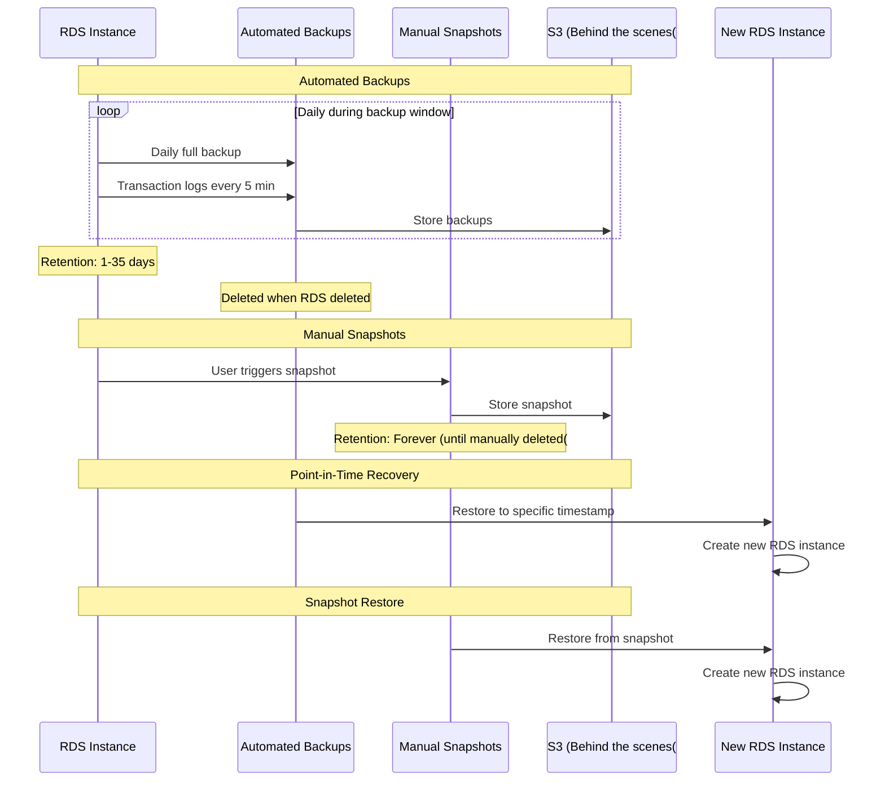
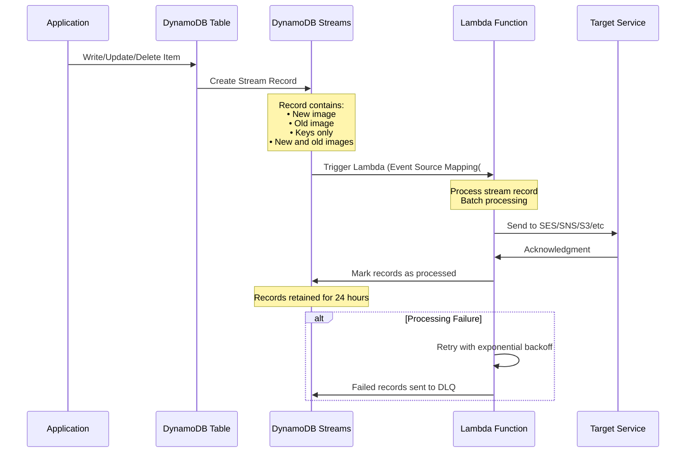

# Database Services - Mermaid Diagrams

## Database Services Overview

### AWS Database Services Map

```mermaid
mindmap
    root((AWS Database&lt;&lt;&lt;BR_SLASH&gt;&gt;&gt;Services()
        Relational
            RDS
                PostgreSQL
                MySQL
                MariaDB
                Oracle
                SQL Server
            Aurora
                Aurora PostgreSQL
                Aurora MySQL
                Aurora Serverless
        NoSQL
            DynamoDB
                Key-Value
                Document
                DynamoDB Streams
                Global Tables
            DocumentDB
                MongoDB compatible
            Keyspaces
                Cassandra compatible
        In-Memory
            ElastiCache
                Redis
                Memcached
            DAX
                DynamoDB Accelerator
        Data Warehouse
            Redshift
                OLAP
                Columnar storage
                Redshift Spectrum
        Graph
            Neptune
                Property Graph
                RDF
        Time Series
            Timestream
            Managed Grafana
        Ledger
            QLDB
                Immutable
                Cryptographic verification
```

## Amazon RDS

### RDS Multi-AZ Deployment

```mermaid
graph TB
    subgraph Region_us_east_1_Group["Region: us-east-1"[
        Route53[Route 53[
        DNS["DNS Name:&lt;&lt;&lt;BR_SLASH&gt;&gt;&gt;database.region.rds.amazonaws.com"[
        
        subgraph AZ_us_east_1a_Group["AZ: us-east-1a"[
            Primary["Primary RDS Instance&lt;&lt;&lt;BR_SLASH&gt;&gt;&gt;Read/Write"[
            App1[Application Server 1[
            
            App1 --> Primary
        end
        
        subgraph AZ_us_east_1b_Group["AZ: us-east-1b"[
            Standby["Standby RDS Instance&lt;&lt;&lt;BR_SLASH&gt;&gt;&gt;Synchronous Replication"[
            App2[Application Server 2[
            
            App2 -.Not Accessible.-> Standby
        end
    end
    
    Route53 --> DNS
    DNS --> Primary
    Primary -.Sync Replication.-> Standby
    
    Primary -.Failure.-> Failover["Automatic Failover&lt;&lt;&lt;BR_SLASH&gt;&gt;&gt;60-120 seconds"[
    Failover --> DNS
    DNS -.Update.-> Standby
    Standby -.Promoted to.-> NewPrimary[New Primary[
    
    Features["Features:&lt;&lt;&lt;BR_SLASH&gt;&gt;&gt;✅ High Availability&lt;&lt;&lt;BR_SLASH&gt;&gt;&gt;✅ Automatic failover&lt;&lt;&lt;BR_SLASH&gt;&gt;&gt;✅ No manual intervention&lt;&lt;&lt;BR_SLASH&gt;&gt;&gt;✅ Same DNS endpoint&lt;&lt;&lt;BR_SLASH&gt;&gt;&gt;⚠️ Standby not for reads&lt;&lt;&lt;BR_SLASH&gt;&gt;&gt;💰 ~2x cost"[
    
    classDef style1 fill:#569A31
    class Primary style1
    classDef style2 fill:#FF9900
    class Standby style2
    classDef style3 fill:#C00
    class Failover style3
```

### RDS Read Replicas

```mermaid
graph TB
    subgraph Primary_Region_us_east_1_Group["Primary Region: us-east-1"[
        subgraph AZ_us_east_1a_Group["AZ: us-east-1a"[
            Primary["Primary RDS Instance&lt;&lt;&lt;BR_SLASH&gt;&gt;&gt;Read/Write"[
            App1["Application&lt;&lt;&lt;BR_SLASH&gt;&gt;&gt;Write Operations"[
            
            App1 -->|Write| Primary
        end
        
        subgraph AZ_us_east_1b_Group["AZ: us-east-1b"[
            Replica1["Read Replica 1&lt;&lt;&lt;BR_SLASH&gt;&gt;&gt;Async Replication"[
            App2["Application&lt;&lt;&lt;BR_SLASH&gt;&gt;&gt;Read Operations"[
            
            App2 -->|Read| Replica1
        end
        
        subgraph AZ_us_east_1c_Group["AZ: us-east-1c"[
            Replica2["Read Replica 2&lt;&lt;&lt;BR_SLASH&gt;&gt;&gt;Async Replication"[
            App3["Application&lt;&lt;&lt;BR_SLASH&gt;&gt;&gt;Read Operations"[
            
            App3 -->|Read| Replica2
        end
    end
    
    subgraph Secondary_Region_eu_west_1_Group["Secondary Region: eu-west-1"[
        ReplicaCR["Cross-Region&lt;&lt;&lt;BR_SLASH&gt;&gt;&gt;Read Replica&lt;&lt;&lt;BR_SLASH&gt;&gt;&gt;DR & Low Latency"[
        AppEU[European Users[
        
        AppEU -->|Read| ReplicaCR
    end
    
    Primary -.Async Replication.-> Replica1
    Primary -.Async Replication.-> Replica2
    Primary -.Async Replication.-> ReplicaCR
    
    Replica1 -.Can Promote to.-> Independent[Independent Database[
    
    Features["Features:&lt;&lt;&lt;BR_SLASH&gt;&gt;&gt;✅ Scale read workloads&lt;&lt;&lt;BR_SLASH&gt;&gt;&gt;✅ Up to 15 read replicas&lt;&lt;&lt;BR_SLASH&gt;&gt;&gt;✅ Cross-AZ, Cross-Region&lt;&lt;&lt;BR_SLASH&gt;&gt;&gt;✅ Async replication&lt;&lt;&lt;BR_SLASH&gt;&gt;&gt;✅ Can be promoted&lt;&lt;&lt;BR_SLASH&gt;&gt;&gt;💰 Replication cost for cross-region"[
    
    classDef style1 fill:#569A31
    class Primary style1
    classDef style2 fill:#FF9900
    class Replica1 style2
    classDef style3 fill:#146EB4
    class ReplicaCR style3
```

### RDS Backup and Restore



### RDS Proxy Architecture

```mermaid
graph TB
    subgraph Application_Tier_Group["Application Tier"[
        Lambda1[Lambda Function 1[
        Lambda2[Lambda Function 2[
        Lambda3[Lambda Function 3[
        EC2[EC2 Application[
    end
    
    subgraph RDS_Proxy_Group["RDS Proxy"[
        Proxy["RDS Proxy&lt;&lt;&lt;BR_SLASH&gt;&gt;&gt;Connection Pooling&lt;&lt;&lt;BR_SLASH&gt;&gt;&gt;Serverless, Auto-scaling"[
        Pool["Connection Pool&lt;&lt;&lt;BR_SLASH&gt;&gt;&gt;Reuse connections&lt;&lt;&lt;BR_SLASH&gt;&gt;&gt;Reduce DB load"[
        
        Proxy --> Pool
    end
    
    subgraph Database_Tier_Group["Database Tier"[
        Primary["Primary RDS&lt;&lt;&lt;BR_SLASH&gt;&gt;&gt;PostgreSQL/MySQL"[
        Standby["Standby RDS&lt;&lt;&lt;BR_SLASH&gt;&gt;&gt;Multi-AZ"[
        
        Primary -.Sync.-> Standby
    end
    
    Lambda1 --> Proxy
    Lambda2 --> Proxy
    Lambda3 --> Proxy
    EC2 --> Proxy
    
    Pool --> Primary
    
    Proxy -.Failover<br/>66% faster.-> Standby
    
    Benefits["Benefits:&lt;&lt;&lt;BR_SLASH&gt;&gt;&gt;✅ Connection pooling&lt;&lt;&lt;BR_SLASH&gt;&gt;&gt;✅ 66% faster failover&lt;&lt;&lt;BR_SLASH&gt;&gt;&gt;✅ Enforce IAM auth&lt;&lt;&lt;BR_SLASH&gt;&gt;&gt;✅ Never publicly accessible&lt;&lt;&lt;BR_SLASH&gt;&gt;&gt;✅ Reduce DB stress&lt;&lt;&lt;BR_SLASH&gt;&gt;&gt;Use: Lambda, frequent connections"[
    
    classDef style1 fill:#FF9900
    class Proxy style1
    classDef style2 fill:#569A31
    class Pool style2
```

## Amazon Aurora

### Aurora Architecture

```mermaid
graph TB
    subgraph Aurora_Cluster_Group["Aurora Cluster"[
        Writer["Writer Endpoint&lt;&lt;&lt;BR_SLASH&gt;&gt;&gt;Primary Instance&lt;&lt;&lt;BR_SLASH&gt;&gt;&gt;Read/Write"[
        
        Reader["Reader Endpoint&lt;&lt;&lt;BR_SLASH&gt;&gt;&gt;Load balanced&lt;&lt;&lt;BR_SLASH&gt;&gt;&gt;Auto-scaling"[
        
        subgraph AZ_us_east_1a_Group["AZ: us-east-1a"[
            R1["Aurora Replica 1&lt;&lt;&lt;BR_SLASH&gt;&gt;&gt;Read + Failover"[
            Storage1["Storage&lt;&lt;&lt;BR_SLASH&gt;&gt;&gt;2 copies"[
        end
        
        subgraph AZ_us_east_1b_Group["AZ: us-east-1b"[
            R2["Aurora Replica 2&lt;&lt;&lt;BR_SLASH&gt;&gt;&gt;Read + Failover"[
            Storage2["Storage&lt;&lt;&lt;BR_SLASH&gt;&gt;&gt;2 copies"[
        end
        
        subgraph AZ_us_east_1c_Group["AZ: us-east-1c"[
            R3["Aurora Replica 3&lt;&lt;&lt;BR_SLASH&gt;&gt;&gt;Read + Failover"[
            Storage3["Storage&lt;&lt;&lt;BR_SLASH&gt;&gt;&gt;2 copies"[
        end
    end
    
    subgraph Shared_Storage_Group["Shared Storage"[
        SharedStorage["Shared Storage Layer&lt;&lt;&lt;BR_SLASH&gt;&gt;&gt;Auto-expanding: 10GB -&gt; 128TB&lt;&lt;&lt;BR_SLASH&gt;&gt;&gt;6 copies across 3 AZs&lt;&lt;&lt;BR_SLASH&gt;&gt;&gt;Self-healing, Auto-replication"[
    end
    
    Writer --> SharedStorage
    R1 --> SharedStorage
    R2 --> SharedStorage
    R3 --> SharedStorage
    
    Reader --> R1
    Reader --> R2
    Reader --> R3
    
    App1[Write Application[ --> Writer
    App2[Read Application[ --> Reader
    
    Writer -.Failover<br/>< 30 sec.-> R1
    
    Features["Features:&lt;&lt;&lt;BR_SLASH&gt;&gt;&gt;✅ 5x faster than MySQL&lt;&lt;&lt;BR_SLASH&gt;&gt;&gt;✅ 3x faster than PostgreSQL&lt;&lt;&lt;BR_SLASH&gt;&gt;&gt;✅ 15 read replicas&lt;&lt;&lt;BR_SLASH&gt;&gt;&gt;✅ &lt; 30 sec failover&lt;&lt;&lt;BR_SLASH&gt;&gt;&gt;✅ Auto-scaling storage&lt;&lt;&lt;BR_SLASH&gt;&gt;&gt;✅ 6 copies of data"[
    
    classDef style1 fill:#569A31
    class Writer style1
    classDef style2 fill:#FF9900
    class Reader style2
    classDef style3 fill:#146EB4
    class SharedStorage style3
```

### Aurora Global Database

```mermaid
graph TB
    subgraph Primary_Region_us_east_1_Group["Primary Region: us-east-1"[
        PrimaryCluster["Primary Aurora Cluster&lt;&lt;&lt;BR_SLASH&gt;&gt;&gt;Read/Write"[
        
        subgraph Primary_AZs_Group["Primary AZs"[
            P_Writer[Writer Instance[
            P_Reader1[Reader 1[
            P_Reader2[Reader 2[
        end
        
        PrimaryCluster --> P_Writer
        PrimaryCluster --> P_Reader1
        PrimaryCluster --> P_Reader2
        
        P_Storage[6 copies across 3 AZs[
        P_Writer --> P_Storage
    end
    
    subgraph Secondary_Region_eu_west_1_Group["Secondary Region: eu-west-1"[
        SecondaryCluster["Secondary Aurora Cluster&lt;&lt;&lt;BR_SLASH&gt;&gt;&gt;Read-Only"[
        
        subgraph Secondary_AZs_Group["Secondary AZs"[
            S_Reader1[Reader 1[
            S_Reader2[Reader 2[
            S_Reader3[Reader 3[
        end
        
        SecondaryCluster --> S_Reader1
        SecondaryCluster --> S_Reader2
        SecondaryCluster --> S_Reader3
        
        S_Storage[6 copies across 3 AZs[
        S_Reader1 --> S_Storage
    end
    
    subgraph Additional_Region_ap_southeast_1_Group["Additional Region: ap-southeast-1"[
        APCluster["Tertiary Aurora Cluster&lt;&lt;&lt;BR_SLASH&gt;&gt;&gt;Read-Only"[
        AP_Reader[Reader Instances[
        APCluster --> AP_Reader
    end
    
    PrimaryCluster -.Async Replication<br/>< 1 second.-> SecondaryCluster
    PrimaryCluster -.Async Replication<br/>< 1 second.-> APCluster
    
    SecondaryCluster -.Can Promote<br/>< 1 minute RTO.-> NewPrimary[New Primary Region[
    
    UseCases["Use Cases:&lt;&lt;&lt;BR_SLASH&gt;&gt;&gt;✅ Disaster Recovery (RPO &lt; 1 sec, RTO &lt; 1 min[<br/>✅ Global read scaling<br/>✅ Low latency for global users<br/>📊 Up to 5 secondary regions<br/>📊 16 read replicas per region"]
    
    classDef style1 fill:#569A31
    class PrimaryCluster style1
    classDef style2 fill:#FF9900
    class SecondaryCluster style2
```

### Aurora Serverless

```mermaid
graph TB
    Client["Client Application[
    
    subgraph Aurora_Serverless_Group["Aurora Serverless"[
        Proxy["Proxy Fleet&lt;&lt;&lt;BR_SLASH&gt;&gt;&gt;Connection Management"[
        
        ACU["Aurora Capacity Units&lt;&lt;&lt;BR_SLASH&gt;&gt;&gt;Auto-scaling"[
        
        ACU1["ACU: 2&lt;&lt;&lt;BR_SLASH&gt;&gt;&gt;Low load"[
        ACU2["ACU: 16&lt;&lt;&lt;BR_SLASH&gt;&gt;&gt;Medium load"[
        ACU3["ACU: 64&lt;&lt;&lt;BR_SLASH&gt;&gt;&gt;High load"[
        
        SharedStorage["Shared Storage&lt;&lt;&lt;BR_SLASH&gt;&gt;&gt;Always available"[
    end
    
    Client --> Proxy
    Proxy --> ACU
    
    ACU -.Scale.-> ACU1
    ACU -.Scale.-> ACU2
    ACU -.Scale.-> ACU3
    
    ACU1 --> SharedStorage
    ACU2 --> SharedStorage
    ACU3 --> SharedStorage
    
    Scaling["Auto-scaling based on:&lt;&lt;&lt;BR_SLASH&gt;&gt;&gt;• CPU utilization&lt;&lt;&lt;BR_SLASH&gt;&gt;&gt;• Connections&lt;&lt;&lt;BR_SLASH&gt;&gt;&gt;• Min/Max ACU settings"[
    
    UseCases["Use Cases:&lt;&lt;&lt;BR_SLASH&gt;&gt;&gt;✅ Infrequent workloads&lt;&lt;&lt;BR_SLASH&gt;&gt;&gt;✅ Unpredictable workloads&lt;&lt;&lt;BR_SLASH&gt;&gt;&gt;✅ Development/Test&lt;&lt;&lt;BR_SLASH&gt;&gt;&gt;✅ Multi-tenant apps&lt;&lt;&lt;BR_SLASH&gt;&gt;&gt;💰 Pay per second&lt;&lt;&lt;BR_SLASH&gt;&gt;&gt;⏸️ Auto-pause when inactive"[
    
    V1vsV2["Aurora Serverless v2:&lt;&lt;&lt;BR_SLASH&gt;&gt;&gt;✅ Instant scaling (fraction of second[<br/>✅ Finer granularity (0.5 ACU(<br/>✅ More features supported""]
    
    classDef style1 fill:#FF9900
    class Proxy style1
    classDef style2 fill:#569A31
    class ACU style2
```

## Amazon DynamoDB

### DynamoDB Architecture

```mermaid
graph TB
    subgraph Application_Layer_Group["Application Layer"[
        App[Application[
        SDK[AWS SDK[
        
        App --> SDK
    end
    
    subgraph DynamoDB_Service_Group["DynamoDB Service"[
        API["DynamoDB API&lt;&lt;&lt;BR_SLASH&gt;&gt;&gt;HTTP/HTTPS"[
        
        subgraph Table_Users_Group["Table: Users"[
            Partition1["Partition 1&lt;&lt;&lt;BR_SLASH&gt;&gt;&gt;user_id: 1-1000"[
            Partition2["Partition 2&lt;&lt;&lt;BR_SLASH&gt;&gt;&gt;user_id: 1001-2000"[
            Partition3["Partition 3&lt;&lt;&lt;BR_SLASH&gt;&gt;&gt;user_id: 2001-3000"[
        end
        
        Replication["Multi-AZ Replication&lt;&lt;&lt;BR_SLASH&gt;&gt;&gt;3 copies across 3 AZs"[
        
        API --> Partition1
        API --> Partition2
        API --> Partition3
        
        Partition1 --> Replication
        Partition2 --> Replication
        Partition3 --> Replication
    end
    
    SDK --> API
    
    Features["Features:&lt;&lt;&lt;BR_SLASH&gt;&gt;&gt;✅ Fully managed NoSQL&lt;&lt;&lt;BR_SLASH&gt;&gt;&gt;✅ Single-digit millisecond latency&lt;&lt;&lt;BR_SLASH&gt;&gt;&gt;✅ Auto-scaling&lt;&lt;&lt;BR_SLASH&gt;&gt;&gt;✅ Serverless&lt;&lt;&lt;BR_SLASH&gt;&gt;&gt;✅ ACID transactions&lt;&lt;&lt;BR_SLASH&gt;&gt;&gt;✅ Built-in security"[
    
    classDef style1 fill:#FF9900
    class API style1
    classDef style2 fill:#569A31
    class Replication style2
```

### DynamoDB Read/Write Capacity Modes

```mermaid
graph TB
    DynamoDB[DynamoDB Table[
    
    DynamoDB --> Provisioned["Provisioned Mode&lt;&lt;&lt;BR_SLASH&gt;&gt;&gt;🎯 Predictable workloads"[
    DynamoDB --> OnDemand["On-Demand Mode&lt;&lt;&lt;BR_SLASH&gt;&gt;&gt;🔄 Unpredictable workloads"[
    
    subgraph Provisioned_Capacity_Group["Provisioned Capacity"[
        Provisioned --> RCU["Read Capacity Units RCU&lt;&lt;&lt;BR_SLASH&gt;&gt;&gt;1 RCU = 1 strongly consistent read/sec&lt;&lt;&lt;BR_SLASH&gt;&gt;&gt;1 RCU = 2 eventually consistent reads/sec&lt;&lt;&lt;BR_SLASH&gt;&gt;&gt;For items up to 4 KB"[
        
        Provisioned --> WCU["Write Capacity Units WCU&lt;&lt;&lt;BR_SLASH&gt;&gt;&gt;1 WCU = 1 write/sec&lt;&lt;&lt;BR_SLASH&gt;&gt;&gt;For items up to 1 KB"[
        
        Provisioned --> AutoScale["Auto Scaling&lt;&lt;&lt;BR_SLASH&gt;&gt;&gt;✅ Set min/max capacity&lt;&lt;&lt;BR_SLASH&gt;&gt;&gt;✅ Target utilization&lt;&lt;&lt;BR_SLASH&gt;&gt;&gt;💰 Cost-effective"[
    end
    
    subgraph On_Demand_Capacity_Group["On-Demand Capacity"[
        OnDemand --> PayPerRequest["Pay per Request&lt;&lt;&lt;BR_SLASH&gt;&gt;&gt;💰 $1.25 per million write units&lt;&lt;&lt;BR_SLASH&gt;&gt;&gt;💰 $0.25 per million read units&lt;&lt;&lt;BR_SLASH&gt;&gt;&gt;✅ No capacity planning&lt;&lt;&lt;BR_SLASH&gt;&gt;&gt;⚡ Instant scaling"[
        
        OnDemand --> UseCase["Use Cases:&lt;&lt;&lt;BR_SLASH&gt;&gt;&gt;• New tables&lt;&lt;&lt;BR_SLASH&gt;&gt;&gt;• Unpredictable workloads&lt;&lt;&lt;BR_SLASH&gt;&gt;&gt;• Spiky traffic&lt;&lt;&lt;BR_SLASH&gt;&gt;&gt;• Pay for what you use"[
    end
    
    Provisioned --> Switch["Can switch between modes&lt;&lt;&lt;BR_SLASH&gt;&gt;&gt;once per 24 hours"[
    OnDemand --> Switch
    
    classDef style1 fill:#FF9900
    class Provisioned style1
    classDef style2 fill:#569A31
    class OnDemand style2
```

### DynamoDB Global Tables

```mermaid
graph TB
    subgraph Region_us_east_1_Group["Region: us-east-1"[
        Table1["DynamoDB Table&lt;&lt;&lt;BR_SLASH&gt;&gt;&gt;Users Table"[
        App1[Application US[
        
        App1 -->|Read/Write| Table1
    end
    
    subgraph Region_eu_west_1_Group["Region: eu-west-1"[
        Table2["DynamoDB Table&lt;&lt;&lt;BR_SLASH&gt;&gt;&gt;Users Table"[
        App2[Application EU[
        
        App2 -->|Read/Write| Table2
    end
    
    subgraph Region_ap_southeast_1_Group["Region: ap-southeast-1"[
        Table3["DynamoDB Table&lt;&lt;&lt;BR_SLASH&gt;&gt;&gt;Users Table"[
        App3[Application Asia[
        
        App3 -->|Read/Write| Table3
    end
    
    Table1 <-.Bi-directional<br/>Async Replication.-> Table2
    Table2 <-.Bi-directional<br/>Async Replication.-> Table3
    Table3 <-.Bi-directional<br/>Async Replication.-> Table1
    
    Features["Features:&lt;&lt;&lt;BR_SLASH&gt;&gt;&gt;✅ Multi-region, multi-active&lt;&lt;&lt;BR_SLASH&gt;&gt;&gt;✅ Read/Write in any region&lt;&lt;&lt;BR_SLASH&gt;&gt;&gt;✅ Sub-second replication&lt;&lt;&lt;BR_SLASH&gt;&gt;&gt;✅ Last writer wins conflict resolution&lt;&lt;&lt;BR_SLASH&gt;&gt;&gt;✅ Disaster recovery&lt;&lt;&lt;BR_SLASH&gt;&gt;&gt;Requirement: DynamoDB Streams enabled"[
    
    classDef style1 fill:#569A31
    class Table1 style1
    classDef style2 fill:#569A31
    class Table2 style2
    classDef style3 fill:#569A31
    class Table3 style3
```

### DynamoDB Streams and Lambda Integration



### DynamoDB Accelerator (DAX)

```mermaid
graph TB
    subgraph Application_Layer_Group["Application Layer"[
        App1[Application 1[
        App2[Application 2[
        App3[Application 3[
    end
    
    subgraph DAX_Cluster_Group["DAX Cluster"[
        DAX["DAX&lt;&lt;&lt;BR_SLASH&gt;&gt;&gt;In-Memory Cache&lt;&lt;&lt;BR_SLASH&gt;&gt;&gt;Microsecond latency"[
        
        Node1["DAX Node 1&lt;&lt;&lt;BR_SLASH&gt;&gt;&gt;Primary"[
        Node2["DAX Node 2&lt;&lt;&lt;BR_SLASH&gt;&gt;&gt;Replica"[
        Node3["DAX Node 3&lt;&lt;&lt;BR_SLASH&gt;&gt;&gt;Replica"[
        
        DAX --> Node1
        DAX --> Node2
        DAX --> Node3
    end
    
    subgraph DynamoDB_Group["DynamoDB"[
        Table["DynamoDB Table&lt;&lt;&lt;BR_SLASH&gt;&gt;&gt;Single-digit ms latency"[
    end
    
    App1 --> DAX
    App2 --> DAX
    App3 --> DAX
    
    Node1 -.Cache Miss.-> Table
    Node1 -.Cache Hit<br/>Microseconds.-> App1
    
    Node1 <-.Replication.-> Node2
    Node1 <-.Replication.-> Node3
    
    Features["Features:&lt;&lt;&lt;BR_SLASH&gt;&gt;&gt;✅ Microsecond read latency&lt;&lt;&lt;BR_SLASH&gt;&gt;&gt;✅ No application changes needed&lt;&lt;&lt;BR_SLASH&gt;&gt;&gt;✅ Compatible with DynamoDB API&lt;&lt;&lt;BR_SLASH&gt;&gt;&gt;✅ Multi-AZ (3 nodes minimum[<br/>⚠️ Not suitable for strongly consistent reads<br/>💰 Pay for cluster nodes"]
    
    Comparison["DAX vs ElastiCache:&lt;&lt;&lt;BR_SLASH&gt;&gt;&gt;• DAX: DynamoDB-specific, no code change&lt;&lt;&lt;BR_SLASH&gt;&gt;&gt;• ElastiCache: General purpose, requires code changes"[
    
    classDef style1 fill:#FF9900
    class DAX style1
    classDef style2 fill:#569A31
    class Node1 style2
```

## Amazon ElastiCache

### ElastiCache - Redis vs Memcached

```mermaid
graph TB
    ElastiCache["Amazon ElastiCache&lt;&lt;&lt;BR_SLASH&gt;&gt;&gt;Managed In-Memory Cache"[
    
    ElastiCache --> Redis[ElastiCache for Redis[
    ElastiCache --> Memcached[ElastiCache for Memcached[
    
    subgraph Redis_Features_Group["Redis Features"[
        Redis --> RedisF1["✅ Data Persistence"[
        Redis --> RedisF2["✅ Backup & Restore"[
        Redis --> RedisF3["✅ Multi-AZ with failover"[
        Redis --> RedisF4["✅ Read Replicas"[
        Redis --> RedisF5["✅ Data structures: sets, sorted sets, lists"[
        Redis --> RedisF6["✅ Pub/Sub capability"[
        Redis --> RedisF7["✅ Geospatial support"[
        Redis --> RedisF8["✅ Transactions"[
        Redis --> RedisF9["⚠️ Single-threaded"[
    end
    
    subgraph Memcached_Features_Group["Memcached Features"[
        Memcached --> MemF1["✅ Multi-threaded"[
        Memcached --> MemF2["✅ Horizontal scaling sharding"[
        Memcached --> MemF3["✅ Simple data types"[
        Memcached --> MemF4["❌ No persistence"[
        Memcached --> MemF5["❌ No backup/restore"[
        Memcached --> MemF6["❌ No replication"[
        Memcached --> MemF7["❌ No Multi-AZ"[
    end
    
    subgraph Use_Cases_Group["Use Cases"[
        Redis --> RedisUC["• Session store&lt;&lt;&lt;BR_SLASH&gt;&gt;&gt;• Gaming leaderboards&lt;&lt;&lt;BR_SLASH&gt;&gt;&gt;• Real-time analytics&lt;&lt;&lt;BR_SLASH&gt;&gt;&gt;• Pub/Sub messaging&lt;&lt;&lt;BR_SLASH&gt;&gt;&gt;• Geospatial data&lt;&lt;&lt;BR_SLASH&gt;&gt;&gt;• HA requirements"[
        
        Memcached --> MemUC["• Simple caching&lt;&lt;&lt;BR_SLASH&gt;&gt;&gt;• Multi-core optimization&lt;&lt;&lt;BR_SLASH&gt;&gt;&gt;• Large cache nodes&lt;&lt;&lt;BR_SLASH&gt;&gt;&gt;• No persistence needed&lt;&lt;&lt;BR_SLASH&gt;&gt;&gt;• Horizontal scaling"[
    end
    
    classDef style1 fill:#C00
    class Redis style1
    classDef style2 fill:#569A31
    class Memcached style2
```

### ElastiCache Redis Cluster Architecture

```mermaid
graph TB
    subgraph ElastiCache_Redis_Cluster_Group["ElastiCache Redis Cluster"[
        subgraph Cluster_Mode_Disabled_Group["Cluster Mode Disabled"[
            Primary["Primary Node&lt;&lt;&lt;BR_SLASH&gt;&gt;&gt;Read/Write"[
            Replica1["Read Replica 1&lt;&lt;&lt;BR_SLASH&gt;&gt;&gt;AZ-1b"[
            Replica2["Read Replica 2&lt;&lt;&lt;BR_SLASH&gt;&gt;&gt;AZ-1c"[
            
            Primary -.Async<br/>Replication.-> Replica1
            Primary -.Async<br/>Replication.-> Replica2
        end
        
        subgraph Cluster_Mode_Enabled_Group["Cluster Mode Enabled"[
            Shard1["Shard 1&lt;&lt;&lt;BR_SLASH&gt;&gt;&gt;Primary + Replicas&lt;&lt;&lt;BR_SLASH&gt;&gt;&gt;Hash Slot: 0-5460"[
            Shard2["Shard 2&lt;&lt;&lt;BR_SLASH&gt;&gt;&gt;Primary + Replicas&lt;&lt;&lt;BR_SLASH&gt;&gt;&gt;Hash Slot: 5461-10922"[
            Shard3["Shard 3&lt;&lt;&lt;BR_SLASH&gt;&gt;&gt;Primary + Replicas&lt;&lt;&lt;BR_SLASH&gt;&gt;&gt;Hash Slot: 10923-16383"[
        end
    end
    
    App1[Application[ --> Primary
    App1 -.Read.-> Replica1
    App1 -.Read.-> Replica2
    
    App2[Application[ --> Shard1
    App2 --> Shard2
    App2 --> Shard3
    
    Features["Cluster Mode Disabled:&lt;&lt;&lt;BR_SLASH&gt;&gt;&gt;✅ Single shard&lt;&lt;&lt;BR_SLASH&gt;&gt;&gt;✅ Up to 5 replicas&lt;&lt;&lt;BR_SLASH&gt;&gt;&gt;✅ Multi-AZ failover&lt;&lt;&lt;BR_SLASH&gt;&gt;&gt;⚠️ All data in one shard"[
    
    ClusterFeatures["Cluster Mode Enabled:&lt;&lt;&lt;BR_SLASH&gt;&gt;&gt;✅ Data partitioned&lt;&lt;&lt;BR_SLASH&gt;&gt;&gt;✅ Up to 500 nodes&lt;&lt;&lt;BR_SLASH&gt;&gt;&gt;✅ Up to 250 shards&lt;&lt;&lt;BR_SLASH&gt;&gt;&gt;✅ Better write scaling"[
    
    classDef style1 fill:#C00
    class Primary style1
    classDef style2 fill:#569A31
    class Shard1 style2
```

### Caching Strategies

```mermaid
graph TB
    subgraph Lazy_Loading_Cache_Aside_Group["Lazy Loading (Cache-Aside["[
        App1[Application[
        App1 --&gt;|1. Read| Cache1[Cache[
        Cache1 --&gt;|2. Cache Miss| App1
        App1 --&gt;|3. Read from DB| DB1[(Database[[
        DB1 -->|4. Return Data| App1
        App1 -->|5. Write to Cache| Cache1
        
        Lazy[""Pros:&lt;&lt;&lt;BR_SLASH&gt;&gt;&gt;✅ Only requested data cached&lt;&lt;&lt;BR_SLASH&gt;&gt;&gt;✅ Node failures not fatal&lt;&lt;&lt;BR_SLASH&gt;&gt;&gt;Cons:&lt;&lt;&lt;BR_SLASH&gt;&gt;&gt;❌ Cache miss penalty&lt;&lt;&lt;BR_SLASH&gt;&gt;&gt;❌ Stale data possible"[
    end
    
    subgraph Write_Through_Group["Write-Through"[
        App2[Application[
        App2 -->|1. Write| Cache2[Cache[
        Cache2 -->|2. Write to DB| DB2[(Database["]
        DB2 -->|3. Confirm| App2
        
        WriteThrough[""Pros:&lt;&lt;&lt;BR_SLASH&gt;&gt;&gt;✅ Data never stale&lt;&lt;&lt;BR_SLASH&gt;&gt;&gt;✅ Cache always updated&lt;&lt;&lt;BR_SLASH&gt;&gt;&gt;Cons:&lt;&lt;&lt;BR_SLASH&gt;&gt;&gt;❌ Write penalty&lt;&lt;&lt;BR_SLASH&gt;&gt;&gt;❌ Missing data until added&lt;&lt;&lt;BR_SLASH&gt;&gt;&gt;❌ Cache churn"[
    end
    
    subgraph Cache_Invalidation_Group["Cache Invalidation"[
        App3[Application[
        App3 -->|1. Update/Delete| DB3[(Database["]
        DB3 -->|2. Success| App3
        App3 -->|3. Invalidate| Cache3[Cache[
        
        Invalidation["Strategies:&lt;&lt;&lt;BR_SLASH&gt;&gt;&gt;• TTL-based&lt;&lt;&lt;BR_SLASH&gt;&gt;&gt;• Event-based&lt;&lt;&lt;BR_SLASH&gt;&gt;&gt;• Manual&lt;&lt;&lt;BR_SLASH&gt;&gt;&gt;• Scheduled"[
    end
    
    Combined["Best Practice:&lt;&lt;&lt;BR_SLASH&gt;&gt;&gt;Combine Lazy Loading + Write-Through + TTL"[
    
    classDef style1 fill:#FF9900
    class Cache1 style1
    classDef style2 fill:#569A31
    class Cache2 style2
    classDef style3 fill:#146EB4
    class Cache3 style3
```

## Amazon Redshift

### Redshift Architecture

```mermaid
graph TB
    subgraph Client_Layer_Group["Client Layer"[
        BI["BI Tools&lt;&lt;&lt;BR_SLASH&gt;&gt;&gt;Tableau, QuickSight"[
        SQL[SQL Clients[
        App[Applications[
    end
    
    subgraph Redshift_Cluster_Group["Redshift Cluster"[
        Leader["Leader Node&lt;&lt;&lt;BR_SLASH&gt;&gt;&gt;• Query planning&lt;&lt;&lt;BR_SLASH&gt;&gt;&gt;• Aggregation&lt;&lt;&lt;BR_SLASH&gt;&gt;&gt;• Client connections"[
        
        subgraph Compute_Nodes_Group["Compute Nodes"[
            Node1["Compute Node 1&lt;&lt;&lt;BR_SLASH&gt;&gt;&gt;Slices 1-4"[
            Node2["Compute Node 2&lt;&lt;&lt;BR_SLASH&gt;&gt;&gt;Slices 5-8"[
            Node3["Compute Node 3&lt;&lt;&lt;BR_SLASH&gt;&gt;&gt;Slices 9-12"[
        end
        
        Leader --> Node1
        Leader --> Node2
        Leader --> Node3
    end
    
    subgraph Storage_Group["Storage"[
        S3["S3&lt;&lt;&lt;BR_SLASH&gt;&gt;&gt;Backup & Redshift Spectrum"[
    end
    
    BI --> Leader
    SQL --> Leader
    App --> Leader
    
    Node1 --> S3
    Node2 --> S3
    Node3 --> S3
    
    Features["Features:&lt;&lt;&lt;BR_SLASH&gt;&gt;&gt;✅ Columnar storage&lt;&lt;&lt;BR_SLASH&gt;&gt;&gt;✅ Massively parallel processing&lt;&lt;&lt;BR_SLASH&gt;&gt;&gt;✅ Petabyte scale&lt;&lt;&lt;BR_SLASH&gt;&gt;&gt;✅ 10x faster than traditional databases&lt;&lt;&lt;BR_SLASH&gt;&gt;&gt;💰 Cost-effective for analytics&lt;&lt;&lt;BR_SLASH&gt;&gt;&gt;📊 OLAP workloads"[
    
    classDef style1 fill:#FF9900
    class Leader style1
    classDef style2 fill:#569A31
    class Node1 style2
```

### Redshift Spectrum

```mermaid
graph TB
    subgraph Redshift_Cluster_Group["Redshift Cluster"[
        Leader[Leader Node[
        Compute["Compute Nodes&lt;&lt;&lt;BR_SLASH&gt;&gt;&gt;Local Redshift Tables"[
    end
    
    subgraph Redshift_Spectrum_Group["Redshift Spectrum"[
        Spectrum["Spectrum Layer&lt;&lt;&lt;BR_SLASH&gt;&gt;&gt;Query S3 Data"[
        SpectrumNodes["Spectrum Nodes&lt;&lt;&lt;BR_SLASH&gt;&gt;&gt;Auto-scaled"[
    end
    
    subgraph S3_Data_Lake_Group["S3 Data Lake"[
        S3_Raw["S3 - Raw Data&lt;&lt;&lt;BR_SLASH&gt;&gt;&gt;CSV, Parquet, ORC"[
        S3_Structured[S3 - Structured Data[
        S3_Archive[S3 - Historical Data[
    end
    
    subgraph AWS_Glue_Group["AWS Glue"[
        GlueCatalog["Glue Data Catalog&lt;&lt;&lt;BR_SLASH&gt;&gt;&gt;Table metadata"[
    end
    
    Query[SQL Query[ --> Leader
    Leader --> Compute
    Leader --> Spectrum
    
    Spectrum --> SpectrumNodes
    SpectrumNodes --> GlueCatalog
    GlueCatalog --> S3_Raw
    GlueCatalog --> S3_Structured
    GlueCatalog --> S3_Archive
    
    Compute --> Join[JOIN Results[
    Spectrum --> Join
    
    Join --> Result[Query Result[
    
    Benefits["Benefits:&lt;&lt;&lt;BR_SLASH&gt;&gt;&gt;✅ Query exabytes in S3&lt;&lt;&lt;BR_SLASH&gt;&gt;&gt;✅ No loading/ETL required&lt;&lt;&lt;BR_SLASH&gt;&gt;&gt;✅ Separate storage/compute&lt;&lt;&lt;BR_SLASH&gt;&gt;&gt;✅ Auto-scaling&lt;&lt;&lt;BR_SLASH&gt;&gt;&gt;💰 Pay per query&lt;&lt;&lt;BR_SLASH&gt;&gt;&gt;Use: Historical data, data lake queries"[
    
    classDef style1 fill:#FF9900
    class Spectrum style1
    classDef style2 fill:#569A31
    class S3_Raw style2
```

## Database Selection Decision Tree

### Choosing the Right Database

```mermaid
flowchart TD
    Start([Choose Database Service((
    
    Start --> Q1{Workload Type?{
    
    Q1 -->|OLTP<br/>Transactional| OLTP{Data Model?{
    Q1 -->|OLAP<br/>Analytics| Redshift["Amazon Redshift&lt;&lt;&lt;BR_SLASH&gt;&gt;&gt;Data Warehouse"[
    Q1 -->|Caching| Cache{Feature Needs?{
    
    OLTP -->|Relational| RDSChoice{Performance Needs?{
    OLTP -->|Key-Value| DynamoDB["DynamoDB&lt;&lt;&lt;BR_SLASH&gt;&gt;&gt;NoSQL"[
    OLTP -->|Document| DocDB["DocumentDB&lt;&lt;&lt;BR_SLASH&gt;&gt;&gt;MongoDB compatible"[
    OLTP -->|Graph| Neptune["Neptune&lt;&lt;&lt;BR_SLASH&gt;&gt;&gt;Graph database"[
    OLTP -->|Time Series| Timestream[Timestream[
    OLTP -->|Ledger| QLDB["QLDB&lt;&lt;&lt;BR_SLASH&gt;&gt;&gt;Immutable ledger"[
    
    RDSChoice -->|High performance<br/>AWS-specific| Aurora["Amazon Aurora&lt;&lt;&lt;BR_SLASH&gt;&gt;&gt;5x MySQL, 3x PostgreSQL"[
    RDSChoice -->|Standard<br/>Engine compatibility| RDS["Amazon RDS&lt;&lt;&lt;BR_SLASH&gt;&gt;&gt;MySQL, PostgreSQL,&lt;&lt;&lt;BR_SLASH&gt;&gt;&gt;Oracle, SQL Server"[
    
    Cache -->|Simple<br/>Multi-threaded| Memcached["ElastiCache&lt;&lt;&lt;BR_SLASH&gt;&gt;&gt;Memcached"[
    Cache -->|Advanced<br/>HA, Persistence| Redis["ElastiCache&lt;&lt;&lt;BR_SLASH&gt;&gt;&gt;Redis"[
    Cache -->|DynamoDB specific| DAX["DynamoDB&lt;&lt;&lt;BR_SLASH&gt;&gt;&gt;Accelerator DAX"[
    
    Aurora --> Serverless{Predictable?{
    Serverless -->|No| AuroraServerless[Aurora Serverless[
    Serverless -->|Yes| AuroraProvisioned[Aurora Provisioned[
    
    classDef style1 fill:#232F3E
    class Start style1
    classDef style2 fill:#569A31
    class Aurora style2
    classDef style3 fill:#FF9900
    class DynamoDB style3
    classDef style4 fill:#146EB4
    class Redshift style4
```

### Database Migration Paths

```mermaid
graph LR
    subgraph Source_Databases_Group["Source Databases"[
        OnPremOracle[Oracle On-Premises[
        OnPremSQL[SQL Server On-Premises[
        OnPremMySQL[MySQL On-Premises[
        OnPremMongo[MongoDB[
    end
    
    subgraph AWS_DMS_Group["AWS DMS"[
        DMS["AWS Database&lt;&lt;&lt;BR_SLASH&gt;&gt;&gt;Migration Service&lt;&lt;&lt;BR_SLASH&gt;&gt;&gt;Homogeneous &&lt;&lt;&lt;BR_SLASH&gt;&gt;&gt;Heterogeneous"[
        SCT["Schema Conversion Tool&lt;&lt;&lt;BR_SLASH&gt;&gt;&gt;For heterogeneous"[
    end
    
    subgraph Target_AWS_Databases_Group["Target AWS Databases"[
        RDS_Oracle[RDS Oracle[
        RDS_SQL[RDS SQL Server[
        Aurora_MySQL[Aurora MySQL[
        Aurora_PG[Aurora PostgreSQL[
        DocumentDB[DocumentDB[
        DynamoDBTarget[DynamoDB[
    end
    
    OnPremOracle -->|Homogeneous| DMS
    OnPremSQL -->|Heterogeneous| SCT
    OnPremMySQL -->|Homogeneous| DMS
    OnPremMongo -->|Similar| DMS
    
    SCT --> DMS
    
    DMS --> RDS_Oracle
    DMS --> RDS_SQL
    DMS --> Aurora_MySQL
    DMS --> Aurora_PG
    DMS --> DocumentDB
    DMS --> DynamoDBTarget
    
    Features["DMS Features:&lt;&lt;&lt;BR_SLASH&gt;&gt;&gt;✅ Minimal downtime&lt;&lt;&lt;BR_SLASH&gt;&gt;&gt;✅ Continuous replication&lt;&lt;&lt;BR_SLASH&gt;&gt;&gt;✅ Supports most databases&lt;&lt;&lt;BR_SLASH&gt;&gt;&gt;✅ Consolidate databases&lt;&lt;&lt;BR_SLASH&gt;&gt;&gt;✅ Homogeneous & heterogeneous"[
    
    classDef style1 fill:#FF9900
    class DMS style1
    classDef style2 fill:#569A31
    class SCT style2
```

