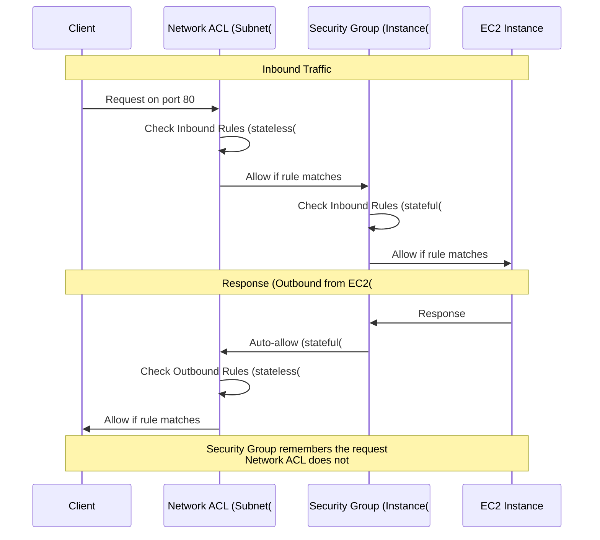
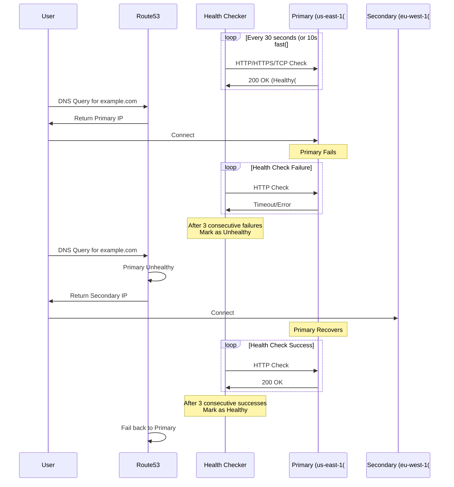
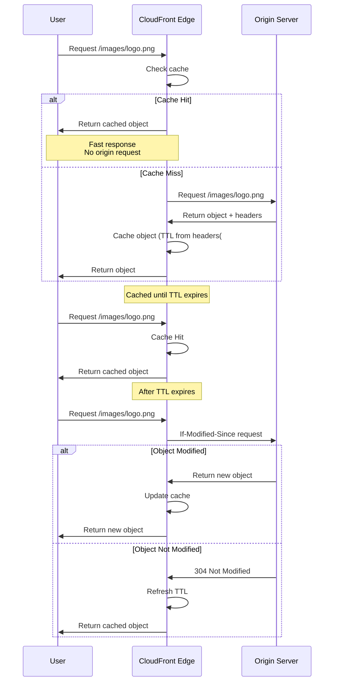

# Networking & Content Delivery - Mermaid Diagrams

## VPC Architecture

### VPC Complete Architecture

```mermaid
graph TB
    Internet["Internet[
    
    subgraph VPC_10_0_0_0_16_Group["VPC: 10.0.0.0/16"[
        IGW[Internet Gateway[
        
        subgraph Availability_Zone_A_Group["Availability Zone A"[
            PublicSubnetA["Public Subnet&lt;&lt;&lt;BR_SLASH&gt;&gt;&gt;10.0.1.0/24"[
            PrivateSubnetA["Private Subnet&lt;&lt;&lt;BR_SLASH&gt;&gt;&gt;10.0.3.0/24"[
            
            WebServerA["Web Server&lt;&lt;&lt;BR_SLASH&gt;&gt;&gt;10.0.1.10"[
            AppServerA["App Server&lt;&lt;&lt;BR_SLASH&gt;&gt;&gt;10.0.3.10"[
            
            WebServerA --> PublicSubnetA
            AppServerA --> PrivateSubnetA
        end
        
        subgraph Availability_Zone_B_Group["Availability Zone B"[
            PublicSubnetB["Public Subnet&lt;&lt;&lt;BR_SLASH&gt;&gt;&gt;10.0.2.0/24"[
            PrivateSubnetB["Private Subnet&lt;&lt;&lt;BR_SLASH&gt;&gt;&gt;10.0.4.0/24"[
            
            WebServerB["Web Server&lt;&lt;&lt;BR_SLASH&gt;&gt;&gt;10.0.2.10"[
            AppServerB["App Server&lt;&lt;&lt;BR_SLASH&gt;&gt;&gt;10.0.4.10"[
            NATGW["NAT Gateway&lt;&lt;&lt;BR_SLASH&gt;&gt;&gt;10.0.2.100"[
            
            WebServerB --> PublicSubnetB
            AppServerB --> PrivateSubnetB
            NATGW --> PublicSubnetB
        end
        
        RDS["(RDS Multi-AZ&lt;&lt;&lt;BR_SLASH&gt;&gt;&gt;Primary: AZ-A&lt;&lt;&lt;BR_SLASH&gt;&gt;&gt;Standby: AZ-B[""]
    end
    
    Internet <--> IGW
    IGW <--> PublicSubnetA
    IGW <--> PublicSubnetB
    
    PublicSubnetA -.Route.-> IGW
    PublicSubnetB -.Route.-> IGW
    
    PrivateSubnetA -.Route.-> NATGW
    PrivateSubnetB -.Route.-> NATGW
    NATGW -.Route.-> IGW
    
    AppServerA --> RDS
    AppServerB --> RDS
    
    classDef style1 fill:#FF9900
    class IGW style1
    classDef style2 fill:#569A31
    class NATGW style2
    classDef style3 fill:#146EB4
    class PublicSubnetA style3
    classDef style4 fill:#8C4FFF
    class PrivateSubnetA style4
```

### VPC Subnet CIDR Calculation

```mermaid
graph TB
    VPC[""VPC: 10.0.0.0/16&lt;&lt;&lt;BR_SLASH&gt;&gt;&gt;65,536 IP addresses"[
    
    VPC --> Subnet1["Public Subnet 1&lt;&lt;&lt;BR_SLASH&gt;&gt;&gt;10.0.1.0/24&lt;&lt;&lt;BR_SLASH&gt;&gt;&gt;256 IPs - 5 = 251 usable"[
    VPC --> Subnet2["Public Subnet 2&lt;&lt;&lt;BR_SLASH&gt;&gt;&gt;10.0.2.0/24&lt;&lt;&lt;BR_SLASH&gt;&gt;&gt;256 IPs - 5 = 251 usable"[
    VPC --> Subnet3["Private Subnet 1&lt;&lt;&lt;BR_SLASH&gt;&gt;&gt;10.0.3.0/24&lt;&lt;&lt;BR_SLASH&gt;&gt;&gt;256 IPs - 5 = 251 usable"[
    VPC --> Subnet4["Private Subnet 2&lt;&lt;&lt;BR_SLASH&gt;&gt;&gt;10.0.4.0/24&lt;&lt;&lt;BR_SLASH&gt;&gt;&gt;256 IPs - 5 = 251 usable"[
    
    Reserved["AWS Reserved IPs per Subnet:&lt;&lt;&lt;BR_SLASH&gt;&gt;&gt;10.0.1.0 - Network address&lt;&lt;&lt;BR_SLASH&gt;&gt;&gt;10.0.1.1 - VPC router&lt;&lt;&lt;BR_SLASH&gt;&gt;&gt;10.0.1.2 - DNS server&lt;&lt;&lt;BR_SLASH&gt;&gt;&gt;10.0.1.3 - Future use&lt;&lt;&lt;BR_SLASH&gt;&gt;&gt;10.0.1.255 - Broadcast not supported but reserved"[
    
    Subnet1 -.Reserves.-> Reserved
    
    classDef style1 fill:#FF9900
    class VPC style1
    classDef style2 fill:#C00
    class Reserved style2
```

### Route Table Configuration

```mermaid
graph TB
    subgraph Public_Route_Table_Group["Public Route Table"[
        PRT[Public Route Table[
        PRT --> PR1["Destination: 10.0.0.0/16&lt;&lt;&lt;BR_SLASH&gt;&gt;&gt;Target: local"[
        PRT --> PR2["Destination: 0.0.0.0/0&lt;&lt;&lt;BR_SLASH&gt;&gt;&gt;Target: igw-xxxxx"[
        
        PRT -.Associated with.-> PublicSubnets["Public Subnets&lt;&lt;&lt;BR_SLASH&gt;&gt;&gt;10.0.1.0/24&lt;&lt;&lt;BR_SLASH&gt;&gt;&gt;10.0.2.0/24"[
    end
    
    subgraph Private_Route_Table_Group["Private Route Table"[
        PrivRT[Private Route Table[
        PrivRT --> PrivR1["Destination: 10.0.0.0/16&lt;&lt;&lt;BR_SLASH&gt;&gt;&gt;Target: local"[
        PrivRT --> PrivR2["Destination: 0.0.0.0/0&lt;&lt;&lt;BR_SLASH&gt;&gt;&gt;Target: nat-xxxxx"[
        
        PrivRT -.Associated with.-> PrivateSubnets["Private Subnets&lt;&lt;&lt;BR_SLASH&gt;&gt;&gt;10.0.3.0/24&lt;&lt;&lt;BR_SLASH&gt;&gt;&gt;10.0.4.0/24"[
    end
    
    IGW["Internet Gateway&lt;&lt;&lt;BR_SLASH&gt;&gt;&gt;igw-xxxxx"[ -.Routes to.-> PR2
    NATGW["NAT Gateway&lt;&lt;&lt;BR_SLASH&gt;&gt;&gt;nat-xxxxx"[ -.Routes to.-> PrivR2
    
    classDef style1 fill:#569A31
    class PRT style1
    classDef style2 fill:#FF9900
    class PrivRT style2
```

## Security Groups vs NACLs

### Security Groups vs Network ACLs

```mermaid
graph TB
    subgraph Security_Groups_Group["Security Groups"[
        SG["Security Group&lt;&lt;&lt;BR_SLASH&gt;&gt;&gt;Instance Level&lt;&lt;&lt;BR_SLASH&gt;&gt;&gt;Stateful"[
        
        SGRules["Rules:&lt;&lt;&lt;BR_SLASH&gt;&gt;&gt;✅ Allow rules only&lt;&lt;&lt;BR_SLASH&gt;&gt;&gt;✅ Can reference other SGs&lt;&lt;&lt;BR_SLASH&gt;&gt;&gt;✅ Return traffic automatic&lt;&lt;&lt;BR_SLASH&gt;&gt;&gt;✅ Evaluate all rules&lt;&lt;&lt;BR_SLASH&gt;&gt;&gt;Default: Deny all inbound"[
        
        SGExample["Example:&lt;&lt;&lt;BR_SLASH&gt;&gt;&gt;Inbound: SSH from 10.0.0.0/16&lt;&lt;&lt;BR_SLASH&gt;&gt;&gt;Inbound: HTTP from 0.0.0.0/0&lt;&lt;&lt;BR_SLASH&gt;&gt;&gt;Outbound: All traffic allowed"[
    end
    
    subgraph Network_ACLs_Group["Network ACLs"[
        NACL["Network ACL&lt;&lt;&lt;BR_SLASH&gt;&gt;&gt;Subnet Level&lt;&lt;&lt;BR_SLASH&gt;&gt;&gt;Stateless"[
        
        NACLRules["Rules:&lt;&lt;&lt;BR_SLASH&gt;&gt;&gt;✅ Allow and Deny rules&lt;&lt;&lt;BR_SLASH&gt;&gt;&gt;✅ Process in number order&lt;&lt;&lt;BR_SLASH&gt;&gt;&gt;❌ Return traffic must be explicitly allowed&lt;&lt;&lt;BR_SLASH&gt;&gt;&gt;✅ First match wins&lt;&lt;&lt;BR_SLASH&gt;&gt;&gt;Default: Allow all"[
        
        NACLExample["Example:&lt;&lt;&lt;BR_SLASH&gt;&gt;&gt;100: Allow HTTP from 0.0.0.0/0&lt;&lt;&lt;BR_SLASH&gt;&gt;&gt;200: Allow HTTPS from 0.0.0.0/0&lt;&lt;&lt;BR_SLASH&gt;&gt;&gt;300: Deny all from 10.0.5.0/24&lt;&lt;&lt;BR_SLASH&gt;&gt;&gt;*: Deny all"[
    end
    
    Instance[EC2 Instance[ --> SG
    SG --> Subnet[Subnet[
    Subnet --> NACL
    
    classDef style1 fill:#569A31
    class SG style1
    classDef style2 fill:#FF9900
    class NACL style2
```

### Traffic Flow with SG and NACL



## VPC Connectivity

### VPC Peering

```mermaid
graph TB
    subgraph VPC_A_10_0_0_0_16_Group["VPC A: 10.0.0.0/16"[
        VPC_A["VPC A&lt;&lt;&lt;BR_SLASH&gt;&gt;&gt;us-east-1"[
        SubnetA["Subnet 10.0.1.0/24"[
        EC2_A[EC2 Instance A[
        
        SubnetA --> VPC_A
        EC2_A --> SubnetA
    end
    
    subgraph VPC_B_172_16_0_0_16_Group["VPC B: 172.16.0.0/16"[
        VPC_B["VPC B&lt;&lt;&lt;BR_SLASH&gt;&gt;&gt;us-east-1"[
        SubnetB["Subnet 172.16.1.0/24"[
        EC2_B[EC2 Instance B[
        
        SubnetB --> VPC_B
        EC2_B --> SubnetB
    end
    
    subgraph VPC_C_192_168_0_0_16_Group["VPC C: 192.168.0.0/16"[
        VPC_C["VPC C&lt;&lt;&lt;BR_SLASH&gt;&gt;&gt;eu-west-1"[
        SubnetC["Subnet 192.168.1.0/24"[
        EC2_C[EC2 Instance C[
        
        SubnetC --> VPC_C
        EC2_C --> SubnetC
    end
    
    VPC_A <-.Peering Connection.-> VPC_B
    VPC_A <-.Peering Connection.-> VPC_C
    
    Limitations["Limitations:&lt;&lt;&lt;BR_SLASH&gt;&gt;&gt;❌ No transitive peering&lt;&lt;&lt;BR_SLASH&gt;&gt;&gt;VPC C cannot access VPC B through VPC A&lt;&lt;&lt;BR_SLASH&gt;&gt;&gt;❌ CIDR must not overlap&lt;&lt;&lt;BR_SLASH&gt;&gt;&gt;✅ Cross-region supported&lt;&lt;&lt;BR_SLASH&gt;&gt;&gt;✅ Cross-account supported"[
    
    classDef style1 fill:#FF9900
    class VPC_A style1
    classDef style2 fill:#569A31
    class VPC_B style2
    classDef style3 fill:#146EB4
    class VPC_C style3
```

### Transit Gateway

```mermaid
graph TB
    TGW["Transit Gateway&lt;&lt;&lt;BR_SLASH&gt;&gt;&gt;Hub & Spoke Model&lt;&lt;&lt;BR_SLASH&gt;&gt;&gt;Regional Resource"[
    
    VPC1["VPC 1&lt;&lt;&lt;BR_SLASH&gt;&gt;&gt;10.0.0.0/16"[
    VPC2["VPC 2&lt;&lt;&lt;BR_SLASH&gt;&gt;&gt;172.16.0.0/16"[
    VPC3["VPC 3&lt;&lt;&lt;BR_SLASH&gt;&gt;&gt;192.168.0.0/16"[
    VPC4["VPC 4&lt;&lt;&lt;BR_SLASH&gt;&gt;&gt;10.1.0.0/16"[
    
    VPN["VPN Connection&lt;&lt;&lt;BR_SLASH&gt;&gt;&gt;On-Premises"[
    DX["Direct Connect&lt;&lt;&lt;BR_SLASH&gt;&gt;&gt;On-Premises"[
    
    VPC1 <--> TGW
    VPC2 <--> TGW
    VPC3 <--> TGW
    VPC4 <--> TGW
    VPN <--> TGW
    DX <--> TGW
    
    TGW_Peer["Transit Gateway&lt;&lt;&lt;BR_SLASH&gt;&gt;&gt;Another Region"[ <-.Peering.-> TGW
    
    Benefits["Benefits:&lt;&lt;&lt;BR_SLASH&gt;&gt;&gt;✅ Transitive routing&lt;&lt;&lt;BR_SLASH&gt;&gt;&gt;✅ Hub and spoke topology&lt;&lt;&lt;BR_SLASH&gt;&gt;&gt;✅ Works with VPN & Direct Connect&lt;&lt;&lt;BR_SLASH&gt;&gt;&gt;✅ Cross-region peering&lt;&lt;&lt;BR_SLASH&gt;&gt;&gt;✅ Single gateway for thousands of VPCs&lt;&lt;&lt;BR_SLASH&gt;&gt;&gt;💰 Pay per attachment per hour"[
    
    classDef style1 fill:#FF9900
    class TGW style1
    classDef style2 fill:#569A31
    class VPC1 style2
```

### VPC Endpoints

```mermaid
graph TB
    subgraph VPC_10_0_0_0_16_Group["VPC: 10.0.0.0/16"[
        subgraph Private_Subnet_Group["Private Subnet"[
            EC2["EC2 Instance&lt;&lt;&lt;BR_SLASH&gt;&gt;&gt;Private IP only&lt;&lt;&lt;BR_SLASH&gt;&gt;&gt;No internet access"[
        end
        
        subgraph VPC_Endpoints_Group["VPC Endpoints"[
            InterfaceEP["Interface Endpoint&lt;&lt;&lt;BR_SLASH&gt;&gt;&gt;ENI with Private IP&lt;&lt;&lt;BR_SLASH&gt;&gt;&gt;Powered by PrivateLink"[
            GatewayEP["Gateway Endpoint&lt;&lt;&lt;BR_SLASH&gt;&gt;&gt;Route table entry"[
        end
    end
    
    subgraph AWS_Services_Group["AWS Services"[
        S3[Amazon S3[
        DynamoDB[DynamoDB[
        SNS[SNS[
        SQS[SQS[
        Others[Other AWS Services[
    end
    
    EC2 -->|Private connection| InterfaceEP
    EC2 -->|Private connection| GatewayEP
    
    InterfaceEP -.PrivateLink.-> SNS
    InterfaceEP -.PrivateLink.-> SQS
    InterfaceEP -.PrivateLink.-> Others
    
    GatewayEP -.Free.-> S3
    GatewayEP -.Free.-> DynamoDB
    
    Comparison["Gateway Endpoint:&lt;&lt;&lt;BR_SLASH&gt;&gt;&gt;✅ S3 and DynamoDB only&lt;&lt;&lt;BR_SLASH&gt;&gt;&gt;✅ Free&lt;&lt;&lt;BR_SLASH&gt;&gt;&gt;✅ Route table entry&lt;&lt;&lt;BR_SLASH&gt;&gt;&gt;&lt;&lt;&lt;BR_SLASH&gt;&gt;&gt;Interface Endpoint:&lt;&lt;&lt;BR_SLASH&gt;&gt;&gt;✅ Most AWS services&lt;&lt;&lt;BR_SLASH&gt;&gt;&gt;💰 Pay per hour + data&lt;&lt;&lt;BR_SLASH&gt;&gt;&gt;✅ ENI in subnet&lt;&lt;&lt;BR_SLASH&gt;&gt;&gt;✅ Security groups apply"[
    
    classDef style1 fill:#FF9900
    class InterfaceEP style1
    classDef style2 fill:#569A31
    class GatewayEP style2
```

## Route 53

### Route 53 Routing Policies

```mermaid
graph TB
    Route53["Route 53&lt;&lt;&lt;BR_SLASH&gt;&gt;&gt;DNS Service"[
    
    Route53 --> Simple["Simple Routing&lt;&lt;&lt;BR_SLASH&gt;&gt;&gt;Single resource&lt;&lt;&lt;BR_SLASH&gt;&gt;&gt;No health checks"[
    Route53 --> Weighted["Weighted Routing&lt;&lt;&lt;BR_SLASH&gt;&gt;&gt;% traffic distribution&lt;&lt;&lt;BR_SLASH&gt;&gt;&gt;A/B testing, gradual deployment"[
    Route53 --> Latency["Latency Routing&lt;&lt;&lt;BR_SLASH&gt;&gt;&gt;Lowest latency&lt;&lt;&lt;BR_SLASH&gt;&gt;&gt;Based on user location"[
    Route53 --> Failover["Failover Routing&lt;&lt;&lt;BR_SLASH&gt;&gt;&gt;Active-Passive&lt;&lt;&lt;BR_SLASH&gt;&gt;&gt;Health check based"[
    Route53 --> Geolocation["Geolocation Routing&lt;&lt;&lt;BR_SLASH&gt;&gt;&gt;Based on user location&lt;&lt;&lt;BR_SLASH&gt;&gt;&gt;Country/continent"[
    Route53 --> Geoproximity["Geoproximity Routing&lt;&lt;&lt;BR_SLASH&gt;&gt;&gt;Route based on resource location&lt;&lt;&lt;BR_SLASH&gt;&gt;&gt;Bias adjustment"[
    Route53 --> Multivalue["Multi-Value Routing&lt;&lt;&lt;BR_SLASH&gt;&gt;&gt;Multiple resources&lt;&lt;&lt;BR_SLASH&gt;&gt;&gt;Up to 8 healthy records"[
    
    Simple --> Example1["example.com -&gt; 1.2.3.4"[
    Weighted --> Example2["70% -&gt; us-east-1&lt;&lt;&lt;BR_SLASH&gt;&gt;&gt;30% -&gt; eu-west-1"[
    Latency --> Example3["EU users -&gt; eu-west-1&lt;&lt;&lt;BR_SLASH&gt;&gt;&gt;US users -&gt; us-east-1"[
    Failover --> Example4["Primary: us-east-1&lt;&lt;&lt;BR_SLASH&gt;&gt;&gt;Secondary: eu-west-1"[
    
    classDef style1 fill:#8C4FFF
    class Route53 style1
    classDef style2 fill:#C00
    class Failover style2
    classDef style3 fill:#569A31
    class Latency style3
```

### Route 53 Health Checks and Failover



## CloudFront

### CloudFront Distribution Architecture

```mermaid
graph TB
    subgraph Users_Worldwide_Group["Users Worldwide"[
        User1[User in NYC[
        User2[User in London[
        User3[User in Tokyo[
        User4[User in Sydney[
    end
    
    subgraph CloudFront_Edge_Locations_Group["CloudFront Edge Locations"[
        Edge1["Edge Location&lt;&lt;&lt;BR_SLASH&gt;&gt;&gt;New York&lt;&lt;&lt;BR_SLASH&gt;&gt;&gt;Cache"[
        Edge2["Edge Location&lt;&lt;&lt;BR_SLASH&gt;&gt;&gt;London&lt;&lt;&lt;BR_SLASH&gt;&gt;&gt;Cache"[
        Edge3["Edge Location&lt;&lt;&lt;BR_SLASH&gt;&gt;&gt;Tokyo&lt;&lt;&lt;BR_SLASH&gt;&gt;&gt;Cache"[
        Edge4["Edge Location&lt;&lt;&lt;BR_SLASH&gt;&gt;&gt;Sydney&lt;&lt;&lt;BR_SLASH&gt;&gt;&gt;Cache"[
    end
    
    subgraph Origin_Group["Origin"[
        S3["S3 Bucket&lt;&lt;&lt;BR_SLASH&gt;&gt;&gt;us-east-1"[
        ALB["Application&lt;&lt;&lt;BR_SLASH&gt;&gt;&gt;Load Balancer"[
        Custom["Custom Origin&lt;&lt;&lt;BR_SLASH&gt;&gt;&gt;HTTP Server"[
    end
    
    User1 --> Edge1
    User2 --> Edge2
    User3 --> Edge3
    User4 --> Edge4
    
    Edge1 -.Cache Miss.-> S3
    Edge1 -.Cache Hit.-> User1
    
    Edge2 -.Cache Miss.-> ALB
    Edge3 -.Cache Miss.-> Custom
    
    OAI["Origin Access Identity&lt;&lt;&lt;BR_SLASH&gt;&gt;&gt;Restrict S3 to CloudFront only"[ -.Secures.-> S3
    
    Features["Features:&lt;&lt;&lt;BR_SLASH&gt;&gt;&gt;✅ Global CDN with 400+ edge locations&lt;&lt;&lt;BR_SLASH&gt;&gt;&gt;✅ DDoS protection&lt;&lt;&lt;BR_SLASH&gt;&gt;&gt;✅ SSL/TLS support&lt;&lt;&lt;BR_SLASH&gt;&gt;&gt;✅ Geo-restriction&lt;&lt;&lt;BR_SLASH&gt;&gt;&gt;✅ Caching at edge&lt;&lt;&lt;BR_SLASH&gt;&gt;&gt;✅ Compress objects automatically"[
    
    classDef style1 fill:#146EB4
    class Edge1 style1
    classDef style2 fill:#569A31
    class S3 style2
    classDef style3 fill:#FF9900
    class OAI style3
```

### CloudFront Cache Behavior



## Hybrid Connectivity

### VPN Connection

```mermaid
graph TB
    subgraph On_Premises_Data_Center_Group["On-Premises Data Center"[
        OnPrem["Corporate Network&lt;&lt;&lt;BR_SLASH&gt;&gt;&gt;192.168.0.0/16"[
        CGW["Customer Gateway&lt;&lt;&lt;BR_SLASH&gt;&gt;&gt;Physical device&lt;&lt;&lt;BR_SLASH&gt;&gt;&gt;Public IP: 203.0.113.1"[
        
        OnPrem --> CGW
    end
    
    Internet[Internet[
    
    subgraph AWS_Cloud_Group["AWS Cloud"[
        VGW["Virtual Private Gateway&lt;&lt;&lt;BR_SLASH&gt;&gt;&gt;VPN endpoint on AWS side"[
        
        subgraph VPC_10_0_0_0_16_Group["VPC: 10.0.0.0/16"[
            PrivateSubnet[Private Subnet[
            EC2[EC2 Instances[
            RDS[(RDS Database["]
            
            PrivateSubnet --> EC2
            PrivateSubnet --> RDS
        end
        
        VGW --> PrivateSubnet
    end
    
    CGW <-.VPN Tunnel 1<br/>IPSec encrypted.-> Internet
    CGW <-.VPN Tunnel 2<br/>IPSec encrypted.-> Internet
    Internet <-.VPN Tunnels.-> VGW
    
    Features["Features:&lt;&lt;&lt;BR_SLASH&gt;&gt;&gt;✅ Encrypted connection&lt;&lt;&lt;BR_SLASH&gt;&gt;&gt;✅ Goes over internet&lt;&lt;&lt;BR_SLASH&gt;&gt;&gt;✅ Quick to setup&lt;&lt;&lt;BR_SLASH&gt;&gt;&gt;✅ Two tunnels for HA&lt;&lt;&lt;BR_SLASH&gt;&gt;&gt;⚠️ Bandwidth limited by internet&lt;&lt;&lt;BR_SLASH&gt;&gt;&gt;⚠️ Variable latency"[
    
    classDef style1 fill:#FF9900
    class VGW style1
    classDef style2 fill:#569A31
    class CGW style2
```

### Direct Connect

```mermaid
graph TB
    subgraph On_Premises_Group["On-Premises"[
        OnPrem[Corporate Data Center[
        Router[Customer Router[
        
        OnPrem --> Router
    end
    
    subgraph AWS_Direct_Connect_Location_Group["AWS Direct Connect Location"[
        DXLocation["Direct Connect Location&lt;&lt;&lt;BR_SLASH&gt;&gt;&gt;Co-location facility"[
        DXRouter["AWS Direct Connect&lt;&lt;&lt;BR_SLASH&gt;&gt;&gt;Router"[
        
        DXLocation --> DXRouter
    end
    
    subgraph AWS_Region_Group["AWS Region"[
        VGW[Virtual Private Gateway[
        
        subgraph VPC_Group["VPC"[
            Resources[AWS Resources[
        end
        
        VGW --> Resources
    end
    
    Router <-.Dedicated Private<br/>Connection.-> DXLocation
    DXRouter <-.AWS Private<br/>Network.-> VGW
    
    PublicVIF["Public VIF&lt;&lt;&lt;BR_SLASH&gt;&gt;&gt;Access public AWS services&lt;&lt;&lt;BR_SLASH&gt;&gt;&gt;S3, DynamoDB"[ -.-> DXRouter
    PrivateVIF["Private VIF&lt;&lt;&lt;BR_SLASH&gt;&gt;&gt;Access VPC resources"[ -.-> VGW
    
    Features["Features:&lt;&lt;&lt;BR_SLASH&gt;&gt;&gt;✅ Dedicated network connection&lt;&lt;&lt;BR_SLASH&gt;&gt;&gt;✅ Consistent network performance&lt;&lt;&lt;BR_SLASH&gt;&gt;&gt;✅ Reduced bandwidth costs&lt;&lt;&lt;BR_SLASH&gt;&gt;&gt;✅ 1 Gbps or 10 Gbps&lt;&lt;&lt;BR_SLASH&gt;&gt;&gt;⚠️ Takes weeks/months to set up&lt;&lt;&lt;BR_SLASH&gt;&gt;&gt;💰 More expensive than VPN"[
    
    Backup["Backup VPN Connection&lt;&lt;&lt;BR_SLASH&gt;&gt;&gt;over Internet"[ -.Failover.-> VGW
    
    classDef style1 fill:#FF9900
    class DXRouter style1
    classDef style2 fill:#569A31
    class VGW style2
```

### AWS Global Accelerator

```mermaid
graph TB
    subgraph Users_Worldwide_Group["Users Worldwide"[
        User1[User in Asia[
        User2[User in Europe[
        User3[User in Americas[
    end
    
    subgraph AWS_Global_Accelerator_Group["AWS Global Accelerator"[
        AnyCast["2 Static Anycast IPs&lt;&lt;&lt;BR_SLASH&gt;&gt;&gt;Global edge network"[
        
        Edge1["Edge Location&lt;&lt;&lt;BR_SLASH&gt;&gt;&gt;Asia"[
        Edge2["Edge Location&lt;&lt;&lt;BR_SLASH&gt;&gt;&gt;Europe"[
        Edge3["Edge Location&lt;&lt;&lt;BR_SLASH&gt;&gt;&gt;Americas"[
        
        AnyCast --> Edge1
        AnyCast --> Edge2
        AnyCast --> Edge3
    end
    
    subgraph AWS_Regions_Group["AWS Regions"[
        subgraph us_east_1_Group["us-east-1"[
            ALB1["Application&lt;&lt;&lt;BR_SLASH&gt;&gt;&gt;Load Balancer"[
            EC2_1[EC2 Instances[
            ALB1 --> EC2_1
        end
        
        subgraph eu_west_1_Group["eu-west-1"[
            ALB2["Application&lt;&lt;&lt;BR_SLASH&gt;&gt;&gt;Load Balancer"[
            EC2_2[EC2 Instances[
            ALB2 --> EC2_2
        end
    end
    
    User1 --> AnyCast
    User2 --> AnyCast
    User3 --> AnyCast
    
    Edge1 -.AWS Private<br/>Network.-> ALB1
    Edge2 -.AWS Private<br/>Network.-> ALB2
    Edge3 -.AWS Private<br/>Network.-> ALB1
    
    HealthCheck["Health Checks&lt;&lt;&lt;BR_SLASH&gt;&gt;&gt;Automatic failover"[ -.Monitor.-> ALB1
    HealthCheck -.Monitor.-> ALB2
    
    Features["Features:&lt;&lt;&lt;BR_SLASH&gt;&gt;&gt;✅ 2 static anycast IPs&lt;&lt;&lt;BR_SLASH&gt;&gt;&gt;✅ Uses AWS global network&lt;&lt;&lt;BR_SLASH&gt;&gt;&gt;✅ Faster than internet&lt;&lt;&lt;BR_SLASH&gt;&gt;&gt;✅ Health checks & failover&lt;&lt;&lt;BR_SLASH&gt;&gt;&gt;✅ DDoS protection with Shield&lt;&lt;&lt;BR_SLASH&gt;&gt;&gt;Use: Gaming, IoT, VoIP, non-HTTP"[
    
    VsCloudFront["vs CloudFront:&lt;&lt;&lt;BR_SLASH&gt;&gt;&gt;CloudFront: Cacheable content, HTTP&lt;&lt;&lt;BR_SLASH&gt;&gt;&gt;Global Accelerator: TCP/UDP, static IPs, global performance"[
    
    classDef style1 fill:#FF9900
    class AnyCast style1
    classDef style2 fill:#146EB4
    class Edge1 style2
```

## Network Performance

### Enhanced Networking

```mermaid
graph TB
    EC2[EC2 Instance Types[
    
    EC2 --> ENA["Elastic Network Adapter ENA&lt;&lt;&lt;BR_SLASH&gt;&gt;&gt;Up to 100 Gbps"[
    EC2 --> IntelVF["Intel 82599 VF&lt;&lt;&lt;BR_SLASH&gt;&gt;&gt;Up to 10 Gbps&lt;&lt;&lt;BR_SLASH&gt;&gt;&gt;Legacy"[
    
    ENA --> Features["Features:&lt;&lt;&lt;BR_SLASH&gt;&gt;&gt;✅ Higher bandwidth&lt;&lt;&lt;BR_SLASH&gt;&gt;&gt;✅ Higher PPS (packets per second[<br/>✅ Lower latency<br/>✅ Lower jitter<br/>✅ No additional cost"]
    
    ENA --> UseWith["Supported:&lt;&lt;&lt;BR_SLASH&gt;&gt;&gt;• Most current gen instances&lt;&lt;&lt;BR_SLASH&gt;&gt;&gt;• Some previous gen&lt;&lt;&lt;BR_SLASH&gt;&gt;&gt;• Enabled by default on modern AMIs"[
    
    PlacementGroup[Cluster Placement Group[ -.Combine with.-> ENA
    
    EFA["Elastic Fabric Adapter&lt;&lt;&lt;BR_SLASH&gt;&gt;&gt;HPC & ML workloads&lt;&lt;&lt;BR_SLASH&gt;&gt;&gt;OS-bypass for ultra-low latency"[ --> ENA
    
    classDef style1 fill:#FF9900
    class ENA style1
    classDef style2 fill:#569A31
    class EFA style2
```

