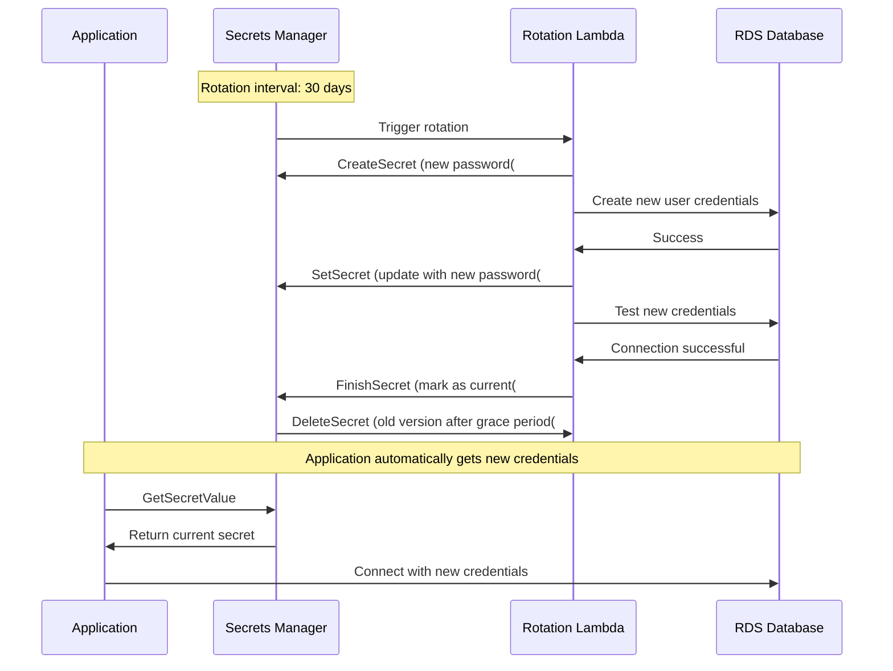
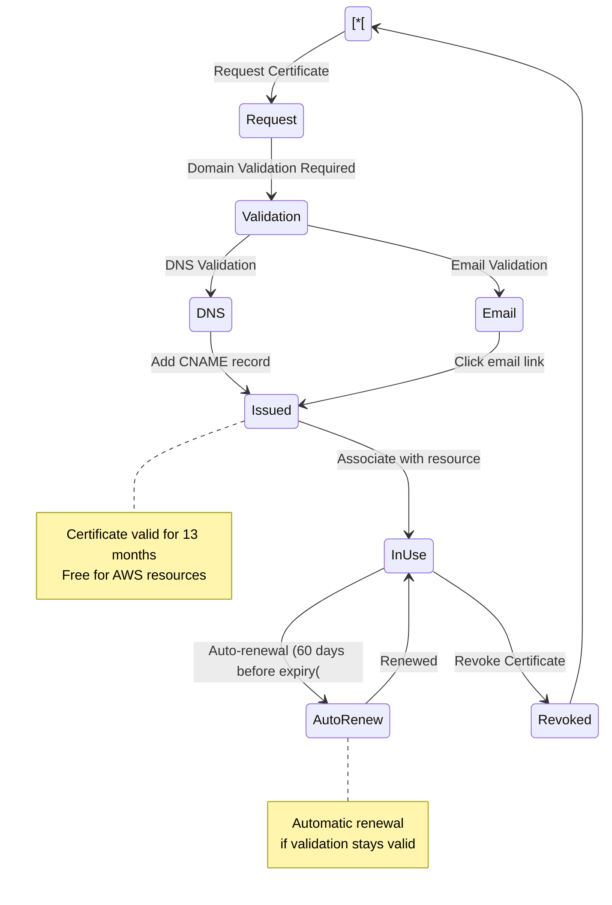
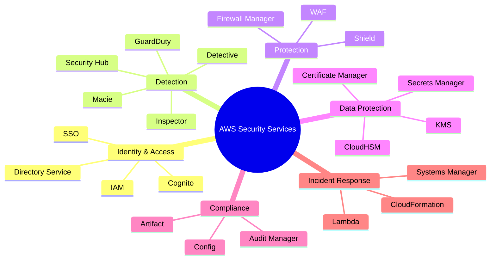

# Security & Compliance - Mermaid Diagrams

## AWS KMS (Key Management Service)

### KMS Architecture

```mermaid
graph TB
    subgraph KMS_Service_Group["KMS Service"[
        CMK["Customer Master Key&lt;&lt;&lt;BR_SLASH&gt;&gt;&gt;Never leaves KMS&lt;&lt;&lt;BR_SLASH&gt;&gt;&gt;FIPS 140-2 Level 2"[
        
        Symmetric["Symmetric CMK&lt;&lt;&lt;BR_SLASH&gt;&gt;&gt;AES-256&lt;&lt;&lt;BR_SLASH&gt;&gt;&gt;Same key encrypt/decrypt"[
        Asymmetric["Asymmetric CMK&lt;&lt;&lt;BR_SLASH&gt;&gt;&gt;RSA or ECC&lt;&lt;&lt;BR_SLASH&gt;&gt;&gt;Public + Private keys"[
        
        CMK --> Symmetric
        CMK --> Asymmetric
    end
    
    subgraph Key_Types_Group["Key Types"[
        AWSManaged["AWS Managed Keys&lt;&lt;&lt;BR_SLASH&gt;&gt;&gt;aws/service-name&lt;&lt;&lt;BR_SLASH&gt;&gt;&gt;Free, Auto-rotate yearly"[
        CustomerManaged["Customer Managed Keys&lt;&lt;&lt;BR_SLASH&gt;&gt;&gt;$1/month&lt;&lt;&lt;BR_SLASH&gt;&gt;&gt;Optional rotation"[
        AWSOwned["AWS Owned Keys&lt;&lt;&lt;BR_SLASH&gt;&gt;&gt;Shared across accounts&lt;&lt;&lt;BR_SLASH&gt;&gt;&gt;Free, Not visible"[
    end
    
    subgraph Applications_Group["Applications"[
        App[Application[
        S3[S3[
        EBS[EBS[
        RDS[RDS[
    end
    
    App -->|API Call| Symmetric
    S3 --> AWSManaged
    EBS --> CustomerManaged
    RDS --> CustomerManaged
    
    CloudTrail["CloudTrail&lt;&lt;&lt;BR_SLASH&gt;&gt;&gt;Audit all key usage"[ -.Logs.-> CMK
    
    classDef style1 fill:#FF9900
    class CMK style1
    classDef style2 fill:#569A31
    class Symmetric style2
```

### KMS Envelope Encryption

```mermaid
sequenceDiagram
    participant App as Application
    participant KMS as AWS KMS
    participant S3 as Amazon S3
    
    Note over App,S3: Encrypt Large File (&gt; 4 KB(
    
    App->>KMS: GenerateDataKey(CMK(
    KMS->>KMS: Generate Data Key
    KMS->>App: Return Plaintext Data Key + Encrypted Data Key
    
    App->>App: Encrypt file with Plaintext Data Key
    App->>App: Delete Plaintext Data Key from memory
    App->>S3: Upload Encrypted File + Encrypted Data Key
    
    Note over App,S3: Decrypt File
    
    S3->>App: Download Encrypted File + Encrypted Data Key
    App->>KMS: Decrypt(Encrypted Data Key(
    KMS->>App: Return Plaintext Data Key
    App->>App: Decrypt file with Plaintext Data Key
    App->>App: Delete Plaintext Data Key from memory
    
    Note over App,S3: Benefits: Encrypt unlimited data size, Network overhead only for small Data Key
    
```

### KMS Key Policies

```mermaid
graph TB
    Request[API Request to use KMS Key[
    
    Request --> KeyPolicy{"Key Policy&lt;&lt;&lt;BR_SLASH&gt;&gt;&gt;Allows?"{
    
    KeyPolicy -->|No| Deny1["❌ DENY"[
    KeyPolicy -->|Yes| IAMPolicy{"IAM Policy&lt;&lt;&lt;BR_SLASH&gt;&gt;&gt;Allows?"{
    
    IAMPolicy -->|No| Deny2["❌ DENY"[
    IAMPolicy -->|Yes| Grant{"Grant&lt;&lt;&lt;BR_SLASH&gt;&gt;&gt;Allows?"{
    
    Grant -->|Not Required| Allow["✅ ALLOW"[
    Grant -->|Yes| Allow
    Grant -->|No| Deny3["❌ DENY"[
    
    DefaultPolicy["Default Key Policy:&lt;&lt;&lt;BR_SLASH&gt;&gt;&gt;Gives root user full access&lt;&lt;&lt;BR_SLASH&gt;&gt;&gt;Enables IAM policies"[
    
    CustomPolicy["Custom Key Policy:&lt;&lt;&lt;BR_SLASH&gt;&gt;&gt;Specific users/roles&lt;&lt;&lt;BR_SLASH&gt;&gt;&gt;Cross-account access&lt;&lt;&lt;BR_SLASH&gt;&gt;&gt;Key administrators&lt;&lt;&lt;BR_SLASH&gt;&gt;&gt;Key users"[
    
    KeyPolicy -.Can be.-> DefaultPolicy
    KeyPolicy -.Can be.-> CustomPolicy
    
    classDef style1 fill:#569A31
    class Allow style1
    classDef style2 fill:#C00
    class Deny1 style2
    classDef style3 fill:#C00
    class Deny2 style3
    classDef style4 fill:#C00
    class Deny3 style4
    classDef style5 fill:#FF9900
    class KeyPolicy style5
```

## CloudHSM

### CloudHSM vs KMS

```mermaid
graph TB
    subgraph AWS_KMS_Group["AWS KMS"[
        KMS[KMS[
        KMS_Features["• Multi-tenant&lt;&lt;&lt;BR_SLASH&gt;&gt;&gt;• AWS manages hardware&lt;&lt;&lt;BR_SLASH&gt;&gt;&gt;• FIPS 140-2 Level 2&lt;&lt;&lt;BR_SLASH&gt;&gt;&gt;• Automatic backups&lt;&lt;&lt;BR_SLASH&gt;&gt;&gt;• Free tier available&lt;&lt;&lt;BR_SLASH&gt;&gt;&gt;• Integrates with AWS services"[
    end
    
    subgraph AWS_CloudHSM_Group["AWS CloudHSM"[
        HSM[CloudHSM[
        HSM_Features["• Single-tenant dedicated HSM&lt;&lt;&lt;BR_SLASH&gt;&gt;&gt;• You manage keys&lt;&lt;&lt;BR_SLASH&gt;&gt;&gt;• FIPS 140-2 Level 3&lt;&lt;&lt;BR_SLASH&gt;&gt;&gt;• No free tier&lt;&lt;&lt;BR_SLASH&gt;&gt;&gt;• Industry-standard APIs&lt;&lt;&lt;BR_SLASH&gt;&gt;&gt;• PKCS#11, JCE, CNG"[
    end
    
    subgraph Use_Cases_Group["Use Cases"[
        KMS --> KMS_Use["• Most AWS workloads&lt;&lt;&lt;BR_SLASH&gt;&gt;&gt;• S3, EBS encryption&lt;&lt;&lt;BR_SLASH&gt;&gt;&gt;• Simple key management&lt;&lt;&lt;BR_SLASH&gt;&gt;&gt;• Cost-effective"[
        
        HSM --> HSM_Use["• Contractual requirements&lt;&lt;&lt;BR_SLASH&gt;&gt;&gt;• Regulatory compliance&lt;&lt;&lt;BR_SLASH&gt;&gt;&gt;• FIPS 140-2 Level 3&lt;&lt;&lt;BR_SLASH&gt;&gt;&gt;• Custom key store for KMS"[
    end
    
    classDef style1 fill:#FF9900
    class KMS style1
    classDef style2 fill:#569A31
    class HSM style2
```

## Secrets Manager vs Parameter Store

### Secrets Manager and Parameter Store Comparison

```mermaid
graph TB
    subgraph AWS_Secrets_Manager_Group["AWS Secrets Manager"[
        SM[Secrets Manager[
        SM_Features["Features:&lt;&lt;&lt;BR_SLASH&gt;&gt;&gt;💰 $0.40/secret/month + API calls&lt;&lt;&lt;BR_SLASH&gt;&gt;&gt;🔄 Automatic rotation&lt;&lt;&lt;BR_SLASH&gt;&gt;&gt;🔐 Encrypt with KMS&lt;&lt;&lt;BR_SLASH&gt;&gt;&gt;🎯 RDS integration&lt;&lt;&lt;BR_SLASH&gt;&gt;&gt;📊 Cross-account access&lt;&lt;&lt;BR_SLASH&gt;&gt;&gt;⏱️ Rotation: Lambda function"[
        
        SM_Use["Use Cases:&lt;&lt;&lt;BR_SLASH&gt;&gt;&gt;• Database credentials&lt;&lt;&lt;BR_SLASH&gt;&gt;&gt;• API keys requiring rotation&lt;&lt;&lt;BR_SLASH&gt;&gt;&gt;• OAuth tokens&lt;&lt;&lt;BR_SLASH&gt;&gt;&gt;• RDS password rotation"[
    end
    
    subgraph Systems_Manager_Parameter_Store_Group["Systems Manager Parameter Store"[
        PS[Parameter Store[
        
        Standard["Standard Parameters&lt;&lt;&lt;BR_SLASH&gt;&gt;&gt;✅ Free&lt;&lt;&lt;BR_SLASH&gt;&gt;&gt;📏 4 KB limit&lt;&lt;&lt;BR_SLASH&gt;&gt;&gt;📊 10,000 parameters&lt;&lt;&lt;BR_SLASH&gt;&gt;&gt;⚠️ No rotation"[
        
        Advanced["Advanced Parameters&lt;&lt;&lt;BR_SLASH&gt;&gt;&gt;💰 $0.05/parameter/month&lt;&lt;&lt;BR_SLASH&gt;&gt;&gt;📏 8 KB limit&lt;&lt;&lt;BR_SLASH&gt;&gt;&gt;📊 100,000 parameters&lt;&lt;&lt;BR_SLASH&gt;&gt;&gt;📋 Parameter policies&lt;&lt;&lt;BR_SLASH&gt;&gt;&gt;⏱️ Manual rotation"[
        
        PS --> Standard
        PS --> Advanced
        
        PS_Use["Use Cases:&lt;&lt;&lt;BR_SLASH&gt;&gt;&gt;• Configuration data&lt;&lt;&lt;BR_SLASH&gt;&gt;&gt;• License keys&lt;&lt;&lt;BR_SLASH&gt;&gt;&gt;• AMI IDs&lt;&lt;&lt;BR_SLASH&gt;&gt;&gt;• Application parameters&lt;&lt;&lt;BR_SLASH&gt;&gt;&gt;• Cost-sensitive scenarios"[
    end
    
    Both["Both Support:&lt;&lt;&lt;BR_SLASH&gt;&gt;&gt;✅ KMS encryption&lt;&lt;&lt;BR_SLASH&gt;&gt;&gt;✅ CloudFormation&lt;&lt;&lt;BR_SLASH&gt;&gt;&gt;✅ IAM permissions&lt;&lt;&lt;BR_SLASH&gt;&gt;&gt;✅ CloudWatch Events"[
    
    SM -.Features.-> SM_Features
    SM -.Use.-> SM_Use
    PS -.Use.-> PS_Use
    
    classDef style1 fill:#FF9900
    class SM style1
    classDef style2 fill:#569A31
    class PS style2
```

### Secrets Manager Rotation



## AWS WAF & Shield

### AWS WAF Architecture

```mermaid
graph TB
    Internet[Internet Traffic[
    
    subgraph AWS_WAF_Web_ACL_Group["AWS WAF Web ACL"[
        WAF["AWS WAF&lt;&lt;&lt;BR_SLASH&gt;&gt;&gt;Web Application Firewall"[
        
        Rules[WAF Rules[
        
        Rules --> Rule1["SQL Injection&lt;&lt;&lt;BR_SLASH&gt;&gt;&gt;Protection"[
        Rules --> Rule2["Cross-Site Scripting&lt;&lt;&lt;BR_SLASH&gt;&gt;&gt;XSS Protection"[
        Rules --> Rule3["Rate-based Rules&lt;&lt;&lt;BR_SLASH&gt;&gt;&gt;DDoS mitigation"[
        Rules --> Rule4["Geo-blocking&lt;&lt;&lt;BR_SLASH&gt;&gt;&gt;Country restrictions"[
        Rules --> Rule5["IP Reputation Lists&lt;&lt;&lt;BR_SLASH&gt;&gt;&gt;Known bad IPs"[
        Rules --> Rule6["Custom Rules&lt;&lt;&lt;BR_SLASH&gt;&gt;&gt;Size constraints, regex"[
    end
    
    subgraph Protected_Resources_Group["Protected Resources"[
        CloudFront["CloudFront&lt;&lt;&lt;BR_SLASH&gt;&gt;&gt;Distribution"[
        ALB["Application&lt;&lt;&lt;BR_SLASH&gt;&gt;&gt;Load Balancer"[
        API[API Gateway[
        AppSync[AWS AppSync[
    end
    
    Internet --> WAF
    WAF --> Rules
    
    Rules -->|Allow| CloudFront
    Rules -->|Allow| ALB
    Rules -->|Allow| API
    Rules -->|Allow| AppSync
    Rules -->|Block| Blocked["❌ Blocked Traffic"[
    
    ManagedRules["AWS Managed Rules&lt;&lt;&lt;BR_SLASH&gt;&gt;&gt;Pre-configured rule sets&lt;&lt;&lt;BR_SLASH&gt;&gt;&gt;OWASP Top 10"[
    
    WAF -.Can use.-> ManagedRules
    
    classDef style1 fill:#FF9900
    class WAF style1
    classDef style2 fill:#C00
    class Blocked style2
```

### AWS Shield Standard vs Advanced

```mermaid
graph TB
    Shield["AWS Shield&lt;&lt;&lt;BR_SLASH&gt;&gt;&gt;DDoS Protection"[
    
    Shield --> Standard["Shield Standard&lt;&lt;&lt;BR_SLASH&gt;&gt;&gt;✅ FREE&lt;&lt;&lt;BR_SLASH&gt;&gt;&gt;✅ Automatic&lt;&lt;&lt;BR_SLASH&gt;&gt;&gt;✅ Layer 3/4 protection&lt;&lt;&lt;BR_SLASH&gt;&gt;&gt;✅ All AWS customers"[
    
    Shield --> Advanced["Shield Advanced&lt;&lt;&lt;BR_SLASH&gt;&gt;&gt;💰 $3,000/month&lt;&lt;&lt;BR_SLASH&gt;&gt;&gt;✅ Layer 3/4/7 protection&lt;&lt;&lt;BR_SLASH&gt;&gt;&gt;✅ 24/7 DDoS Response Team&lt;&lt;&lt;BR_SLASH&gt;&gt;&gt;✅ Cost protection&lt;&lt;&lt;BR_SLASH&gt;&gt;&gt;✅ Real-time notifications"[
    
    subgraph Standard_Protection_Group["Standard Protection"[
        Standard --> S_Features["• SYN/UDP floods&lt;&lt;&lt;BR_SLASH&gt;&gt;&gt;• Reflection attacks&lt;&lt;&lt;BR_SLASH&gt;&gt;&gt;• Network layer DDoS&lt;&lt;&lt;BR_SLASH&gt;&gt;&gt;• Automatic detection"[
    end
    
    subgraph Advanced_Protection_Group["Advanced Protection"[
        Advanced --> A_Features["• Enhanced detection&lt;&lt;&lt;BR_SLASH&gt;&gt;&gt;• Advanced reporting&lt;&lt;&lt;BR_SLASH&gt;&gt;&gt;• CloudFront, Route 53, ELB&lt;&lt;&lt;BR_SLASH&gt;&gt;&gt;• Global Threat Dashboard&lt;&lt;&lt;BR_SLASH&gt;&gt;&gt;• WAF included at no cost"[
        
        Advanced --> DRT["AWS DDoS Response Team&lt;&lt;&lt;BR_SLASH&gt;&gt;&gt;24/7 access&lt;&lt;&lt;BR_SLASH&gt;&gt;&gt;Incident response"[
    end
    
    Use["Use Shield Advanced when:&lt;&lt;&lt;BR_SLASH&gt;&gt;&gt;• High-value applications&lt;&lt;&lt;BR_SLASH&gt;&gt;&gt;• Potential large-scale DDoS&lt;&lt;&lt;BR_SLASH&gt;&gt;&gt;• Need expert support&lt;&lt;&lt;BR_SLASH&gt;&gt;&gt;• Want cost protection"[
    
    classDef style1 fill:#569A31
    class Standard style1
    classDef style2 fill:#FF9900
    class Advanced style2
```

## Amazon GuardDuty

### GuardDuty Architecture

```mermaid
graph TB
    subgraph Data_Sources_Group["Data Sources"[
        VPCFlow[VPC Flow Logs[
        CloudTrailLogs[CloudTrail Events[
        DNSLogs[DNS Logs[
        K8sLogs[Kubernetes Audit Logs[
        S3Logs[S3 Data Events[
    end
    
    subgraph GuardDuty_Group["GuardDuty"[
        GD["Amazon GuardDuty&lt;&lt;&lt;BR_SLASH&gt;&gt;&gt;Intelligent Threat Detection&lt;&lt;&lt;BR_SLASH&gt;&gt;&gt;Machine Learning"[
        
        Analysis["Threat Analysis&lt;&lt;&lt;BR_SLASH&gt;&gt;&gt;• Anomaly detection&lt;&lt;&lt;BR_SLASH&gt;&gt;&gt;• ML algorithms&lt;&lt;&lt;BR_SLASH&gt;&gt;&gt;• Threat intelligence feeds&lt;&lt;&lt;BR_SLASH&gt;&gt;&gt;• Known malicious IPs"[
        
        GD --> Analysis
    end
    
    subgraph Findings_Group["Findings"[
        Finding1["Compromised EC2 Instance&lt;&lt;&lt;BR_SLASH&gt;&gt;&gt;Bitcoin mining"[
        Finding2[Unauthorized API Calls[
        Finding3[Reconnaissance Activity[
        Finding4[Suspicious DNS queries[
        Finding5[Unusual S3 access[
    end
    
    subgraph Actions_Group["Actions"[
        EventBridge[EventBridge Rules[
        SNS[SNS Notifications[
        Lambda[Lambda Remediation[
        SecurityHub[Security Hub Integration[
    end
    
    VPCFlow --> GD
    CloudTrailLogs --> GD
    DNSLogs --> GD
    K8sLogs --> GD
    S3Logs --> GD
    
    Analysis --> Finding1
    Analysis --> Finding2
    Analysis --> Finding3
    Analysis --> Finding4
    Analysis --> Finding5
    
    Finding1 --> EventBridge
    Finding2 --> EventBridge
    
    EventBridge --> SNS
    EventBridge --> Lambda
    EventBridge --> SecurityHub
    
    Features["Features:&lt;&lt;&lt;BR_SLASH&gt;&gt;&gt;✅ 30-day free trial&lt;&lt;&lt;BR_SLASH&gt;&gt;&gt;✅ Continuous monitoring&lt;&lt;&lt;BR_SLASH&gt;&gt;&gt;✅ No agents required&lt;&lt;&lt;BR_SLASH&gt;&gt;&gt;✅ Low overhead&lt;&lt;&lt;BR_SLASH&gt;&gt;&gt;💰 Pay per million events analyzed"[
    
    classDef style1 fill:#FF9900
    class GD style1
    classDef style2 fill:#569A31
    class Analysis style2
```

## Amazon Inspector

### Inspector Assessment

```mermaid
graph TB
    subgraph Resources_Group["Resources to Scan"[
        EC2[EC2 Instances[
        ECR[ECR Container Images[
        Lambda[Lambda Functions[
    end
    
    subgraph Inspector_Group["Amazon Inspector"[
        Inspector["Amazon Inspector&lt;&lt;&lt;BR_SLASH&gt;&gt;&gt;Automated Security Assessment"[
        
        Scans[Continuous Scans[
        
        CVE["CVE Detection&lt;&lt;&lt;BR_SLASH&gt;&gt;&gt;Common Vulnerabilities&lt;&lt;&lt;BR_SLASH&gt;&gt;&gt;and Exposures"[
        Network["Network Reachability&lt;&lt;&lt;BR_SLASH&gt;&gt;&gt;Analysis"[
        Package["Software package&lt;&lt;&lt;BR_SLASH&gt;&gt;&gt;vulnerabilities"[
        
        Inspector --> Scans
        Scans --> CVE
        Scans --> Network
        Scans --> Package
    end
    
    subgraph Findings_Group["Risk Findings"[
        Critical[Critical Vulnerabilities[
        High[High Risk[
        Medium[Medium Risk[
        Low[Low Risk[
    end
    
    subgraph Integration_Group["Integration & Remediation"[
        SecurityHub[Security Hub[
        EventBridge[EventBridge[
        SSM["Systems Manager&lt;&lt;&lt;BR_SLASH&gt;&gt;&gt;Patch Manager"[
        
        EventBridge --> SSM
    end
    
    subgraph Features_Group["Key Features"[
        Features["✅ Continuous scanning&lt;&lt;&lt;BR_SLASH&gt;&gt;&gt;✅ Risk scoring&lt;&lt;&lt;BR_SLASH&gt;&gt;&gt;✅ Remediation guidance&lt;&lt;&lt;BR_SLASH&gt;&gt;&gt;✅ Integration with CI/CD&lt;&lt;&lt;BR_SLASH&gt;&gt;&gt;💰 Pay per assessment"[
    end
    
    EC2 --> Inspector
    ECR --> Inspector
    Lambda --> Inspector
    
    CVE --> Critical
    CVE --> High
    CVE --> Medium
    CVE --> Low
    
    Network --> High
    Network --> Medium
    
    Package --> Critical
    Package --> High
    Package --> Medium
    Package --> Low
    
    Critical --> SecurityHub
    Critical --> EventBridge
    High --> EventBridge
    Medium --> SecurityHub
    
    Inspector -.-> Features
    
    classDef inspectorStyle fill:#FF9900,stroke:#333,stroke-width:2px,color:#fff
    classDef criticalStyle fill:#C00,stroke:#333,stroke-width:2px,color:#fff
    classDef highStyle fill:#FF6B00,stroke:#333,stroke-width:2px,color:#fff
    classDef mediumStyle fill:#FFA500,stroke:#333,stroke-width:2px,color:#fff
    classDef lowStyle fill:#FFD700,stroke:#333,stroke-width:2px,color:#000
    classDef resourceStyle fill:#3B48CC,stroke:#333,stroke-width:2px,color:#fff
    classDef scanStyle fill:#569A31,stroke:#333,stroke-width:2px,color:#fff
    classDef integrationStyle fill:#146EB4,stroke:#333,stroke-width:2px,color:#fff
    classDef featureStyle fill:#232F3E,stroke:#FF9900,stroke-width:2px,color:#fff
    
    class Inspector inspectorStyle
    class Critical criticalStyle
    class High highStyle
    class Medium mediumStyle
    class Low lowStyle
    class EC2,ECR,Lambda resourceStyle
    class Scans,CVE,Network,Package scanStyle
    class SecurityHub,EventBridge,SSM integrationStyle
    class Features featureStyle
```

## AWS Macie

### Macie Data Discovery

```mermaid
graph TB
    subgraph S3_Buckets_Group["S3 Buckets"[
        Bucket1["S3 Bucket 1&lt;&lt;&lt;BR_SLASH&gt;&gt;&gt;Customer Data"[
        Bucket2["S3 Bucket 2&lt;&lt;&lt;BR_SLASH&gt;&gt;&gt;Financial Records"[
        Bucket3["S3 Bucket 3&lt;&lt;&lt;BR_SLASH&gt;&gt;&gt;Logs"[
    end
    
    subgraph Amazon_Macie_Group["Amazon Macie"[
        Macie["Amazon Macie&lt;&lt;&lt;BR_SLASH&gt;&gt;&gt;ML-powered Data Security"[
        
        ML["Machine Learning&lt;&lt;&lt;BR_SLASH&gt;&gt;&gt;Classification"[
        
        Detects["Detection:&lt;&lt;&lt;BR_SLASH&gt;&gt;&gt;• PII Personal Info&lt;&lt;&lt;BR_SLASH&gt;&gt;&gt;• PHI Health Info&lt;&lt;&lt;BR_SLASH&gt;&gt;&gt;• Financial data&lt;&lt;&lt;BR_SLASH&gt;&gt;&gt;• Credentials&lt;&lt;&lt;BR_SLASH&gt;&gt;&gt;• API keys"[
    end
    
    subgraph Findings_Group["Findings"[
        PII["PII Found&lt;&lt;&lt;BR_SLASH&gt;&gt;&gt;Credit cards, SSN"[
        Unencrypted["Unencrypted&lt;&lt;&lt;BR_SLASH&gt;&gt;&gt;Sensitive Data"[
        PublicAccess["Publicly Accessible&lt;&lt;&lt;BR_SLASH&gt;&gt;&gt;Sensitive Data"[
        Policy["Policy Findings&lt;&lt;&lt;BR_SLASH&gt;&gt;&gt;Encryption disabled"[
    end
    
    subgraph Actions_Group["Actions"[
        EventBridge[EventBridge[
        SNS[SNS Alert[
        SecurityHub[Security Hub[
        Remediate["Auto-Remediation&lt;&lt;&lt;BR_SLASH&gt;&gt;&gt;Lambda"[
    end
    
    Bucket1 --> Macie
    Bucket2 --> Macie
    Bucket3 --> Macie
    
    Macie --> ML
    ML --> Detects
    
    Detects --> PII
    Detects --> Unencrypted
    Detects --> PublicAccess
    Detects --> Policy
    
    PII --> EventBridge
    PublicAccess --> EventBridge
    
    EventBridge --> SNS
    EventBridge --> SecurityHub
    EventBridge --> Remediate
    
    classDef style1 fill:#FF9900
    class Macie style1
    classDef style2 fill:#C00
    class PII style2
```

## AWS Certificate Manager (ACM)

### ACM Certificate Lifecycle



### ACM Integration

```mermaid
graph TB
    ACM["AWS Certificate Manager&lt;&lt;&lt;BR_SLASH&gt;&gt;&gt;Free SSL/TLS Certificates"[
    
    subgraph Supported_Services_Group["Supported Services"[
        ELB["Elastic Load Balancer&lt;&lt;&lt;BR_SLASH&gt;&gt;&gt;ALB, NLB, CLB"[
        CloudFront["CloudFront&lt;&lt;&lt;BR_SLASH&gt;&gt;&gt;Distributions"[
        API[API Gateway[
        ElasticBeanstalk[Elastic Beanstalk[
        AppRunner[App Runner[
    end
    
    subgraph Certificate_Types_Group["Certificate Types"[
        Public["Public Certificates&lt;&lt;&lt;BR_SLASH&gt;&gt;&gt;✅ Free&lt;&lt;&lt;BR_SLASH&gt;&gt;&gt;✅ Auto-renewal&lt;&lt;&lt;BR_SLASH&gt;&gt;&gt;✅ CA-signed"[
        
        Private["Private Certificates&lt;&lt;&lt;BR_SLASH&gt;&gt;&gt;💰 $400/month for CA&lt;&lt;&lt;BR_SLASH&gt;&gt;&gt;✅ Internal use&lt;&lt;&lt;BR_SLASH&gt;&gt;&gt;✅ AWS Private CA"[
    end
    
    ACM --> Public
    ACM --> Private
    
    Public --> ELB
    Public --> CloudFront
    Public --> API
    Public --> ElasticBeanstalk
    Public --> AppRunner
    
    Private --> Internal["Internal Applications&lt;&lt;&lt;BR_SLASH&gt;&gt;&gt;Private APIs"[
    
    Note["Note: Cannot export public certs&lt;&lt;&lt;BR_SLASH&gt;&gt;&gt;Can export private certs&lt;&lt;&lt;BR_SLASH&gt;&gt;&gt;Not supported on EC2 directly"[
    
    classDef style1 fill:#FF9900
    class ACM style1
    classDef style2 fill:#569A31
    class Public style2
```

## AWS Security Services Overview

### Security Services Map



### Defense in Depth Strategy

```mermaid
graph TB
    Start[Internet Traffic[
    
    Layer1["Layer 1: Edge Protection • Route 53 with health checks • CloudFront with WAF • Shield Standard/Advanced"[
    
    Layer2["Layer 2: Network • VPC with NACLs • Security Groups • Network Firewall"[
    
    Layer3["Layer 3: Compute • IAM roles for EC2 • Instance hardening • Patch management • Inspector scans"[
    
    Layer4["Layer 4: Application • WAF rules • API authentication • Input validation"[
    
    Layer5["Layer 5: Data • Encryption at rest KMS • Encryption in transit TLS • S3 bucket policies • Macie scanning"[
    
    Layer6["Layer 6: Monitoring • CloudTrail logging • GuardDuty threats • Security Hub compliance • CloudWatch alarms"[
    
    Start --> Layer1
    Layer1 --> Layer2
    Layer2 --> Layer3
    Layer3 --> Layer4
    Layer4 --> Layer5
    Layer5 --> Layer6
    
    Layer6 --> Response["Incident Response • Automated remediation • Security team alerts • Forensics & analysis"[
    
    classDef style1 fill:#FF9900
    class Layer1 style1
    classDef style2 fill:#569A31
    class Layer3 style2
    classDef style3 fill:#146EB4
    class Layer5 style3
    classDef style4 fill:#C00
    class Response style4
```

