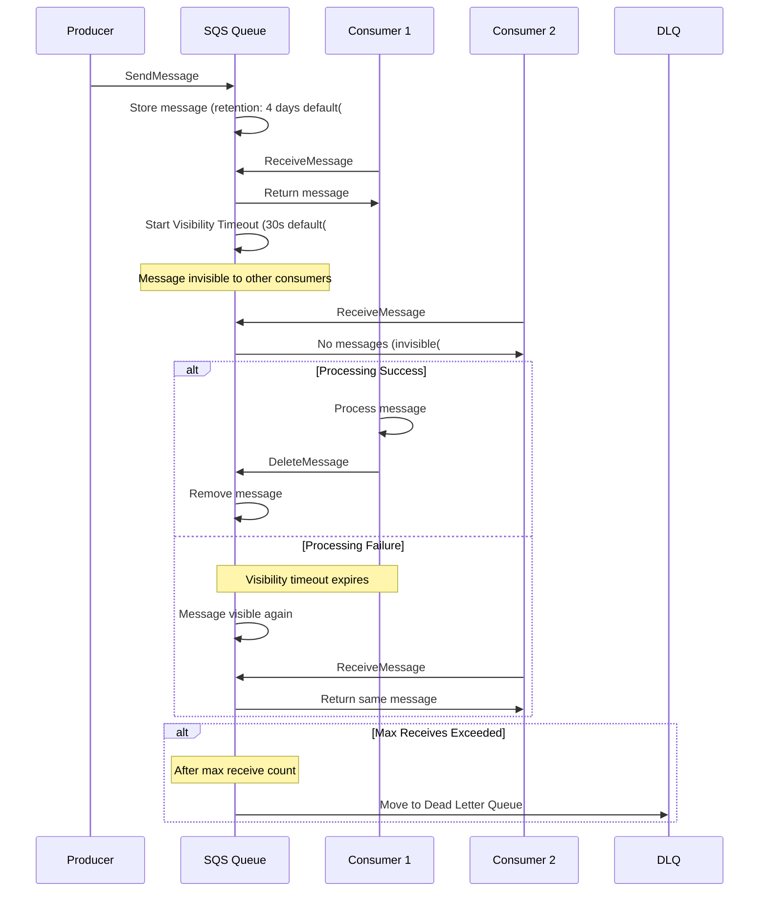
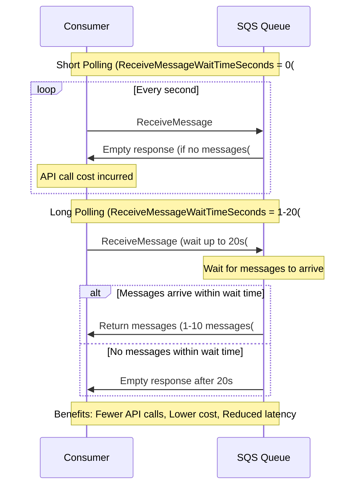
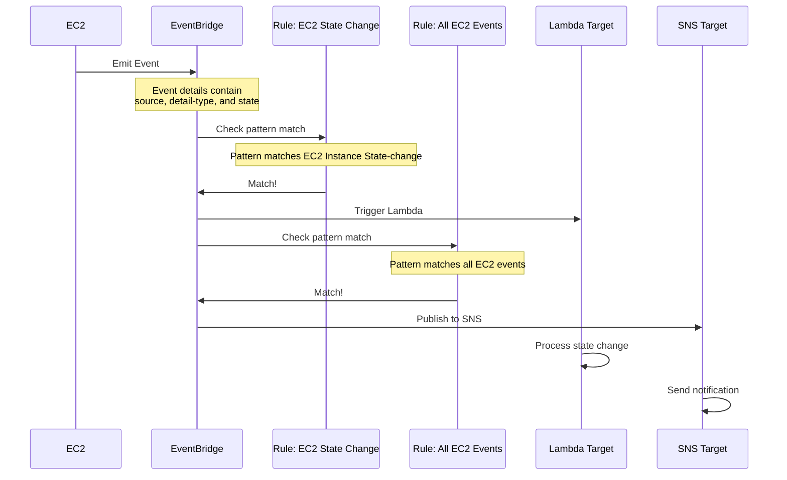

# Application Integration - Mermaid Diagrams

## Amazon SQS (Simple Queue Service)

### SQS Standard vs FIFO Queue

```mermaid
graph TB
    subgraph Standard_Queue_Group["Standard Queue"[
        Standard[SQS Standard Queue[
        
        Standard_Features["Features:&lt;&lt;&lt;BR_SLASH&gt;&gt;&gt;✅ Unlimited throughput&lt;&lt;&lt;BR_SLASH&gt;&gt;&gt;✅ At-least-once delivery&lt;&lt;&lt;BR_SLASH&gt;&gt;&gt;✅ Best-effort ordering&lt;&lt;&lt;BR_SLASH&gt;&gt;&gt;⚠️ May receive duplicates&lt;&lt;&lt;BR_SLASH&gt;&gt;&gt;⚠️ May arrive out of order"[
        
        Standard_Use["Use Cases:&lt;&lt;&lt;BR_SLASH&gt;&gt;&gt;• High throughput needed&lt;&lt;&lt;BR_SLASH&gt;&gt;&gt;• Order doesn't matter&lt;&lt;&lt;BR_SLASH&gt;&gt;&gt;• Duplicate handling in app&lt;&lt;&lt;BR_SLASH&gt;&gt;&gt;• Event-driven architecture"[
    end
    
    subgraph FIFO_Queue_Group["FIFO Queue"[
        FIFO["SQS FIFO Queue&lt;&lt;&lt;BR_SLASH&gt;&gt;&gt;name.fifo"[
        
        FIFO_Features["Features:&lt;&lt;&lt;BR_SLASH&gt;&gt;&gt;📊 300 msg/sec standard&lt;&lt;&lt;BR_SLASH&gt;&gt;&gt;📊 3,000 msg/sec with batching&lt;&lt;&lt;BR_SLASH&gt;&gt;&gt;✅ Exactly-once processing&lt;&lt;&lt;BR_SLASH&gt;&gt;&gt;✅ Strict ordering&lt;&lt;&lt;BR_SLASH&gt;&gt;&gt;✅ Deduplication"[
        
        FIFO_Use["Use Cases:&lt;&lt;&lt;BR_SLASH&gt;&gt;&gt;• Banking transactions&lt;&lt;&lt;BR_SLASH&gt;&gt;&gt;• Order processing&lt;&lt;&lt;BR_SLASH&gt;&gt;&gt;• Strict ordering required&lt;&lt;&lt;BR_SLASH&gt;&gt;&gt;• No duplicates allowed"[
    end
    
    Comparison["Key Differences:&lt;&lt;&lt;BR_SLASH&gt;&gt;&gt;Standard: Speed &gt; Order&lt;&lt;&lt;BR_SLASH&gt;&gt;&gt;FIFO: Order &gt; Speed"[
    
    classDef style1 fill:#FF9900
    class Standard style1
    classDef style2 fill:#569A31
    class FIFO style2
```

### SQS Message Lifecycle



### SQS Decoupling Pattern

```mermaid
graph LR
    subgraph Producers_Group["Producers"[
        Web[Web Application[
        Mobile[Mobile App[
        API[API Service[
    end
    
    subgraph SQS_Queue_Group["SQS Queue"[
        Queue["Standard Queue&lt;&lt;&lt;BR_SLASH&gt;&gt;&gt;Buffer & Decouple&lt;&lt;&lt;BR_SLASH&gt;&gt;&gt;Retention: 14 days max"[
        DLQ["Dead Letter Queue&lt;&lt;&lt;BR_SLASH&gt;&gt;&gt;Failed messages"[
        
        Queue -.Failed messages.-> DLQ
    end
    
    subgraph Consumers_Group["Consumers"[
        ASG["Auto Scaling Group&lt;&lt;&lt;BR_SLASH&gt;&gt;&gt;EC2 Instances"[
        Lambda["Lambda Functions&lt;&lt;&lt;BR_SLASH&gt;&gt;&gt;Event Source Mapping"[
    end
    
    Web -->|Send Message| Queue
    Mobile -->|Send Message| Queue
    API -->|Send Message| Queue
    
    Queue -->|Poll Messages| ASG
    Queue -->|Trigger| Lambda
    
    CloudWatch["CloudWatch&lt;&lt;&lt;BR_SLASH&gt;&gt;&gt;Queue Depth Metric"[ -.Monitor.-> Queue
    CloudWatch -.Scale based on queue depth.-> ASG
    
    Benefits["Benefits:&lt;&lt;&lt;BR_SLASH&gt;&gt;&gt;✅ Decouple components&lt;&lt;&lt;BR_SLASH&gt;&gt;&gt;✅ Handle traffic spikes&lt;&lt;&lt;BR_SLASH&gt;&gt;&gt;✅ Independent scaling&lt;&lt;&lt;BR_SLASH&gt;&gt;&gt;✅ Failure isolation&lt;&lt;&lt;BR_SLASH&gt;&gt;&gt;✅ Asynchronous processing"[
    
    classDef style1 fill:#FF9900
    class Queue style1
    classDef style2 fill:#569A31
    class ASG style2
```

### SQS Long Polling



## Amazon SNS (Simple Notification Service)

### SNS Pub/Sub Architecture

```mermaid
graph TB
    subgraph Publishers_Group["Publishers"[
        CloudWatch[CloudWatch Alarms[
        S3[S3 Events[
        Lambda[Lambda Functions[
        App[Application[
    end
    
    subgraph SNS_Topic_Group["SNS Topic"[
        Topic["SNS Topic&lt;&lt;&lt;BR_SLASH&gt;&gt;&gt;Pub/Sub Messaging"[
        
        Filter["Message Filtering&lt;&lt;&lt;BR_SLASH&gt;&gt;&gt;Filter policies per subscription"[
        
        Topic --> Filter
    end
    
    subgraph Subscribers_Group["Subscribers"[
        SQS1["SQS Queue 1&lt;&lt;&lt;BR_SLASH&gt;&gt;&gt;Order Processing"[
        SQS2["SQS Queue 2&lt;&lt;&lt;BR_SLASH&gt;&gt;&gt;Analytics"[
        Lambda2["Lambda Function&lt;&lt;&lt;BR_SLASH&gt;&gt;&gt;Notifications"[
        Email["Email&lt;&lt;&lt;BR_SLASH&gt;&gt;&gt;alerts@example.com"[
        SMS["SMS&lt;&lt;&lt;BR_SLASH&gt;&gt;&gt;+1-555-0100"[
        HTTP["HTTP/S Endpoint&lt;&lt;&lt;BR_SLASH&gt;&gt;&gt;Webhook"[
        Kinesis["Kinesis Firehose&lt;&lt;&lt;BR_SLASH&gt;&gt;&gt;Data streaming"[
    end
    
    CloudWatch -->|Publish| Topic
    S3 -->|Publish| Topic
    Lambda -->|Publish| Topic
    App -->|Publish| Topic
    
    Filter --> SQS1
    Filter --> SQS2
    Filter --> Lambda2
    Filter --> Email
    Filter --> SMS
    Filter --> HTTP
    Filter --> Kinesis
    
    Features["Features:&lt;&lt;&lt;BR_SLASH&gt;&gt;&gt;✅ Pub/Sub pattern&lt;&lt;&lt;BR_SLASH&gt;&gt;&gt;✅ Fan-out to multiple subscribers&lt;&lt;&lt;BR_SLASH&gt;&gt;&gt;✅ Message filtering&lt;&lt;&lt;BR_SLASH&gt;&gt;&gt;✅ 100,000+ topics per account&lt;&lt;&lt;BR_SLASH&gt;&gt;&gt;✅ 12.5M subscriptions per topic&lt;&lt;&lt;BR_SLASH&gt;&gt;&gt;💰 $0.50 per million requests"[
    
    classDef style1 fill:#FF9900
    class Topic style1
    classDef style2 fill:#569A31
    class Filter style2
```

### SNS Fan-Out Pattern with SQS

```mermaid
graph TB
    S3["S3 Bucket&lt;&lt;&lt;BR_SLASH&gt;&gt;&gt;Image Upload"[
    
    SNS["SNS Topic&lt;&lt;&lt;BR_SLASH&gt;&gt;&gt;Image Processing"[
    
    subgraph Processing_Pipelines_Group["Processing Pipelines"[
        SQS1["SQS Queue 1&lt;&lt;&lt;BR_SLASH&gt;&gt;&gt;Thumbnail Generation"[
        SQS2["SQS Queue 2&lt;&lt;&lt;BR_SLASH&gt;&gt;&gt;Watermark Addition"[
        SQS3["SQS Queue 3&lt;&lt;&lt;BR_SLASH&gt;&gt;&gt;Metadata Extraction"[
    end
    
    subgraph Workers_Group["Workers"[
        Lambda1["Lambda&lt;&lt;&lt;BR_SLASH&gt;&gt;&gt;Thumbnail Worker"[
        Lambda2["Lambda&lt;&lt;&lt;BR_SLASH&gt;&gt;&gt;Watermark Worker"[
        Lambda3["Lambda&lt;&lt;&lt;BR_SLASH&gt;&gt;&gt;Metadata Worker"[
    end
    
    S3 -->|S3 Event| SNS
    SNS -->|Subscribe| SQS1
    SNS -->|Subscribe| SQS2
    SNS -->|Subscribe| SQS3
    
    SQS1 --> Lambda1
    SQS2 --> Lambda2
    SQS3 --> Lambda3
    
    Lambda1 --> Output1["S3&lt;&lt;&lt;BR_SLASH&gt;&gt;&gt;Thumbnails"[
    Lambda2 --> Output2["S3&lt;&lt;&lt;BR_SLASH&gt;&gt;&gt;Watermarked"[
    Lambda3 --> Output3["DynamoDB&lt;&lt;&lt;BR_SLASH&gt;&gt;&gt;Metadata"[
    
    Benefits["Benefits:&lt;&lt;&lt;BR_SLASH&gt;&gt;&gt;✅ Process once, deliver to many&lt;&lt;&lt;BR_SLASH&gt;&gt;&gt;✅ Independent processing&lt;&lt;&lt;BR_SLASH&gt;&gt;&gt;✅ Guaranteed delivery to SQS&lt;&lt;&lt;BR_SLASH&gt;&gt;&gt;✅ Retry logic with DLQ&lt;&lt;&lt;BR_SLASH&gt;&gt;&gt;✅ Decouple services"[
    
    classDef style1 fill:#FF9900
    class SNS style1
    classDef style2 fill:#569A31
    class SQS1 style2
```

### SNS Message Filtering

```mermaid
graph TB
    Publisher["Publisher&lt;&lt;&lt;BR_SLASH&gt;&gt;&gt;E-commerce App"[
    
    Topic[SNS Topic: Orders[
    
    subgraph Subscriptions_with_Filters_Group["Subscriptions with Filters"[
        Sub1["SQS Subscription 1&lt;&lt;&lt;BR_SLASH&gt;&gt;&gt;Filter: order_type = 'premium'"[
        Sub2["SQS Subscription 2&lt;&lt;&lt;BR_SLASH&gt;&gt;&gt;Filter: order_total &gt; 100"[
        Sub3["Lambda Subscription&lt;&lt;&lt;BR_SLASH&gt;&gt;&gt;Filter: region = 'US'"[
        Sub4["Email Subscription&lt;&lt;&lt;BR_SLASH&gt;&gt;&gt;No filter - All messages"[
    end
    
    Publisher -->|Publish with attributes:<br/>order_type: premium<br/>order_total: 150<br/>region: EU| Topic
    
    Topic -.Filter Policy.-> Sub1
    Topic -.Filter Policy.-> Sub2
    Topic -.Filter Policy.-> Sub3
    Topic -.No Filter.-> Sub4
    
    Sub1 -->|Match: premium| Queue1[Premium Processing[
    Sub2 -->|Match: > 100| Queue2[High Value Processing[
    Sub3 -->|No Match: EU ≠ US| NoDeliver[Not Delivered[
    Sub4 -->|All Messages| Email[Email Notification[
    
    FilterExample["Filter Policy Example:&lt;&lt;&lt;BR_SLASH&gt;&gt;&gt;order_type: premium&lt;&lt;&lt;BR_SLASH&gt;&gt;&gt;order_total: numeric &gt; 100"[
    
    classDef style1 fill:#FF9900
    classDef style2 fill:#569A31
    classDef style3 fill:#C00
    class Topic style1
    class Sub1 style2
    class NoDeliver style3
```

## Amazon EventBridge

### EventBridge Architecture

```mermaid
graph TB
    subgraph Event_Sources_Group["Event Sources"[
        AWS["AWS Services&lt;&lt;&lt;BR_SLASH&gt;&gt;&gt;EC2, S3, RDS, etc."[
        Custom["Custom Applications&lt;&lt;&lt;BR_SLASH&gt;&gt;&gt;Your apps"[
        SaaS["SaaS Partners&lt;&lt;&lt;BR_SLASH&gt;&gt;&gt;Zendesk, Datadog, etc."[
        Schedule["Schedule/Cron"[
    end
    
    subgraph EventBridge_Group["EventBridge"[
        DefaultBus["Default Event Bus&lt;&lt;&lt;BR_SLASH&gt;&gt;&gt;AWS service events"[
        CustomBus["Custom Event Bus&lt;&lt;&lt;BR_SLASH&gt;&gt;&gt;Your applications"[
        PartnerBus["Partner Event Bus&lt;&lt;&lt;BR_SLASH&gt;&gt;&gt;SaaS integrations"[
        
        Rules["Event Rules&lt;&lt;&lt;BR_SLASH&gt;&gt;&gt;Pattern matching&lt;&lt;&lt;BR_SLASH&gt;&gt;&gt;Filtering"[
        
        DefaultBus --> Rules
        CustomBus --> Rules
        PartnerBus --> Rules
    end
    
    subgraph Targets_18_AWS_Services_Group["Targets (18+ AWS Services["]
        Lambda["Lambda Functions[
        SQS[SQS Queues[
        SNS[SNS Topics[
        Kinesis[Kinesis Streams[
        StepFunctions[Step Functions[
        ECS[ECS Tasks[
        Batch[AWS Batch[
        SSM[Systems Manager[
        More[And more...[
    end
    
    AWS --> DefaultBus
    Custom --> CustomBus
    SaaS --> PartnerBus
    Schedule --> Rules
    
    Rules --> Lambda
    Rules --> SQS
    Rules --> SNS
    Rules --> Kinesis
    Rules --> StepFunctions
    Rules --> ECS
    Rules --> Batch
    Rules --> SSM
    
    Archive["Event Archive&lt;&lt;&lt;BR_SLASH&gt;&gt;&gt;Replay events"[ -.Store.-> Rules
    
    classDef style1 fill:#FF9900
    class Rules style1
    classDef style2 fill:#569A31
    class Lambda style2
```

### EventBridge Event Pattern Matching



### EventBridge vs CloudWatch Events

```mermaid
graph TB
    subgraph CloudWatch_Events_Legacy_Group["CloudWatch Events (Legacy[""[
        CWE["CloudWatch Events[
        CWE_Features["• AWS services only&lt;&lt;&lt;BR_SLASH&gt;&gt;&gt;• Default event bus&lt;&lt;&lt;BR_SLASH&gt;&gt;&gt;• Basic filtering&lt;&lt;&lt;BR_SLASH&gt;&gt;&gt;• 5 targets per rule"[
    end
    
    subgraph Amazon_EventBridge_Group["Amazon EventBridge"[
        EB[EventBridge[
        EB_Features["• AWS + Custom + SaaS&lt;&lt;&lt;BR_SLASH&gt;&gt;&gt;• Multiple event buses&lt;&lt;&lt;BR_SLASH&gt;&gt;&gt;• Advanced filtering&lt;&lt;&lt;BR_SLASH&gt;&gt;&gt;• 5 targets per rule&lt;&lt;&lt;BR_SLASH&gt;&gt;&gt;• Event archive & replay&lt;&lt;&lt;BR_SLASH&gt;&gt;&gt;• Schema registry&lt;&lt;&lt;BR_SLASH&gt;&gt;&gt;• Dead-letter queue"[
    end
    
    CWE -.Evolved into.-> EB
    
    Recommendation["Recommendation:&lt;&lt;&lt;BR_SLASH&gt;&gt;&gt;✅ Use EventBridge for new applications&lt;&lt;&lt;BR_SLASH&gt;&gt;&gt;✅ CloudWatch Events still works (same API[<br/>✅ EventBridge is superset of CW Events""]
    
    classDef style1 fill:#FF9900
    class EB style1
    classDef style2 fill:#999
    class CWE style2
```

## AWS Step Functions

### Step Functions State Machine

```mermaid
graph TB
    Start([Start(( --> ValidateOrder[""Validate Order&lt;&lt;&lt;BR_SLASH&gt;&gt;&gt;Lambda Task"[
    
    ValidateOrder --> CheckInventory{"Check Inventory&lt;&lt;&lt;BR_SLASH&gt;&gt;&gt;Choice State"{
    
    CheckInventory -->|In Stock| ProcessPayment["Process Payment&lt;&lt;&lt;BR_SLASH&gt;&gt;&gt;Lambda Task"[
    CheckInventory -->|Out of Stock| NotifyOutOfStock["Notify Customer&lt;&lt;&lt;BR_SLASH&gt;&gt;&gt;SNS"[
    
    ProcessPayment --> PaymentSuccess{"Payment Success?&lt;&lt;&lt;BR_SLASH&gt;&gt;&gt;Choice State"{
    
    PaymentSuccess -->|Success| FulfillOrder["Fulfill Order&lt;&lt;&lt;BR_SLASH&gt;&gt;&gt;Lambda Task"[
    PaymentSuccess -->|Failed| RefundCustomer["Refund Customer&lt;&lt;&lt;BR_SLASH&gt;&gt;&gt;Lambda Task"[
    
    FulfillOrder --> Parallel{Parallel State{
    
    Parallel --> SendEmail["Send Email&lt;&lt;&lt;BR_SLASH&gt;&gt;&gt;SNS"[
    Parallel --> UpdateInventory["Update Inventory&lt;&lt;&lt;BR_SLASH&gt;&gt;&gt;DynamoDB"[
    Parallel --> SendSMS["Send SMS&lt;&lt;&lt;BR_SLASH&gt;&gt;&gt;SNS"[
    
    SendEmail --> Wait["Wait 24 Hours&lt;&lt;&lt;BR_SLASH&gt;&gt;&gt;Wait State"[
    UpdateInventory --> Wait
    SendSMS --> Wait
    
    Wait --> FollowUp["Send Follow-up&lt;&lt;&lt;BR_SLASH&gt;&gt;&gt;Lambda Task"[
    
    RefundCustomer --> NotifyFailed["Notify Failed Order&lt;&lt;&lt;BR_SLASH&gt;&gt;&gt;SNS"[
    NotifyOutOfStock --> End1([End()
    NotifyFailed --> End2([End((
    FollowUp --> End3([End: Success((
    
    classDef style1 fill:#569A31
    class Start style1
    classDef style2 fill:#569A31
    class End3 style2
    classDef style3 fill:#C00
    class End1 style3
    classDef style4 fill:#C00
    class End2 style4
    classDef style5 fill:#FF9900
    class Parallel style5
```

### Step Functions State Types

```mermaid
mindmap
    root((Step Functions&lt;&lt;&lt;BR_SLASH&gt;&gt;&gt;State Types()
        Task
            Lambda function
            ECS task
            Batch job
            SNS publish
            SQS send
            DynamoDB operations
            API Gateway
        Choice
            Conditional logic
            Branch execution
            If-then-else
        Parallel
            Execute branches simultaneously
            Wait for all to complete
        Wait
            Delay for fixed time
            Wait until timestamp
        Succeed
            Successful termination
        Fail
            Failed termination
            Error handling
        Pass
            Pass input to output
            Transform data
        Map
            Iterate over array
            Process items in parallel
```

### Step Functions vs SQS vs SNS

```mermaid
graph TB
    subgraph AWS_Step_Functions_Group["AWS Step Functions"[
        SF[Step Functions[
        SF_Features["Features:&lt;&lt;&lt;BR_SLASH&gt;&gt;&gt;✅ Workflow orchestration&lt;&lt;&lt;BR_SLASH&gt;&gt;&gt;✅ Visual workflow designer&lt;&lt;&lt;BR_SLASH&gt;&gt;&gt;✅ State management&lt;&lt;&lt;BR_SLASH&gt;&gt;&gt;✅ Error handling & retry&lt;&lt;&lt;BR_SLASH&gt;&gt;&gt;✅ Long-running processes up to 1 year&lt;&lt;&lt;BR_SLASH&gt;&gt;&gt;💰 Pay per state transition"[
        
        SF_Use["Use Cases:&lt;&lt;&lt;BR_SLASH&gt;&gt;&gt;• Complex workflows&lt;&lt;&lt;BR_SLASH&gt;&gt;&gt;• Order processing&lt;&lt;&lt;BR_SLASH&gt;&gt;&gt;• ETL pipelines&lt;&lt;&lt;BR_SLASH&gt;&gt;&gt;• Microservice orchestration&lt;&lt;&lt;BR_SLASH&gt;&gt;&gt;• Human approval steps"[
    end
    
    subgraph Amazon_SQS_Group["Amazon SQS"[
        SQS[SQS Queues[
        SQS_Features["Features:&lt;&lt;&lt;BR_SLASH&gt;&gt;&gt;✅ Message queuing&lt;&lt;&lt;BR_SLASH&gt;&gt;&gt;✅ Decouple components&lt;&lt;&lt;BR_SLASH&gt;&gt;&gt;✅ Simple processing&lt;&lt;&lt;BR_SLASH&gt;&gt;&gt;✅ Buffer messages&lt;&lt;&lt;BR_SLASH&gt;&gt;&gt;✅ Retention up to 14 days&lt;&lt;&lt;BR_SLASH&gt;&gt;&gt;💰 Pay per million requests"[
        
        SQS_Use["Use Cases:&lt;&lt;&lt;BR_SLASH&gt;&gt;&gt;• Simple task queue&lt;&lt;&lt;BR_SLASH&gt;&gt;&gt;• Decouple services&lt;&lt;&lt;BR_SLASH&gt;&gt;&gt;• Buffer workloads&lt;&lt;&lt;BR_SLASH&gt;&gt;&gt;• Asynchronous processing&lt;&lt;&lt;BR_SLASH&gt;&gt;&gt;• Job queues"[
    end
    
    subgraph Amazon_SNS_Group["Amazon SNS"[
        SNS[SNS Topics[
        SNS_Features["Features:&lt;&lt;&lt;BR_SLASH&gt;&gt;&gt;✅ Pub/Sub messaging&lt;&lt;&lt;BR_SLASH&gt;&gt;&gt;✅ Fan-out pattern&lt;&lt;&lt;BR_SLASH&gt;&gt;&gt;✅ Multiple subscribers&lt;&lt;&lt;BR_SLASH&gt;&gt;&gt;✅ Message filtering&lt;&lt;&lt;BR_SLASH&gt;&gt;&gt;✅ Real-time notifications&lt;&lt;&lt;BR_SLASH&gt;&gt;&gt;💰 Pay per million publishes"[
        
        SNS_Use["Use Cases:&lt;&lt;&lt;BR_SLASH&gt;&gt;&gt;• Notifications&lt;&lt;&lt;BR_SLASH&gt;&gt;&gt;• Fan-out to multiple targets&lt;&lt;&lt;BR_SLASH&gt;&gt;&gt;• Event-driven architecture&lt;&lt;&lt;BR_SLASH&gt;&gt;&gt;• Mobile push&lt;&lt;&lt;BR_SLASH&gt;&gt;&gt;• Email/SMS alerts"[
    end
    
    Combine["Combine Them:&lt;&lt;&lt;BR_SLASH&gt;&gt;&gt;Step Functions orchestrates SQS & SNS&lt;&lt;&lt;BR_SLASH&gt;&gt;&gt;SNS publishes to SQS for fan-out&lt;&lt;&lt;BR_SLASH&gt;&gt;&gt;Step Functions processes SQS messages"[
    
    classDef style1 fill:#FF9900
    class SF style1
    classDef style2 fill:#569A31
    class SQS style2
    classDef style3 fill:#8C4FFF
    class SNS style3
```

## Amazon MQ

### Amazon MQ Architecture

```mermaid
graph TB
    subgraph On_Premises_Migration_Group["On-Premises Migration"[
        OnPrem["On-Premises Apps&lt;&lt;&lt;BR_SLASH&gt;&gt;&gt;Using ActiveMQ/RabbitMQ"[
    end
    
    subgraph Amazon_MQ_Group["Amazon MQ"[
        MQ["Amazon MQ&lt;&lt;&lt;BR_SLASH&gt;&gt;&gt;Managed Message Broker"[
        
        ActiveMQ["ActiveMQ&lt;&lt;&lt;BR_SLASH&gt;&gt;&gt;JMS, AMQP, MQTT, OpenWire, STOMP"[
        RabbitMQ["RabbitMQ&lt;&lt;&lt;BR_SLASH&gt;&gt;&gt;AMQP 0-9-1"[
        
        MQ --> ActiveMQ
        MQ --> RabbitMQ
        
        HA["High Availability&lt;&lt;&lt;BR_SLASH&gt;&gt;&gt;Multi-AZ with failover"[
        
        ActiveMQ --> HA
        RabbitMQ --> HA
    end
    
    subgraph Target_Applications_Group["Target Applications"[
        App1["Application 1&lt;&lt;&lt;BR_SLASH&gt;&gt;&gt;Consumer"[
        App2["Application 2&lt;&lt;&lt;BR_SLASH&gt;&gt;&gt;Consumer"[
    end
    
    OnPrem -.Migrate.-> MQ
    
    MQ --> App1
    MQ --> App2
    
    VsSQS["Amazon MQ vs SQS/SNS:&lt;&lt;&lt;BR_SLASH&gt;&gt;&gt;&lt;&lt;&lt;BR_SLASH&gt;&gt;&gt;Use Amazon MQ when:&lt;&lt;&lt;BR_SLASH&gt;&gt;&gt;• Migrating from on-premises&lt;&lt;&lt;BR_SLASH&gt;&gt;&gt;• Need specific protocols&lt;&lt;&lt;BR_SLASH&gt;&gt;&gt;• Need traditional message broker&lt;&lt;&lt;BR_SLASH&gt;&gt;&gt;&lt;&lt;&lt;BR_SLASH&gt;&gt;&gt;Use SQS/SNS when:&lt;&lt;&lt;BR_SLASH&gt;&gt;&gt;• New cloud-native applications&lt;&lt;&lt;BR_SLASH&gt;&gt;&gt;• Serverless integration&lt;&lt;&lt;BR_SLASH&gt;&gt;&gt;• Unlimited scalability needed&lt;&lt;&lt;BR_SLASH&gt;&gt;&gt;• Lower cost"[
    
    Features["Features:&lt;&lt;&lt;BR_SLASH&gt;&gt;&gt;✅ Managed service&lt;&lt;&lt;BR_SLASH&gt;&gt;&gt;✅ Multi-AZ for HA&lt;&lt;&lt;BR_SLASH&gt;&gt;&gt;✅ Automatic failover&lt;&lt;&lt;BR_SLASH&gt;&gt;&gt;✅ EFS storage for persistence&lt;&lt;&lt;BR_SLASH&gt;&gt;&gt;💰 Pay for instance hours"[
    
    classDef style1 fill:#FF9900
    class MQ style1
    classDef style2 fill:#569A31
    class OnPrem style2
```

## Amazon AppSync

### AppSync GraphQL API

```mermaid
graph TB
    subgraph Clients_Group["Clients"[
        Web[Web App[
        Mobile[Mobile App[
        IoT[IoT Devices[
    end
    
    subgraph AppSync_Group["AWS AppSync"[
        AppSync["AWS AppSync&lt;&lt;&lt;BR_SLASH&gt;&gt;&gt;Managed GraphQL API"[
        
        Schema["GraphQL Schema&lt;&lt;&lt;BR_SLASH&gt;&gt;&gt;Define data types"[
        Resolvers["Resolvers&lt;&lt;&lt;BR_SLASH&gt;&gt;&gt;Map to data sources"[
        RealTime["Real-time Subscriptions&lt;&lt;&lt;BR_SLASH&gt;&gt;&gt;WebSocket"[
        
        AppSync --> Schema
        AppSync --> Resolvers
        AppSync --> RealTime
    end
    
    subgraph DataSources_Group["Data Sources"[
        DynamoDB[(DynamoDB["]
        Lambda[Lambda Functions[
        RDS[(RDS via Lambda[[
        HTTP[HTTP Endpoints[
        ElasticSearch[(OpenSearch[[
    end
    
    subgraph Features_Group["Key Features"[
        Features["✅ GraphQL queries, mutations, subscriptions&lt;&lt;&lt;BR_SLASH&gt;&gt;&gt;✅ Real-time data sync&lt;&lt;&lt;BR_SLASH&gt;&gt;&gt;✅ Offline support&lt;&lt;&lt;BR_SLASH&gt;&gt;&gt;✅ Built-in caching&lt;&lt;&lt;BR_SLASH&gt;&gt;&gt;✅ Fine-grained access control&lt;&lt;&lt;BR_SLASH&gt;&gt;&gt;💰 Pay per query + data transfer"[
    end
    
    Web --> AppSync
    Mobile --> AppSync
    IoT --> AppSync
    
    Resolvers --> DynamoDB
    Resolvers --> Lambda
    Resolvers --> RDS
    Resolvers --> HTTP
    Resolvers --> ElasticSearch
    
    Offline["Offline Sync&lt;&lt;&lt;BR_SLASH&gt;&gt;&gt;AWS Amplify DataStore"[
    Cognito["Amazon Cognito&lt;&lt;&lt;BR_SLASH&gt;&gt;&gt;Authentication"[
    
    Offline -.->|Works with| AppSync
    Cognito -.->|Secures| AppSync
    
    AppSync -.-> Features
    
    classDef appsyncStyle fill:#FF9900,stroke:#333,stroke-width:2px,color:#fff
    classDef realtimeStyle fill:#569A31,stroke:#333,stroke-width:2px,color:#fff
    classDef clientStyle fill:#3B48CC,stroke:#333,stroke-width:2px,color:#fff
    classDef dataStyle fill:#527FFF,stroke:#333,stroke-width:2px,color:#fff
    classDef securityStyle fill:#DD344C,stroke:#333,stroke-width:2px,color:#fff
    classDef featureStyle fill:#232F3E,stroke:#FF9900,stroke-width:2px,color:#fff
    
    class AppSync,Schema,Resolvers appsyncStyle
    class RealTime realtimeStyle
    class Web,Mobile,IoT clientStyle
    class DynamoDB,Lambda,RDS,HTTP,ElasticSearch dataStyle
    class Cognito,Offline securityStyle
    class Features featureStyle
```

## Integration Patterns Summary

### Event-Driven Architecture Patterns

```mermaid
graph TB
    subgraph Pattern_1_Simple_Queue_Group["Pattern 1: Simple Queue"[
        P1_Producer[Producer[ --> P1_SQS[SQS Queue[
        P1_SQS --> P1_Consumer[Consumer[
    end
    
    subgraph Pattern_2_Pub_Sub_Fan_Out_Group["Pattern 2: Pub/Sub Fan-Out"[
        P2_Publisher[Publisher[ --> P2_SNS[SNS Topic[
        P2_SNS --> P2_Sub1[Subscriber 1[
        P2_SNS --> P2_Sub2[Subscriber 2[
        P2_SNS --> P2_Sub3[Subscriber 3[
    end
    
    subgraph Pattern_3_SNS_SQS_Fan_Out_Group["Pattern 3: SNS + SQS Fan-Out"[
        P3_Publisher[Publisher[ --> P3_SNS[SNS Topic[
        P3_SNS --> P3_SQS1[SQS Queue 1[
        P3_SNS --> P3_SQS2[SQS Queue 2[
        P3_SQS1 --> P3_C1[Consumer 1[
        P3_SQS2 --> P3_C2[Consumer 2[
    end
    
    subgraph Pattern_4_Event_Driven_with_EventBridge_Group["Pattern 4: Event-Driven with EventBridge"[
        P4_Source[Event Source[ --> P4_EB[EventBridge[
        P4_EB --> P4_T1[Lambda[
        P4_EB --> P4_T2[SQS[
        P4_EB --> P4_T3[Step Functions[
    end
    
    subgraph Pattern_5_Workflow_Orchestration_Group["Pattern 5: Workflow Orchestration"[
        P5_Trigger[Trigger[ --> P5_SF[Step Functions[
        P5_SF --> P5_L1[Lambda 1[
        P5_SF --> P5_L2[Lambda 2[
        P5_SF --> P5_L3[Lambda 3[
    end
    
    classDef style1 fill:#FF9900
    class P1_SQS style1
    classDef style2 fill:#8C4FFF
    class P2_SNS style2
    classDef style3 fill:#8C4FFF
    class P3_SNS style3
    classDef style4 fill:#569A31
    class P4_EB style4
    classDef style5 fill:#146EB4
    class P5_SF style5
```

