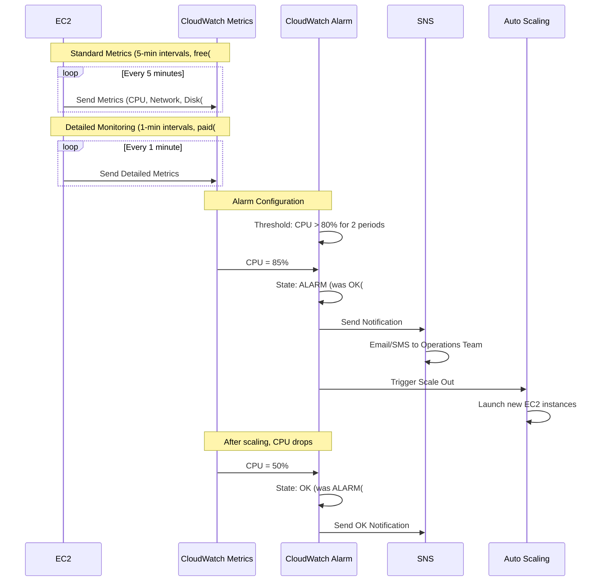
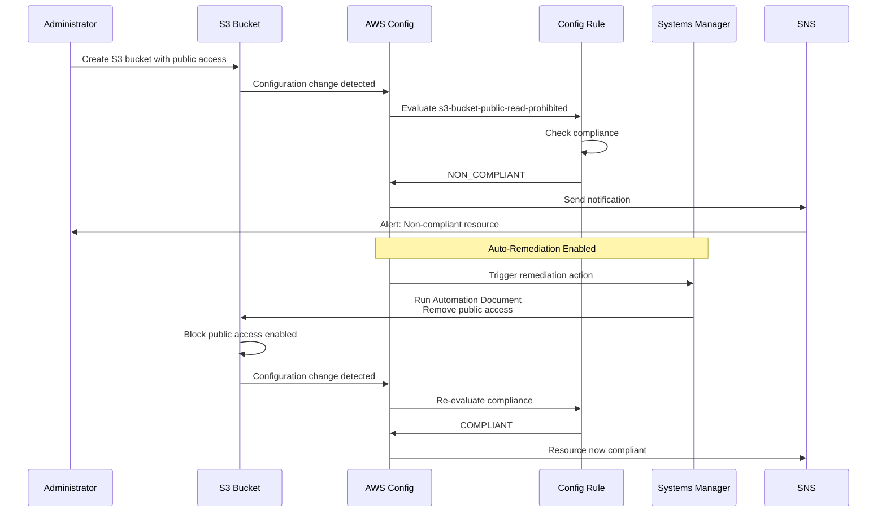

# Monitoring & Management - Mermaid Diagrams

## Amazon CloudWatch

### CloudWatch Architecture

```mermaid
graph TB
    subgraph AWS_Resources_Group["AWS Resources"[
        EC2[EC2 Instances[
        RDS[RDS Databases[
        Lambda[Lambda Functions[
        ELB[Load Balancers[
        Custom[Custom Applications[
    end
    
    subgraph CloudWatch_Group["CloudWatch"[
        Metrics["CloudWatch Metrics&lt;&lt;&lt;BR_SLASH&gt;&gt;&gt;Time-series data"[
        Logs["CloudWatch Logs&lt;&lt;&lt;BR_SLASH&gt;&gt;&gt;Log aggregation"[
        Alarms["CloudWatch Alarms&lt;&lt;&lt;BR_SLASH&gt;&gt;&gt;Notifications & Actions"[
        Dashboards["CloudWatch Dashboards&lt;&lt;&lt;BR_SLASH&gt;&gt;&gt;Visualization"[
        Events["EventBridge&lt;&lt;&lt;BR_SLASH&gt;&gt;&gt;Event routing"[
        Insights["CloudWatch Insights&lt;&lt;&lt;BR_SLASH&gt;&gt;&gt;Log analytics"[
    end
    
    subgraph Actions_Group["Actions"[
        SNS[SNS Notifications[
        ASG_Action[Auto Scaling Actions[
        Lambda_Action[Lambda Functions[
        SSM_Action[Systems Manager[
    end
    
    EC2 -->|CPU, Disk, Network| Metrics
    RDS -->|DB Metrics| Metrics
    Lambda -->|Duration, Errors| Metrics
    ELB -->|Request Count| Metrics
    Custom -->|Custom Metrics| Metrics
    
    EC2 -->|Application Logs| Logs
    Lambda -->|Function Logs| Logs
    Custom -->|App Logs| Logs
    
    Metrics --> Alarms
    Logs --> Insights
    Metrics --> Dashboards
    Logs --> Dashboards
    
    Alarms --> SNS
    Alarms --> ASG_Action
    Alarms --> Lambda_Action
    Alarms --> SSM_Action
    
    Events --> Lambda_Action
    
    classDef style1 fill:#FF9900
    class Metrics style1
    classDef style2 fill:#C00
    class Alarms style2
    classDef style3 fill:#569A31
    class Logs style3
```

### CloudWatch Metrics and Alarms



### CloudWatch Logs Architecture

```mermaid
graph TB
    subgraph Log_Sources_Group["Log Sources"[
        EC2["EC2 Instances&lt;&lt;&lt;BR_SLASH&gt;&gt;&gt;CloudWatch Agent"[
        Lambda["Lambda Functions&lt;&lt;&lt;BR_SLASH&gt;&gt;&gt;Automatic"[
        ECS["ECS Containers&lt;&lt;&lt;BR_SLASH&gt;&gt;&gt;awslogs driver"[
        Beanstalk[Elastic Beanstalk[
        OnPrem["On-Premises&lt;&lt;&lt;BR_SLASH&gt;&gt;&gt;CloudWatch Agent"[
    end
    
    subgraph CloudWatch_Logs_Group["CloudWatch Logs"[
        LogGroups["Log Groups&lt;&lt;&lt;BR_SLASH&gt;&gt;&gt;/aws/lambda/function-name&lt;&lt;&lt;BR_SLASH&gt;&gt;&gt;/var/log/application"[
        LogStreams["Log Streams&lt;&lt;&lt;BR_SLASH&gt;&gt;&gt;Instance ID&lt;&lt;&lt;BR_SLASH&gt;&gt;&gt;Container ID"[
        
        LogGroups --> LogStreams
        
        Retention["Retention Policies&lt;&lt;&lt;BR_SLASH&gt;&gt;&gt;1 day to never expire&lt;&lt;&lt;BR_SLASH&gt;&gt;&gt;Default: Never expire"[
        
        LogStreams --> Retention
    end
    
    subgraph Log_Processing_Group["Log Processing"[
        Filter["Metric Filters&lt;&lt;&lt;BR_SLASH&gt;&gt;&gt;Extract metrics from logs&lt;&lt;&lt;BR_SLASH&gt;&gt;&gt;COUNT, SUM, AVG"[
        
        Subscription["Subscription Filters&lt;&lt;&lt;BR_SLASH&gt;&gt;&gt;Real-time processing"[
        
        Export["Export to S3&lt;&lt;&lt;BR_SLASH&gt;&gt;&gt;Batch export&lt;&lt;&lt;BR_SLASH&gt;&gt;&gt;Up to 12 hours delay"[
    end
    
    subgraph Destinations_Group["Destinations"[
        Kinesis["Kinesis Data Streams&lt;&lt;&lt;BR_SLASH&gt;&gt;&gt;Real-time analytics"[
        Firehose["Kinesis Firehose&lt;&lt;&lt;BR_SLASH&gt;&gt;&gt;S3, Redshift, OpenSearch"[
        Lambda2["Lambda Function&lt;&lt;&lt;BR_SLASH&gt;&gt;&gt;Custom processing"[
        S3["S3 Bucket&lt;&lt;&lt;BR_SLASH&gt;&gt;&gt;Archive"[
    end
    
    EC2 --> LogGroups
    Lambda --> LogGroups
    ECS --> LogGroups
    Beanstalk --> LogGroups
    OnPrem --> LogGroups
    
    LogStreams --> Filter
    LogStreams --> Subscription
    LogStreams --> Export
    
    Subscription --> Kinesis
    Subscription --> Firehose
    Subscription --> Lambda2
    
    Export --> S3
    
    classDef style1 fill:#FF9900
    class LogGroups style1
    classDef style2 fill:#569A31
    class Subscription style2
```

### CloudWatch Logs Insights

```mermaid
graph TB
    LogGroup["CloudWatch Log Group&lt;&lt;&lt;BR_SLASH&gt;&gt;&gt;Application Logs"[
    
    Insights["CloudWatch Logs Insights&lt;&lt;&lt;BR_SLASH&gt;&gt;&gt;Interactive Log Analytics"[
    
    subgraph Query_Examples_Group["Query Examples"[
        Q1["Find Errors:&lt;&lt;&lt;BR_SLASH&gt;&gt;&gt;fields @timestamp, @message&lt;&lt;&lt;BR_SLASH&gt;&gt;&gt;filter @message like /ERROR/&lt;&lt;&lt;BR_SLASH&gt;&gt;&gt;sort @timestamp desc"[
        
        Q2["Top IP Addresses:&lt;&lt;&lt;BR_SLASH&gt;&gt;&gt;stats count by client_ip&lt;&lt;&lt;BR_SLASH&gt;&gt;&gt;sort count desc"[
        
        Q3["Response Time P99:&lt;&lt;&lt;BR_SLASH&gt;&gt;&gt;stats avg, p99 @duration&lt;&lt;&lt;BR_SLASH&gt;&gt;&gt;by bin 5m"[
        
        Q4["Exception Patterns:&lt;&lt;&lt;BR_SLASH&gt;&gt;&gt;parse @message /Exception: (?&lt;exception&gt;.*?[/<br/>stats count by exception"]
    end
    
    subgraph Visualization_Group["Visualization"[
        LineChart["Line Chart&lt;&lt;&lt;BR_SLASH&gt;&gt;&gt;Time series"[
        BarChart["Bar Chart&lt;&lt;&lt;BR_SLASH&gt;&gt;&gt;Aggregations"[
        Table["Table View&lt;&lt;&lt;BR_SLASH&gt;&gt;&gt;Raw results"[
    end
    
    LogGroup --> Insights
    
    Insights --> Q1
    Insights --> Q2
    Insights --> Q3
    Insights --> Q4
    
    Q1 --> Table
    Q2 --> BarChart
    Q3 --> LineChart
    Q4 --> BarChart
    
    Features["Features:&lt;&lt;&lt;BR_SLASH&gt;&gt;&gt;✅ Purpose-built query language&lt;&lt;&lt;BR_SLASH&gt;&gt;&gt;✅ Visualization&lt;&lt;&lt;BR_SLASH&gt;&gt;&gt;✅ Query multiple log groups&lt;&lt;&lt;BR_SLASH&gt;&gt;&gt;✅ Save queries&lt;&lt;&lt;BR_SLASH&gt;&gt;&gt;💰 Pay per GB scanned"[
    
    classDef style1 fill:#FF9900
    class Insights style1
    classDef style2 fill:#569A31
    class LineChart style2
```

## AWS X-Ray

### X-Ray Distributed Tracing

```mermaid
graph LR
    User[User Request[
    
    subgraph API_Gateway_Group["API Gateway"[
        API["API Gateway&lt;&lt;&lt;BR_SLASH&gt;&gt;&gt;X-Ray enabled"[
    end
    
    subgraph Lambda_Function_1_Group["Lambda Function 1"[
        Lambda1["Lambda Function&lt;&lt;&lt;BR_SLASH&gt;&gt;&gt;Process Request&lt;&lt;&lt;BR_SLASH&gt;&gt;&gt;X-Ray SDK"[
    end
    
    subgraph DynamoDB_Group["DynamoDB"[
        DDB["DynamoDB Table&lt;&lt;&lt;BR_SLASH&gt;&gt;&gt;X-Ray integration"[
    end
    
    subgraph Lambda_Function_2_Group["Lambda Function 2"[
        Lambda2["Lambda Function&lt;&lt;&lt;BR_SLASH&gt;&gt;&gt;External API Call&lt;&lt;&lt;BR_SLASH&gt;&gt;&gt;X-Ray SDK"[
    end
    
    subgraph External_Service_Group["External Service"[
        External["External API&lt;&lt;&lt;BR_SLASH&gt;&gt;&gt;HTTP call traced"[
    end
    
    subgraph X_Ray_Service_Group["X-Ray Service"[
        XRay["AWS X-Ray&lt;&lt;&lt;BR_SLASH&gt;&gt;&gt;Trace Collection"[
        
        ServiceMap["Service Map&lt;&lt;&lt;BR_SLASH&gt;&gt;&gt;Visual representation"[
        Traces["Traces&lt;&lt;&lt;BR_SLASH&gt;&gt;&gt;End-to-end view"[
        Analytics["Analytics&lt;&lt;&lt;BR_SLASH&gt;&gt;&gt;Performance insights"[
        
        XRay --> ServiceMap
        XRay --> Traces
        XRay --> Analytics
    end
    
    User --> API
    API -.Trace ID.-> Lambda1
    Lambda1 -.Segment.-> XRay
    
    Lambda1 --> DDB
    DDB -.Segment.-> XRay
    
    Lambda1 -.Trace ID.-> Lambda2
    Lambda2 -.Segment.-> XRay
    
    Lambda2 --> External
    External -.Subsegment.-> XRay
    
    classDef style1 fill:#FF9900
    class XRay style1
    classDef style2 fill:#569A31
    class ServiceMap style2
```

### X-Ray Concepts

```mermaid
graph TB
    subgraph X_Ray_Trace_Group["X-Ray Trace"[
        Trace["Trace&lt;&lt;&lt;BR_SLASH&gt;&gt;&gt;Trace ID: 1-5e7e0b0a-38ec39f3b8c1e12345678"[
        
        Segment1["Segment: API Gateway&lt;&lt;&lt;BR_SLASH&gt;&gt;&gt;Start: 10:00:00.000&lt;&lt;&lt;BR_SLASH&gt;&gt;&gt;Duration: 450ms"[
        Segment2["Segment: Lambda Function&lt;&lt;&lt;BR_SLASH&gt;&gt;&gt;Start: 10:00:00.050&lt;&lt;&lt;BR_SLASH&gt;&gt;&gt;Duration: 400ms"[
        Segment3["Segment: DynamoDB&lt;&lt;&lt;BR_SLASH&gt;&gt;&gt;Start: 10:00:00.150&lt;&lt;&lt;BR_SLASH&gt;&gt;&gt;Duration: 50ms"[
        
        Trace --> Segment1
        Trace --> Segment2
        Trace --> Segment3
        
        Subsegment1["Subsegment: DDB Query&lt;&lt;&lt;BR_SLASH&gt;&gt;&gt;Duration: 30ms"[
        Subsegment2["Subsegment: DDB Deserialize&lt;&lt;&lt;BR_SLASH&gt;&gt;&gt;Duration: 20ms"[
        
        Segment3 --> Subsegment1
        Segment3 --> Subsegment2
    end
    
    subgraph Annotations_Metadata_Group["Annotations & Metadata"[
        Annotations["Annotations&lt;&lt;&lt;BR_SLASH&gt;&gt;&gt;Indexed for filtering&lt;&lt;&lt;BR_SLASH&gt;&gt;&gt;Key-value pairs&lt;&lt;&lt;BR_SLASH&gt;&gt;&gt;e.g., user_id: 12345"[
        
        Metadata["Metadata&lt;&lt;&lt;BR_SLASH&gt;&gt;&gt;Not indexed&lt;&lt;&lt;BR_SLASH&gt;&gt;&gt;Additional context&lt;&lt;&lt;BR_SLASH&gt;&gt;&gt;e.g., request body"[
    end
    
    Segment2 -.Add.-> Annotations
    Segment2 -.Add.-> Metadata
    
    Sampling["Sampling Rules&lt;&lt;&lt;BR_SLASH&gt;&gt;&gt;1st request/sec: 100%&lt;&lt;&lt;BR_SLASH&gt;&gt;&gt;After: 5% of requests&lt;&lt;&lt;BR_SLASH&gt;&gt;&gt;Reduce cost"[
    
    Trace -.Controlled by.-> Sampling
    
    classDef style1 fill:#FF9900
    class Trace style1
    classDef style2 fill:#569A31
    class Segment2 style2
```

## AWS CloudTrail

### CloudTrail Architecture

```mermaid
graph TB
    subgraph AWS_Account_Group["AWS Account"[
        Users["IAM Users/Roles"[
        Services[AWS Services[
        Console[Management Console[
        CLI["AWS CLI/SDK"[
    end
    
    subgraph CloudTrail_Group["CloudTrail"[
        Trail["CloudTrail Trail&lt;&lt;&lt;BR_SLASH&gt;&gt;&gt;Event History"[
        
        Management["Management Events&lt;&lt;&lt;BR_SLASH&gt;&gt;&gt;Control plane operations&lt;&lt;&lt;BR_SLASH&gt;&gt;&gt;e.g., CreateBucket, RunInstances"[
        
        Data["Data Events&lt;&lt;&lt;BR_SLASH&gt;&gt;&gt;Resource operations&lt;&lt;&lt;BR_SLASH&gt;&gt;&gt;e.g., S3 GetObject, Lambda Invoke"[
        
        Insights["CloudTrail Insights&lt;&lt;&lt;BR_SLASH&gt;&gt;&gt;Anomaly detection&lt;&lt;&lt;BR_SLASH&gt;&gt;&gt;Unusual API activity"[
        
        Trail --> Management
        Trail --> Data
        Trail --> Insights
    end
    
    subgraph Storage_Processing_Group["Storage & Processing"[
        S3["S3 Bucket&lt;&lt;&lt;BR_SLASH&gt;&gt;&gt;Log file delivery&lt;&lt;&lt;BR_SLASH&gt;&gt;&gt;Every 5 minutes"[
        
        Athena["Amazon Athena&lt;&lt;&lt;BR_SLASH&gt;&gt;&gt;Query logs with SQL"[
        
        CloudWatch["CloudWatch Logs&lt;&lt;&lt;BR_SLASH&gt;&gt;&gt;Real-time analysis"[
        
        EventBridge["EventBridge&lt;&lt;&lt;BR_SLASH&gt;&gt;&gt;Event-driven automation"[
    end
    
    Users --> Trail
    Services --> Trail
    Console --> Trail
    CLI --> Trail
    
    Management --> S3
    Data --> S3
    Insights --> S3
    
    Trail --> CloudWatch
    Trail --> EventBridge
    
    S3 --> Athena
    
    Encryption["SSE-S3 or SSE-KMS&lt;&lt;&lt;BR_SLASH&gt;&gt;&gt;Log file encryption"[ -.Encrypts.-> S3
    Validation["Log File Validation&lt;&lt;&lt;BR_SLASH&gt;&gt;&gt;Detect tampering"[ -.Validates.-> S3
    
    classDef style1 fill:#FF9900
    class Trail style1
    classDef style2 fill:#569A31
    class Management style2
    classDef style3 fill:#8C4FFF
    class Insights style3
```

### CloudTrail Event Structure

```mermaid
graph TB
    Event[CloudTrail Event[
    
    Event --> EventTime["eventTime:&lt;&lt;&lt;BR_SLASH&gt;&gt;&gt;2024-01-15T10:00:00Z"[
    Event --> EventName["eventName:&lt;&lt;&lt;BR_SLASH&gt;&gt;&gt;RunInstances"[
    Event --> UserIdentity["userIdentity:&lt;&lt;&lt;BR_SLASH&gt;&gt;&gt;type: IAMUser&lt;&lt;&lt;BR_SLASH&gt;&gt;&gt;userName: alice"[
    Event --> SourceIP["sourceIPAddress:&lt;&lt;&lt;BR_SLASH&gt;&gt;&gt;203.0.113.1"[
    Event --> UserAgent["userAgent:&lt;&lt;&lt;BR_SLASH&gt;&gt;&gt;aws-cli/2.0.0"[
    Event --> RequestParams["requestParameters:&lt;&lt;&lt;BR_SLASH&gt;&gt;&gt;instanceType: t3.micro&lt;&lt;&lt;BR_SLASH&gt;&gt;&gt;imageId: ami-12345678"[
    Event --> ResponseElements["responseElements:&lt;&lt;&lt;BR_SLASH&gt;&gt;&gt;instanceId: i-1234567890abcdef"[
    Event --> ErrorCode["errorCode:&lt;&lt;&lt;BR_SLASH&gt;&gt;&gt;null or error details"[
    
    Use["Use Cases:&lt;&lt;&lt;BR_SLASH&gt;&gt;&gt;• Security auditing&lt;&lt;&lt;BR_SLASH&gt;&gt;&gt;• Compliance&lt;&lt;&lt;BR_SLASH&gt;&gt;&gt;• Operational troubleshooting&lt;&lt;&lt;BR_SLASH&gt;&gt;&gt;• Risk auditing"[
    
    classDef style1 fill:#FF9900
    class Event style1
```

## AWS Config

### AWS Config Architecture

```mermaid
graph TB
    subgraph AWS_Resources_Group["AWS Resources"[
        EC2[EC2 Instances[
        S3[S3 Buckets[
        RDS[RDS Databases[
        IAM[IAM Roles[
        SG[Security Groups[
    end
    
    subgraph AWS_Config_Group["AWS Config"[
        Config["AWS Config&lt;&lt;&lt;BR_SLASH&gt;&gt;&gt;Resource Inventory&lt;&lt;&lt;BR_SLASH&gt;&gt;&gt;Configuration History"[
        
        Rules["Config Rules&lt;&lt;&lt;BR_SLASH&gt;&gt;&gt;Compliance Checks"[
        
        Managed["AWS Managed Rules&lt;&lt;&lt;BR_SLASH&gt;&gt;&gt;190+ pre-built rules"[
        Custom["Custom Rules&lt;&lt;&lt;BR_SLASH&gt;&gt;&gt;Lambda functions"[
        
        Rules --> Managed
        Rules --> Custom
    end
    
    subgraph Compliance_Group["Compliance"[
        Compliant["✅ Compliant Resources"[
        NonCompliant["❌ Non-Compliant Resources"[
    end
    
    subgraph Actions_Group["Actions"[
        SNS["SNS Notifications&lt;&lt;&lt;BR_SLASH&gt;&gt;&gt;Config changes"[
        Remediation["Auto Remediation&lt;&lt;&lt;BR_SLASH&gt;&gt;&gt;SSM Automation"[
        Timeline["Configuration Timeline&lt;&lt;&lt;BR_SLASH&gt;&gt;&gt;Historical changes"[
    end
    
    subgraph Storage_Group["Storage"[
        S3Bucket["S3 Bucket&lt;&lt;&lt;BR_SLASH&gt;&gt;&gt;Config snapshots&lt;&lt;&lt;BR_SLASH&gt;&gt;&gt;History files"[
    end
    
    EC2 --> Config
    S3 --> Config
    RDS --> Config
    IAM --> Config
    SG --> Config
    
    Config --> Rules
    
    Rules --> Compliant
    Rules --> NonCompliant
    
    NonCompliant --> SNS
    NonCompliant --> Remediation
    
    Config --> Timeline
    Config --> S3Bucket
    
    Examples["Rule Examples:&lt;&lt;&lt;BR_SLASH&gt;&gt;&gt;• ec2-encrypted-volumes&lt;&lt;&lt;BR_SLASH&gt;&gt;&gt;• s3-bucket-public-read-prohibited&lt;&lt;&lt;BR_SLASH&gt;&gt;&gt;• iam-password-policy&lt;&lt;&lt;BR_SLASH&gt;&gt;&gt;• rds-multi-az-support"[
    
    classDef style1 fill:#FF9900
    class Config style1
    classDef style2 fill:#C00
    class NonCompliant style2
    classDef style3 fill:#569A31
    class Compliant style3
```

### Config Rules and Remediation



## AWS Systems Manager

### Systems Manager Capabilities

```mermaid
mindmap
    root((AWS Systems&lt;&lt;&lt;BR_SLASH&gt;&gt;&gt;Manager()
        Operations Management
            Automation
                Runbooks
                Automated tasks
                Remediation
            OpsCenter
                Operational issues
                Centralized dashboard
            Incident Manager
                Incident response
        Application Management
            Parameter Store
                Configuration data
                Secrets
                Free tier
            AppConfig
                Feature flags
                Configuration deployment
        Change Management
            Change Manager
                ITSM integration
                Change approval
            Maintenance Windows
                Scheduled tasks
                Patching windows
        Node Management
            Fleet Manager
                Remote management
                GUI for instances
            Session Manager
                Secure shell access
                No SSH keys needed
            Patch Manager
                Automated patching
                Compliance reporting
            Run Command
                Execute commands
                No SSH required
            State Manager
                Desired state
                Configuration compliance
        Shared Resources
            Documents
                SSM Documents
                Automation runbooks
                Command documents
```

### Systems Manager Session Manager

```mermaid
graph TB
    Admin["Administrator&lt;&lt;&lt;BR_SLASH&gt;&gt;&gt;No SSH key needed"[
    
    subgraph AWS_Systems_Manager_Group["AWS Systems Manager"[
        SSM["Session Manager&lt;&lt;&lt;BR_SLASH&gt;&gt;&gt;Secure shell access"[
        
        IAM["IAM Permissions&lt;&lt;&lt;BR_SLASH&gt;&gt;&gt;Control access"[
        
        SSM --> IAM
    end
    
    subgraph VPC_Private_Subnet_Group["VPC - Private Subnet"[
        EC2["EC2 Instance&lt;&lt;&lt;BR_SLASH&gt;&gt;&gt;No public IP&lt;&lt;&lt;BR_SLASH&gt;&gt;&gt;No SSH port 22&lt;&lt;&lt;BR_SLASH&gt;&gt;&gt;SSM Agent installed"[
        
        SSMAgent["SSM Agent&lt;&lt;&lt;BR_SLASH&gt;&gt;&gt;Connects to SSM"[
        
        EC2 --> SSMAgent
    end
    
    subgraph Logging_Auditing_Group["Logging & Auditing"[
        CloudTrail["CloudTrail&lt;&lt;&lt;BR_SLASH&gt;&gt;&gt;API calls logged"[
        S3["S3 Bucket&lt;&lt;&lt;BR_SLASH&gt;&gt;&gt;Session logs"[
        CloudWatch["CloudWatch Logs&lt;&lt;&lt;BR_SLASH&gt;&gt;&gt;Session output"[
    end
    
    Admin --> SSM
    SSM --> IAM
    IAM --> EC2
    
    SSMAgent -.Poll for commands.-> SSM
    
    SSM --> CloudTrail
    SSM --> S3
    SSM --> CloudWatch
    
    Benefits["Benefits:&lt;&lt;&lt;BR_SLASH&gt;&gt;&gt;✅ No bastion hosts&lt;&lt;&lt;BR_SLASH&gt;&gt;&gt;✅ No SSH keys to manage&lt;&lt;&lt;BR_SLASH&gt;&gt;&gt;✅ IAM-based access control&lt;&lt;&lt;BR_SLASH&gt;&gt;&gt;✅ Full audit trail&lt;&lt;&lt;BR_SLASH&gt;&gt;&gt;✅ Session recording&lt;&lt;&lt;BR_SLASH&gt;&gt;&gt;✅ Works in private subnets"[
    
    classDef style1 fill:#FF9900
    class SSM style1
    classDef style2 fill:#569A31
    class EC2 style2
```

### Systems Manager Parameter Store

```mermaid
graph TB
    subgraph Parameter_Store_Group["Parameter Store"[
        PS["Parameter Store&lt;&lt;&lt;BR_SLASH&gt;&gt;&gt;Centralized Configuration"[
        
        Standard["Standard Parameters&lt;&lt;&lt;BR_SLASH&gt;&gt;&gt;✅ Free&lt;&lt;&lt;BR_SLASH&gt;&gt;&gt;📏 4 KB&lt;&lt;&lt;BR_SLASH&gt;&gt;&gt;📊 10,000 params"[
        
        Advanced["Advanced Parameters&lt;&lt;&lt;BR_SLASH&gt;&gt;&gt;💰 $0.05/param/month&lt;&lt;&lt;BR_SLASH&gt;&gt;&gt;📏 8 KB&lt;&lt;&lt;BR_SLASH&gt;&gt;&gt;📊 100,000 params&lt;&lt;&lt;BR_SLASH&gt;&gt;&gt;📋 Policies"[
        
        PS --> Standard
        PS --> Advanced
    end
    
    subgraph Parameter_Types_Group["Parameter Types"[
        String["String&lt;&lt;&lt;BR_SLASH&gt;&gt;&gt;Plain text"[
        StringList["StringList&lt;&lt;&lt;BR_SLASH&gt;&gt;&gt;Comma-separated"[
        SecureString["SecureString&lt;&lt;&lt;BR_SLASH&gt;&gt;&gt;🔐 KMS encrypted"[
    end
    
    subgraph Hierarchical_Organization_Group["Hierarchical Organization"[
        Hierarchy["/myapp/dev/db-url&lt;&lt;&lt;BR_SLASH&gt;&gt;&gt;/myapp/dev/db-password&lt;&lt;&lt;BR_SLASH&gt;&gt;&gt;/myapp/prod/db-url&lt;&lt;&lt;BR_SLASH&gt;&gt;&gt;/myapp/prod/db-password"[
    end
    
    subgraph Applications_Group["Applications"[
        Lambda[Lambda Functions[
        EC2[EC2 Instances[
        CodeBuild[CodeBuild[
        ECS[ECS Tasks[
    end
    
    Standard --> String
    Standard --> StringList
    Advanced --> SecureString
    
    PS --> Hierarchy
    
    Lambda --> PS
    EC2 --> PS
    CodeBuild --> PS
    ECS --> PS
    
    Versioning["Parameter Versioning&lt;&lt;&lt;BR_SLASH&gt;&gt;&gt;Track changes&lt;&lt;&lt;BR_SLASH&gt;&gt;&gt;Rollback capability"[ -.Feature.-> PS
    
    Policies["Parameter Policies&lt;&lt;&lt;BR_SLASH&gt;&gt;&gt;Expiration&lt;&lt;&lt;BR_SLASH&gt;&gt;&gt;Notification&lt;&lt;&lt;BR_SLASH&gt;&gt;&gt;Advanced only"[ -.Feature.-> Advanced
    
    classDef style1 fill:#FF9900
    class PS style1
    classDef style2 fill:#569A31
    class SecureString style2
```

## AWS Personal Health Dashboard

### Health Dashboard Architecture

```mermaid
graph TB
    subgraph AWS_Health_Events_Group["AWS Health Events"[
        Service["Service Health Events&lt;&lt;&lt;BR_SLASH&gt;&gt;&gt;Regional or global issues"[
        Account["Account-specific Events&lt;&lt;&lt;BR_SLASH&gt;&gt;&gt;Scheduled maintenance&lt;&lt;&lt;BR_SLASH&gt;&gt;&gt;Resource changes"[
    end
    
    subgraph Personal_Health_Dashboard_Group["Personal Health Dashboard"[
        PHD["AWS Personal Health Dashboard&lt;&lt;&lt;BR_SLASH&gt;&gt;&gt;Personalized service health"[
        
        Current["Current Issues&lt;&lt;&lt;BR_SLASH&gt;&gt;&gt;Affecting your resources"[
        Scheduled["Scheduled Changes&lt;&lt;&lt;BR_SLASH&gt;&gt;&gt;Upcoming maintenance"[
        History["Event History&lt;&lt;&lt;BR_SLASH&gt;&gt;&gt;Past 90 days"[
        
        PHD --> Current
        PHD --> Scheduled
        PHD --> History
    end
    
    subgraph Notifications_Group["Notifications"[
        EventBridge["EventBridge&lt;&lt;&lt;BR_SLASH&gt;&gt;&gt;Event-driven automation"[
        SNS["SNS&lt;&lt;&lt;BR_SLASH&gt;&gt;&gt;Email/SMS alerts"[
        Lambda["Lambda&lt;&lt;&lt;BR_SLASH&gt;&gt;&gt;Auto-remediation"[
        Slack["Slack/Teams&lt;&lt;&lt;BR_SLASH&gt;&gt;&gt;Chat notifications"[
    end
    
    Service --> PHD
    Account --> PHD
    
    Current --> EventBridge
    Scheduled --> EventBridge
    
    EventBridge --> SNS
    EventBridge --> Lambda
    EventBridge --> Slack
    
    Examples["Event Examples:&lt;&lt;&lt;BR_SLASH&gt;&gt;&gt;• EC2 instance retirement&lt;&lt;&lt;BR_SLASH&gt;&gt;&gt;• EBS volume migration&lt;&lt;&lt;BR_SLASH&gt;&gt;&gt;• RDS maintenance&lt;&lt;&lt;BR_SLASH&gt;&gt;&gt;• Service degradation in region"[
    
    classDef style1 fill:#FF9900
    class PHD style1
    classDef style2 fill:#569A31
    class EventBridge style2
```

## Monitoring Best Practices

### Comprehensive Monitoring Strategy

```mermaid
graph TB
    subgraph Infrastructure_Monitoring_Group["Infrastructure Monitoring"[
        CW_Metrics["CloudWatch Metrics&lt;&lt;&lt;BR_SLASH&gt;&gt;&gt;CPU, Memory, Disk, Network"[
        CW_Alarms["CloudWatch Alarms&lt;&lt;&lt;BR_SLASH&gt;&gt;&gt;Threshold alerts"[
        
        CW_Metrics --> CW_Alarms
    end
    
    subgraph Application_Monitoring_Group["Application Monitoring"[
        CW_Logs["CloudWatch Logs&lt;&lt;&lt;BR_SLASH&gt;&gt;&gt;Application logs"[
        Insights["Logs Insights&lt;&lt;&lt;BR_SLASH&gt;&gt;&gt;Query & analyze"[
        
        CW_Logs --> Insights
    end
    
    subgraph Distributed_Tracing_Group["Distributed Tracing"[
        XRay["X-Ray&lt;&lt;&lt;BR_SLASH&gt;&gt;&gt;End-to-end traces&lt;&lt;&lt;BR_SLASH&gt;&gt;&gt;Service map"[
    end
    
    subgraph Compliance_Audit_Group["Compliance & Audit"[
        Config["AWS Config&lt;&lt;&lt;BR_SLASH&gt;&gt;&gt;Resource compliance"[
        CloudTrail["CloudTrail&lt;&lt;&lt;BR_SLASH&gt;&gt;&gt;API audit logs"[
    end
    
    subgraph Security_Monitoring_Group["Security Monitoring"[
        GuardDuty["GuardDuty&lt;&lt;&lt;BR_SLASH&gt;&gt;&gt;Threat detection"[
        SecurityHub["Security Hub&lt;&lt;&lt;BR_SLASH&gt;&gt;&gt;Central security view"[
        
        GuardDuty --> SecurityHub
    end
    
    subgraph Centralized_Dashboard_Group["Centralized Dashboard"[
        Dashboard["CloudWatch Dashboard&lt;&lt;&lt;BR_SLASH&gt;&gt;&gt;Unified view&lt;&lt;&lt;BR_SLASH&gt;&gt;&gt;All metrics & logs"[
    end
    
    CW_Alarms --> Dashboard
    Insights --> Dashboard
    XRay --> Dashboard
    Config --> Dashboard
    
    Actions["Automated Actions:&lt;&lt;&lt;BR_SLASH&gt;&gt;&gt;• Auto Scaling&lt;&lt;&lt;BR_SLASH&gt;&gt;&gt;• Lambda remediation&lt;&lt;&lt;BR_SLASH&gt;&gt;&gt;• SNS notifications&lt;&lt;&lt;BR_SLASH&gt;&gt;&gt;• Incident tickets"[
    
    CW_Alarms --> Actions
    Config --> Actions
    GuardDuty --> Actions
    
    classDef style1 fill:#FF9900
    class Dashboard style1
    classDef style2 fill:#569A31
    class Actions style2
```

