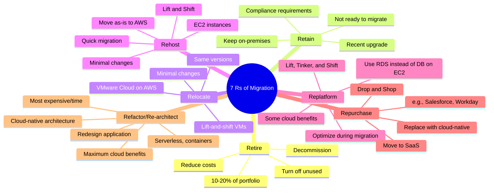
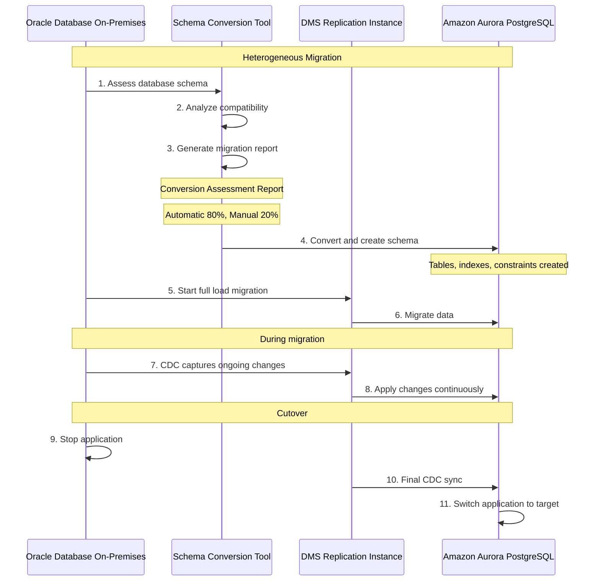
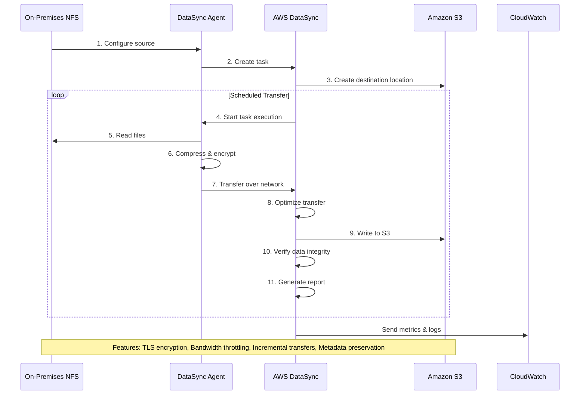
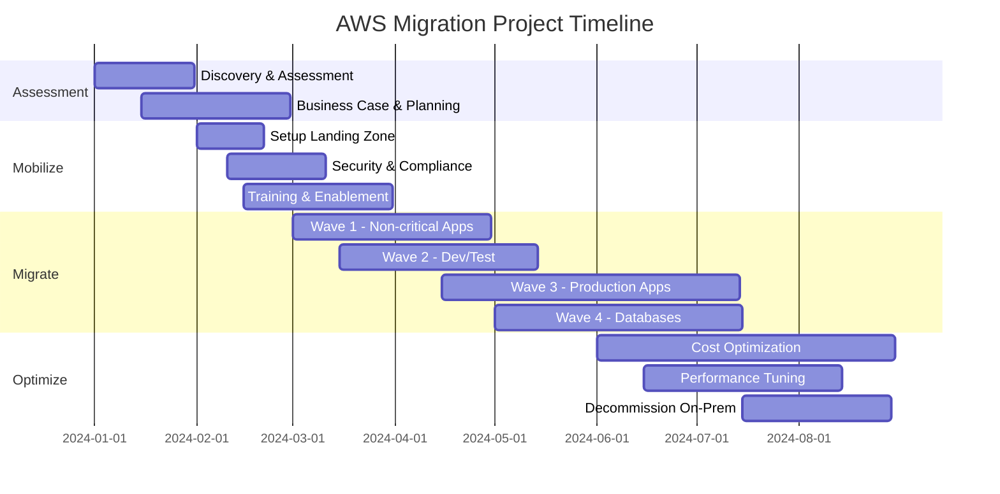

# Migration & Transfer - Mermaid Diagrams

## AWS Migration Strategies (7 Rs)

### The 7 Rs of Migration



### Migration Decision Tree

```mermaid
flowchart TD
    Start([Application to Migrate((
    
    Start --> Q1{Still needed?{
    Q1 -->|No| Retire["Retire: Decommission"[
    Q1 -->|Yes| Q2{Ready to migrate?{
    
    Q2 -->|No| Retain["Retain: Keep on-premises"[
    Q2 -->|Yes| Q3{Migration urgency?{
    
    Q3 -->|Very Urgent| Q4{VMware workload?{
    Q3 -->|Not Urgent| Q5{Willing to redesign?{
    
    Q4 -->|Yes| Relocate["Relocate: VMware Cloud on AWS"[
    Q4 -->|No| Rehost["Rehost: Lift & Shift to EC2"[
    
    Q5 -->|No| Q6{Some optimization OK?{
    Q5 -->|Yes| Q7{Budget available?{
    
    Q6 -->|Yes| Replatform["Replatform: Use managed services"[
    Q6 -->|No| Rehost
    
    Q7 -->|No| Repurchase["Repurchase: Move to SaaS"[
    Q7 -->|Yes| Refactor["Refactor: Cloud-native redesign"[
    
    classDef style1 fill:#232F3E
    class Start style1
    classDef style2 fill:#FF9900
    class Rehost style2
    classDef style3 fill:#569A31
    class Refactor style3
    classDef style4 fill:#C00
    class Retire style4
```

## AWS Migration Hub

### Migration Hub Architecture

```mermaid
graph TB
    subgraph On_Premises_Environment_Group["On-Premises Environment"[
        Servers["Physical/Virtual Servers&lt;&lt;&lt;BR_SLASH&gt;&gt;&gt;Databases&lt;&lt;&lt;BR_SLASH&gt;&gt;&gt;Applications"[
    end
    
    subgraph Discovery_Group["Discovery"[
        Connector["AWS Application&lt;&lt;&lt;BR_SLASH&gt;&gt;&gt;Discovery Service&lt;&lt;&lt;BR_SLASH&gt;&gt;&gt;Agent-based or agentless"[
        
        Import["Import via CSV&lt;&lt;&lt;BR_SLASH&gt;&gt;&gt;Manual entry&lt;&lt;&lt;BR_SLASH&gt;&gt;&gt;Partner tools"[
        
        Servers --> Connector
    end
    
    subgraph AWS_Migration_Hub_Group["AWS Migration Hub"[
        Hub["Migration Hub&lt;&lt;&lt;BR_SLASH&gt;&gt;&gt;Central tracking dashboard"[
        
        Groups["Application Groups&lt;&lt;&lt;BR_SLASH&gt;&gt;&gt;Logical grouping"[
        
        Status["Migration Status&lt;&lt;&lt;BR_SLASH&gt;&gt;&gt;Track progress"[
        
        Hub --> Groups
        Hub --> Status
    end
    
    subgraph Migration_Tools_Group["Migration Tools"[
        DMS["AWS DMS&lt;&lt;&lt;BR_SLASH&gt;&gt;&gt;Database migration"[
        SMS["AWS SMS&lt;&lt;&lt;BR_SLASH&gt;&gt;&gt;Server migration"[
        MGN["AWS MGN&lt;&lt;&lt;BR_SLASH&gt;&gt;&gt;Application Migration"[
        DataSync["AWS DataSync&lt;&lt;&lt;BR_SLASH&gt;&gt;&gt;Data transfer"[
    end
    
    subgraph AWS_Cloud_Group["AWS Cloud"[
        EC2[EC2 Instances[
        RDS[RDS Databases[
        S3[S3 Storage[
    end
    
    Connector --> Hub
    Import --> Hub
    
    Hub --> DMS
    Hub --> SMS
    Hub --> MGN
    Hub --> DataSync
    
    DMS --> RDS
    SMS --> EC2
    MGN --> EC2
    DataSync --> S3
    
    classDef style1 fill:#FF9900
    class Hub style1
    classDef style2 fill:#569A31
    class MGN style2
```

## AWS Application Discovery Service

### Discovery Service Options

```mermaid
graph TB
    subgraph Agentless_Discovery_Group["Agentless Discovery"[
        Agentless["AWS Agentless&lt;&lt;&lt;BR_SLASH&gt;&gt;&gt;Discovery Connector&lt;&lt;&lt;BR_SLASH&gt;&gt;&gt;VMware vCenter"[
        
        Agentless_Data["Collects:&lt;&lt;&lt;BR_SLASH&gt;&gt;&gt;• VM inventory&lt;&lt;&lt;BR_SLASH&gt;&gt;&gt;• Configuration&lt;&lt;&lt;BR_SLASH&gt;&gt;&gt;• Performance metrics&lt;&lt;&lt;BR_SLASH&gt;&gt;&gt;• Network connections&lt;&lt;&lt;BR_SLASH&gt;&gt;&gt;⚠️ VMware only"[
    end
    
    subgraph Agent_based_Discovery_Group["Agent-based Discovery"[
        Agent["AWS Discovery Agent&lt;&lt;&lt;BR_SLASH&gt;&gt;&gt;Install on each server"[
        
        Agent_Data["Collects:&lt;&lt;&lt;BR_SLASH&gt;&gt;&gt;• System config&lt;&lt;&lt;BR_SLASH&gt;&gt;&gt;• Performance&lt;&lt;&lt;BR_SLASH&gt;&gt;&gt;• Running processes&lt;&lt;&lt;BR_SLASH&gt;&gt;&gt;• Network connections&lt;&lt;&lt;BR_SLASH&gt;&gt;&gt;• Dependencies&lt;&lt;&lt;BR_SLASH&gt;&gt;&gt;✅ Works on any server"[
    end
    
    subgraph Data_Analysis_Group["Data Analysis"[
        MigrationHub["Migration Hub&lt;&lt;&lt;BR_SLASH&gt;&gt;&gt;Analyze data"[
        
        Athena["Amazon Athena&lt;&lt;&lt;BR_SLASH&gt;&gt;&gt;Query discovery data"[
        
        QuickSight["Amazon QuickSight&lt;&lt;&lt;BR_SLASH&gt;&gt;&gt;Visualize data"[
    end
    
    Agentless --> Agentless_Data
    Agent --> Agent_Data
    
    Agentless_Data --> MigrationHub
    Agent_Data --> MigrationHub
    
    MigrationHub --> Athena
    MigrationHub --> QuickSight
    
    Use["Use Cases:&lt;&lt;&lt;BR_SLASH&gt;&gt;&gt;• Discover application dependencies&lt;&lt;&lt;BR_SLASH&gt;&gt;&gt;• Plan migration wave&lt;&lt;&lt;BR_SLASH&gt;&gt;&gt;• Rightsizing recommendations&lt;&lt;&lt;BR_SLASH&gt;&gt;&gt;• TCO analysis"[
    
    classDef style1 fill:#FF9900
    class Agentless style1
    classDef style2 fill:#569A31
    class Agent style2
```

## AWS Database Migration Service (DMS)

### DMS Architecture

```mermaid
graph TB
    subgraph Source_Databases_Group["Source Databases"[
        Oracle[Oracle[
        SQLServer[SQL Server[
        MySQL[MySQL[
        PostgreSQL[PostgreSQL[
        MongoDB[MongoDB[
        SAP[SAP ASE[
        S3Source[Amazon S3[
    end
    
    subgraph AWS_DMS_Group["AWS DMS"[
        Replication["DMS Replication Instance&lt;&lt;&lt;BR_SLASH&gt;&gt;&gt;EC2 instance running DMS"[
        
        Tasks["Migration Tasks&lt;&lt;&lt;BR_SLASH&gt;&gt;&gt;Source -&gt; Target mapping"[
        
        SCT["Schema Conversion Tool&lt;&lt;&lt;BR_SLASH&gt;&gt;&gt;Heterogeneous migrations"[
        
        Replication --> Tasks
    end
    
    subgraph Target_Databases_Group["Target Databases"[
        RDS[Amazon RDS[
        Aurora[Amazon Aurora[
        Redshift[Amazon Redshift[
        S3Target[Amazon S3[
        DynamoDB[DynamoDB[
        OpenSearch[OpenSearch[
        Kinesis[Kinesis Data Streams[
    end
    
    Oracle --> SCT
    SQLServer --> SCT
    
    SCT --> Replication
    
    MySQL --> Replication
    PostgreSQL --> Replication
    MongoDB --> Replication
    SAP --> Replication
    S3Source --> Replication
    
    Tasks --> RDS
    Tasks --> Aurora
    Tasks --> Redshift
    Tasks --> S3Target
    Tasks --> DynamoDB
    Tasks --> OpenSearch
    Tasks --> Kinesis
    
    CDC["Continuous Data Capture CDC&lt;&lt;&lt;BR_SLASH&gt;&gt;&gt;Ongoing replication&lt;&lt;&lt;BR_SLASH&gt;&gt;&gt;Minimal downtime"[ -.Feature.-> Replication
    
    classDef style1 fill:#FF9900
    class Replication style1
    classDef style2 fill:#569A31
    class SCT style2
```

### DMS Migration Types

```mermaid
graph LR
    subgraph Full_Load_Group["Full Load"[
        FL["Full Load Migration&lt;&lt;&lt;BR_SLASH&gt;&gt;&gt;One-time migration&lt;&lt;&lt;BR_SLASH&gt;&gt;&gt;Snapshot of data"[
        
        FL_Steps["1. Stop writes to source&lt;&lt;&lt;BR_SLASH&gt;&gt;&gt;2. Migrate all data&lt;&lt;&lt;BR_SLASH&gt;&gt;&gt;3. Switch to target&lt;&lt;&lt;BR_SLASH&gt;&gt;&gt;⚠️ Downtime required"[
    end
    
    subgraph Full_Load_CDC_Group["Full Load + CDC"[
        FLCDC["Full Load + CDC&lt;&lt;&lt;BR_SLASH&gt;&gt;&gt;Minimal downtime&lt;&lt;&lt;BR_SLASH&gt;&gt;&gt;Recommended approach"[
        
        FLCDC_Steps["1. Full load starts&lt;&lt;&lt;BR_SLASH&gt;&gt;&gt;2. CDC captures changes&lt;&lt;&lt;BR_SLASH&gt;&gt;&gt;3. Apply cached changes&lt;&lt;&lt;BR_SLASH&gt;&gt;&gt;4. Ongoing replication&lt;&lt;&lt;BR_SLASH&gt;&gt;&gt;✅ Minimal downtime"[
    end
    
    subgraph CDC_Only_Group["CDC Only"[
        CDC["CDC Only&lt;&lt;&lt;BR_SLASH&gt;&gt;&gt;Replicate ongoing changes&lt;&lt;&lt;BR_SLASH&gt;&gt;&gt;Assumes data already migrated"[
        
        CDC_Steps["1. Existing data in target&lt;&lt;&lt;BR_SLASH&gt;&gt;&gt;2. Replicate changes only&lt;&lt;&lt;BR_SLASH&gt;&gt;&gt;3. Keep in sync&lt;&lt;&lt;BR_SLASH&gt;&gt;&gt;Use: After full load"[
    end
    
    FL --> FL_Steps
    FLCDC --> FLCDC_Steps
    CDC --> CDC_Steps
    
    Recommendation["Recommendation:&lt;&lt;&lt;BR_SLASH&gt;&gt;&gt;Use Full Load + CDC&lt;&lt;&lt;BR_SLASH&gt;&gt;&gt;for production migrations"[
    
    classDef style1 fill:#569A31
    class FLCDC style1
    classDef style2 fill:#FF9900
    class FL style2
```

### DMS with Schema Conversion Tool



## AWS Application Migration Service (MGN)

### MGN CloudEndure Migration

```mermaid
graph TB
    subgraph Source_Environment_Group["Source Environment"[
        Physical[Physical Servers[
        Virtual[Virtual Machines[
        Cloud["Other Cloud&lt;&lt;&lt;BR_SLASH&gt;&gt;&gt;Azure, GCP"[
        
        Agent["MGN Replication Agent&lt;&lt;&lt;BR_SLASH&gt;&gt;&gt;Installed on each server"[
        
        Physical --> Agent
        Virtual --> Agent
        Cloud --> Agent
    end
    
    subgraph AWS_Migration_Service_Group["AWS Migration Service"[
        MGN["AWS Application&lt;&lt;&lt;BR_SLASH&gt;&gt;&gt;Migration Service&lt;&lt;&lt;BR_SLASH&gt;&gt;&gt;Automated Lift-and-Shift"[
        
        Staging["Staging Area&lt;&lt;&lt;BR_SLASH&gt;&gt;&gt;Low-cost replication&lt;&lt;&lt;BR_SLASH&gt;&gt;&gt;EBS volumes"[
        
        MGN --> Staging
    end
    
    subgraph Target_AWS_Group["Target AWS"[
        Testing["Test Instances&lt;&lt;&lt;BR_SLASH&gt;&gt;&gt;Non-disruptive testing&lt;&lt;&lt;BR_SLASH&gt;&gt;&gt;Isolated environment"[
        
        Production["Production Instances&lt;&lt;&lt;BR_SLASH&gt;&gt;&gt;Cutover when ready&lt;&lt;&lt;BR_SLASH&gt;&gt;&gt;Minimal downtime"[
    end
    
    Agent -.Continuous<br/>Block-level replication.-> Staging
    
    Staging --> Testing
    Testing -.Launch cutover.-> Production
    
    Cutover["Cutover Process:&lt;&lt;&lt;BR_SLASH&gt;&gt;&gt;1. Stop replication agent&lt;&lt;&lt;BR_SLASH&gt;&gt;&gt;2. Launch target instances&lt;&lt;&lt;BR_SLASH&gt;&gt;&gt;3. Switch DNS/network&lt;&lt;&lt;BR_SLASH&gt;&gt;&gt;4. Application running on AWS&lt;&lt;&lt;BR_SLASH&gt;&gt;&gt;Downtime: Minutes"[
    
    Features["Features:&lt;&lt;&lt;BR_SLASH&gt;&gt;&gt;✅ Continuous replication&lt;&lt;&lt;BR_SLASH&gt;&gt;&gt;✅ Non-disruptive testing&lt;&lt;&lt;BR_SLASH&gt;&gt;&gt;✅ Automated conversion&lt;&lt;&lt;BR_SLASH&gt;&gt;&gt;✅ Minimal downtime &lt;1 hour&lt;&lt;&lt;BR_SLASH&gt;&gt;&gt;✅ Any source to AWS"[
    
    classDef style1 fill:#FF9900
    class MGN style1
    classDef style2 fill:#569A31
    class Production style2
```

## AWS DataSync

### DataSync Architecture

```mermaid
graph TB
    subgraph Source_Locations_Group["Source Locations"[
        NFS["NFS Server&lt;&lt;&lt;BR_SLASH&gt;&gt;&gt;On-premises"[
        SMB["SMB Server&lt;&lt;&lt;BR_SLASH&gt;&gt;&gt;On-premises"[
        HDFS["HDFS Cluster&lt;&lt;&lt;BR_SLASH&gt;&gt;&gt;Hadoop"[
        S3Compatible[S3-compatible storage[
        
        Agent["DataSync Agent&lt;&lt;&lt;BR_SLASH&gt;&gt;&gt;VM on-premises&lt;&lt;&lt;BR_SLASH&gt;&gt;&gt;or EC2"[
        
        NFS --> Agent
        SMB --> Agent
        HDFS --> Agent
    end
    
    subgraph AWS_DataSync_Service_Group["AWS DataSync Service"[
        DataSync["AWS DataSync&lt;&lt;&lt;BR_SLASH&gt;&gt;&gt;Managed data transfer&lt;&lt;&lt;BR_SLASH&gt;&gt;&gt;Accelerated, encrypted"[
        
        Schedule["Scheduled Tasks&lt;&lt;&lt;BR_SLASH&gt;&gt;&gt;Hourly, daily, weekly&lt;&lt;&lt;BR_SLASH&gt;&gt;&gt;or one-time"[
        
        Verification["Data Verification&lt;&lt;&lt;BR_SLASH&gt;&gt;&gt;Integrity checks&lt;&lt;&lt;BR_SLASH&gt;&gt;&gt;End-to-end"[
        
        DataSync --> Schedule
        DataSync --> Verification
    end
    
    subgraph Destination_Locations_Group["Destination Locations"[
        S3["Amazon S3&lt;&lt;&lt;BR_SLASH&gt;&gt;&gt;All storage classes"[
        EFS["Amazon EFS&lt;&lt;&lt;BR_SLASH&gt;&gt;&gt;File system"[
        FSx["Amazon FSx&lt;&lt;&lt;BR_SLASH&gt;&gt;&gt;Windows/Lustre/NetApp/OpenZFS"[
    end
    
    Agent --> DataSync
    S3Compatible --> DataSync
    
    DataSync --> S3
    DataSync --> EFS
    DataSync --> FSx
    
    Features["Features:&lt;&lt;&lt;BR_SLASH&gt;&gt;&gt;✅ 10x faster than open-source tools&lt;&lt;&lt;BR_SLASH&gt;&gt;&gt;✅ Bandwidth throttling&lt;&lt;&lt;BR_SLASH&gt;&gt;&gt;✅ Data encryption in-transit&lt;&lt;&lt;BR_SLASH&gt;&gt;&gt;✅ Data integrity validation&lt;&lt;&lt;BR_SLASH&gt;&gt;&gt;✅ Pay per GB transferred&lt;&lt;&lt;BR_SLASH&gt;&gt;&gt;✅ Incremental transfers"[
    
    VsSnowball["DataSync vs Snowball:&lt;&lt;&lt;BR_SLASH&gt;&gt;&gt;DataSync: Online transfer, recurring&lt;&lt;&lt;BR_SLASH&gt;&gt;&gt;Snowball: Offline, one-time large migration"[
    
    classDef style1 fill:#FF9900
    class DataSync style1
    classDef style2 fill:#569A31
    class Agent style2
```

### DataSync Transfer Flow



## AWS Transfer Family

### Transfer Family Services

```mermaid
graph TB
    subgraph Clients_Group["Clients"[
        SFTP_Client[SFTP Clients[
        FTPS_Client[FTPS Clients[
        FTP_Client[FTP Clients[
        AS2_Client[AS2 EDI Partners[
    end
    
    subgraph AWS_Transfer_Family_Group["AWS Transfer Family"[
        SFTP["Transfer for SFTP&lt;&lt;&lt;BR_SLASH&gt;&gt;&gt;SSH File Transfer Protocol"[
        FTPS["Transfer for FTPS&lt;&lt;&lt;BR_SLASH&gt;&gt;&gt;FTP over SSL/TLS"[
        FTP["Transfer for FTP&lt;&lt;&lt;BR_SLASH&gt;&gt;&gt;File Transfer Protocol"[
        AS2["Transfer for AS2&lt;&lt;&lt;BR_SLASH&gt;&gt;&gt;EDI B2B"[
        
        Auth["Authentication:&lt;&lt;&lt;BR_SLASH&gt;&gt;&gt;• Service-managed&lt;&lt;&lt;BR_SLASH&gt;&gt;&gt;• Active Directory&lt;&lt;&lt;BR_SLASH&gt;&gt;&gt;• Custom Lambda&lt;&lt;&lt;BR_SLASH&gt;&gt;&gt;• Okta, Auth0"[
        
        SFTP --> Auth
        FTPS --> Auth
        FTP --> Auth
        AS2 --> Auth
    end
    
    subgraph Storage_Backends_Group["Storage Backends"[
        S3["Amazon S3&lt;&lt;&lt;BR_SLASH&gt;&gt;&gt;Object storage"[
        EFS["Amazon EFS&lt;&lt;&lt;BR_SLASH&gt;&gt;&gt;File storage"[
    end
    
    subgraph Features_Group["Features"[
        VPC["VPC Hosted&lt;&lt;&lt;BR_SLASH&gt;&gt;&gt;Private endpoints"[
        Public["Internet-facing&lt;&lt;&lt;BR_SLASH&gt;&gt;&gt;Public endpoints"[
        DNS["Custom DNS&lt;&lt;&lt;BR_SLASH&gt;&gt;&gt;Your domain"[
    end
    
    SFTP_Client --> SFTP
    FTPS_Client --> FTPS
    FTP_Client --> FTP
    AS2_Client --> AS2
    
    SFTP --> S3
    SFTP --> EFS
    FTPS --> S3
    FTP --> S3
    AS2 --> S3
    
    SFTP -.Deploy.-> VPC
    SFTP -.Deploy.-> Public
    SFTP -.Use.-> DNS
    
    UseCase["Use Cases:&lt;&lt;&lt;BR_SLASH&gt;&gt;&gt;• Legacy application migration&lt;&lt;&lt;BR_SLASH&gt;&gt;&gt;• B2B file exchange&lt;&lt;&lt;BR_SLASH&gt;&gt;&gt;• Data lake ingestion&lt;&lt;&lt;BR_SLASH&gt;&gt;&gt;• Replace on-prem FTP servers&lt;&lt;&lt;BR_SLASH&gt;&gt;&gt;💰 Pay per hour + data transferred"[
    
    classDef style1 fill:#FF9900
    class SFTP style1
    classDef style2 fill:#569A31
    class S3 style2
```

## AWS Snow Family Migration

### Snow Family Device Comparison

```mermaid
graph TB
    Decision["📊 Choose Your Device:<br/>• &lt; 10 TB → Snowcone<br/>• 10-80 TB → Snowball<br/>• &gt; 10 PB → Snowmobile"]
    
    subgraph Snowcone_Group["Snowcone"[
        Snowcone["AWS Snowcone&lt;&lt;&lt;BR_SLASH&gt;&gt;&gt;Smallest device"[
        
        Snowcone_Specs["Specs:&lt;&lt;&lt;BR_SLASH&gt;&gt;&gt;💾 8-14 TB usable&lt;&lt;&lt;BR_SLASH&gt;&gt;&gt;💪 2 vCPUs, 4 GB RAM&lt;&lt;&lt;BR_SLASH&gt;&gt;&gt;📦 4.5 lbs / 2 kg&lt;&lt;&lt;BR_SLASH&gt;&gt;&gt;🔋 Battery optional&lt;&lt;&lt;BR_SLASH&gt;&gt;&gt;📡 Wi-Fi optional"[
        
        Snowcone_Use["Use Cases:&lt;&lt;&lt;BR_SLASH&gt;&gt;&gt;• Edge computing&lt;&lt;&lt;BR_SLASH&gt;&gt;&gt;• IoT&lt;&lt;&lt;BR_SLASH&gt;&gt;&gt;• Remote locations&lt;&lt;&lt;BR_SLASH&gt;&gt;&gt;• Drones&lt;&lt;&lt;BR_SLASH&gt;&gt;&gt;• Vehicles"[
        
        Snowcone --> Snowcone_Specs
        Snowcone_Specs --> Snowcone_Use
    end
    
    subgraph Snowball_Group["Snowball Edge"[
        Snowball["AWS Snowball Edge"[
        
        Storage["Storage Optimized&lt;&lt;&lt;BR_SLASH&gt;&gt;&gt;💾 80 TB usable&lt;&lt;&lt;BR_SLASH&gt;&gt;&gt;💪 40 vCPUs, 80 GB RAM&lt;&lt;&lt;BR_SLASH&gt;&gt;&gt;📦 50 lbs"[
        
        Compute["Compute Optimized&lt;&lt;&lt;BR_SLASH&gt;&gt;&gt;💾 42-28 TB usable&lt;&lt;&lt;BR_SLASH&gt;&gt;&gt;💪 52 vCPUs, 208 GB RAM&lt;&lt;&lt;BR_SLASH&gt;&gt;&gt;🎮 Optional GPU"[
        
        Snowball_Use["Use Cases:&lt;&lt;&lt;BR_SLASH&gt;&gt;&gt;• Data center migration&lt;&lt;&lt;BR_SLASH&gt;&gt;&gt;• Disaster recovery&lt;&lt;&lt;BR_SLASH&gt;&gt;&gt;• Content distribution&lt;&lt;&lt;BR_SLASH&gt;&gt;&gt;• Local processing"[
        
        Snowball --> Storage
        Snowball --> Compute
        Storage --> Snowball_Use
        Compute --> Snowball_Use
    end
    
    subgraph Snowmobile_Group["Snowmobile"[
        Snowmobile["AWS Snowmobile&lt;&lt;&lt;BR_SLASH&gt;&gt;&gt;Shipping container"[
        
        Snowmobile_Specs["Specs:&lt;&lt;&lt;BR_SLASH&gt;&gt;&gt;💾 100 PB capacity&lt;&lt;&lt;BR_SLASH&gt;&gt;&gt;🚛 45-foot container&lt;&lt;&lt;BR_SLASH&gt;&gt;&gt;🔒 GPS tracking&lt;&lt;&lt;BR_SLASH&gt;&gt;&gt;👮 Security escort&lt;&lt;&lt;BR_SLASH&gt;&gt;&gt;📹 Video surveillance"[
        
        Snowmobile_Use["Use Cases:&lt;&lt;&lt;BR_SLASH&gt;&gt;&gt;• Exabyte-scale migration&lt;&lt;&lt;BR_SLASH&gt;&gt;&gt;• Complete datacenter&lt;&lt;&lt;BR_SLASH&gt;&gt;&gt;• Video libraries&lt;&lt;&lt;BR_SLASH&gt;&gt;&gt;• Massive datasets"[
        
        Snowmobile --> Snowmobile_Specs
        Snowmobile_Specs --> Snowmobile_Use
    end
    
    Decision -.-> Snowcone
    Decision -.-> Snowball
    Decision -.-> Snowmobile
    
    classDef style1 fill:#569A31,stroke:#333,stroke-width:2px,color:#fff
    classDef style2 fill:#FF9900,stroke:#333,stroke-width:2px,color:#fff
    classDef style3 fill:#146EB4,stroke:#333,stroke-width:2px,color:#fff
    classDef decisionStyle fill:#232F3E,stroke:#FF9900,stroke-width:3px,color:#fff
    
    class Snowcone,Snowcone_Specs,Snowcone_Use style1
    class Snowball,Storage,Compute,Snowball_Use style2
    class Snowmobile,Snowmobile_Specs,Snowmobile_Use style3
    class Decision decisionStyle
```

### Snow Family with Edge Computing

```mermaid
graph TB
    subgraph Edge_Location_Remote_Site_Group["Edge Location Remote Site"[
        Snowball["Snowball Edge&lt;&lt;&lt;BR_SLASH&gt;&gt;&gt;Compute Optimized"[
        
        LocalData["Local Data Sources&lt;&lt;&lt;BR_SLASH&gt;&gt;&gt;Sensors, Cameras, IoT"[
        
        EC2["EC2 Instances&lt;&lt;&lt;BR_SLASH&gt;&gt;&gt;Running on Snowball"[
        
        Lambda["Lambda Functions&lt;&lt;&lt;BR_SLASH&gt;&gt;&gt;Local processing"[
        
        LocalData --> Snowball
        Snowball --> EC2
        Snowball --> Lambda
    end
    
    subgraph Processing_at_Edge_Group["Processing at Edge"[
        Analysis["Data Analysis&lt;&lt;&lt;BR_SLASH&gt;&gt;&gt;ML inference&lt;&lt;&lt;BR_SLASH&gt;&gt;&gt;Video processing&lt;&lt;&lt;BR_SLASH&gt;&gt;&gt;Image recognition"[
        
        Storage["Local Storage&lt;&lt;&lt;BR_SLASH&gt;&gt;&gt;Buffer data&lt;&lt;&lt;BR_SLASH&gt;&gt;&gt;80 TB capacity"[
        
        EC2 --> Analysis
        Analysis --> Storage
    end
    
    subgraph AWS_Cloud_Group["AWS Cloud"[
        S3["Amazon S3&lt;&lt;&lt;BR_SLASH&gt;&gt;&gt;Final destination"[
        
        CloudProcessing["Cloud Processing&lt;&lt;&lt;BR_SLASH&gt;&gt;&gt;ML training&lt;&lt;&lt;BR_SLASH&gt;&gt;&gt;Analytics&lt;&lt;&lt;BR_SLASH&gt;&gt;&gt;Long-term storage"[
    end
    
    Storage -.Ship device back.-> S3
    Storage -.DataSync over network.-> S3
    
    S3 --> CloudProcessing
    
    UseCase["Edge Computing Use Cases:&lt;&lt;&lt;BR_SLASH&gt;&gt;&gt;• Oil & gas exploration&lt;&lt;&lt;BR_SLASH&gt;&gt;&gt;• Military operations&lt;&lt;&lt;BR_SLASH&gt;&gt;&gt;• Cruise ships&lt;&lt;&lt;BR_SLASH&gt;&gt;&gt;• Mining sites&lt;&lt;&lt;BR_SLASH&gt;&gt;&gt;• Manufacturing floors&lt;&lt;&lt;BR_SLASH&gt;&gt;&gt;• Disaster zones"[
    
    OpsHub["AWS OpsHub&lt;&lt;&lt;BR_SLASH&gt;&gt;&gt;GUI management tool&lt;&lt;&lt;BR_SLASH&gt;&gt;&gt;Manage Snow devices"[ -.Manages.-> Snowball
    
    classDef style1 fill:#FF9900
    class Snowball style1
    classDef style2 fill:#569A31
    class Analysis style2
```

## Migration Timeline

### Typical Large-Scale Migration



