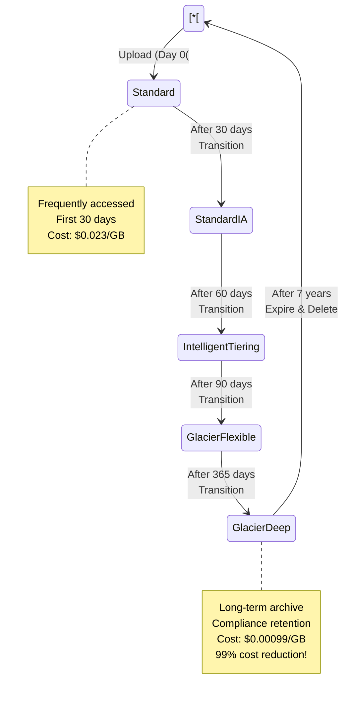
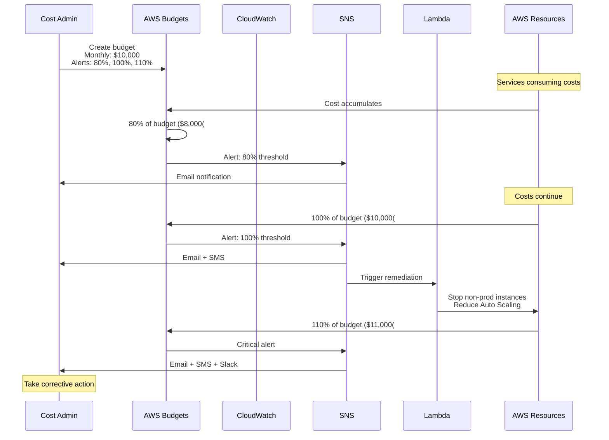

# Cost Optimization - Mermaid Diagrams

## Cost Optimization Strategies

### Cost Optimization Pillars

```mermaid
mindmap
    root((Cost&lt;&lt;&lt;BR_SLASH&gt;&gt;&gt;Optimization()
        Right-Sizing
            Match instances to workload
            CloudWatch metrics
            Compute Optimizer
            Downsize over-provisioned
        Purchase Options
            On-Demand baseline
            Reserved Instances 1-3 year
            Savings Plans flexible
            Spot Instances 90% off
        Storage Optimization
            S3 Lifecycle policies
            EBS snapshot cleanup
            Intelligent-Tiering
            Archive to Glacier
        Monitoring & Governance
            Cost allocation tags
            AWS Budgets
            Cost Explorer
            Trusted Advisor
        Serverless & Managed
            Lambda pay-per-use
            DynamoDB on-demand
            Fargate containers
            Aurora Serverless
```

## EC2 Cost Optimization

### EC2 Pricing Models Comparison

```mermaid
graph TB
    subgraph On_Demand_Instances_Group["On-Demand Instances"[
        OD["On-Demand&lt;&lt;&lt;BR_SLASH&gt;&gt;&gt;💰 Full price&lt;&lt;&lt;BR_SLASH&gt;&gt;&gt;⏱️ No commitment&lt;&lt;&lt;BR_SLASH&gt;&gt;&gt;📊 Flexible"[
        
        OD_Use["Use Cases:&lt;&lt;&lt;BR_SLASH&gt;&gt;&gt;• Unpredictable workloads&lt;&lt;&lt;BR_SLASH&gt;&gt;&gt;• Development/testing&lt;&lt;&lt;BR_SLASH&gt;&gt;&gt;• Short-term spikes&lt;&lt;&lt;BR_SLASH&gt;&gt;&gt;• New applications"[
        
        OD_Price["Pricing:&lt;&lt;&lt;BR_SLASH&gt;&gt;&gt;Linux t3.medium:&lt;&lt;&lt;BR_SLASH&gt;&gt;&gt;$0.0416/hour&lt;&lt;&lt;BR_SLASH&gt;&gt;&gt;$30/month"[
    end
    
    subgraph Reserved_Instances_Group["Reserved Instances"[
        RI["Reserved Instances&lt;&lt;&lt;BR_SLASH&gt;&gt;&gt;💰 Up to 72% discount&lt;&lt;&lt;BR_SLASH&gt;&gt;&gt;⏱️ 1 or 3 years&lt;&lt;&lt;BR_SLASH&gt;&gt;&gt;📊 Predictable"[
        
        RI_Types["Types:&lt;&lt;&lt;BR_SLASH&gt;&gt;&gt;• Standard RI 72% off&lt;&lt;&lt;BR_SLASH&gt;&gt;&gt;• Convertible RI 54% off&lt;&lt;&lt;BR_SLASH&gt;&gt;&gt;• Scheduled RI specific times"[
        
        RI_Use["Use Cases:&lt;&lt;&lt;BR_SLASH&gt;&gt;&gt;• Steady-state workloads&lt;&lt;&lt;BR_SLASH&gt;&gt;&gt;• Databases&lt;&lt;&lt;BR_SLASH&gt;&gt;&gt;• Base capacity&lt;&lt;&lt;BR_SLASH&gt;&gt;&gt;• Long-term projects"[
        
        RI_Price["Pricing:&lt;&lt;&lt;BR_SLASH&gt;&gt;&gt;Linux t3.medium 3yr:&lt;&lt;&lt;BR_SLASH&gt;&gt;&gt;$0.0116/hour&lt;&lt;&lt;BR_SLASH&gt;&gt;&gt;$8.50/month&lt;&lt;&lt;BR_SLASH&gt;&gt;&gt;72% savings"[
    end
    
    subgraph Savings_Plans_Group["Savings Plans"[
        SP["Savings Plans&lt;&lt;&lt;BR_SLASH&gt;&gt;&gt;💰 Up to 66% discount&lt;&lt;&lt;BR_SLASH&gt;&gt;&gt;⏱️ 1 or 3 years&lt;&lt;&lt;BR_SLASH&gt;&gt;&gt;📊 More flexible"[
        
        SP_Types["Types:&lt;&lt;&lt;BR_SLASH&gt;&gt;&gt;• Compute SP 66% off any instance&lt;&lt;&lt;BR_SLASH&gt;&gt;&gt;• EC2 Instance SP 72% off specific&lt;&lt;&lt;BR_SLASH&gt;&gt;&gt;• SageMaker SP ML workloads"[
        
        SP_Use["Use Cases:&lt;&lt;&lt;BR_SLASH&gt;&gt;&gt;• Consistent usage&lt;&lt;&lt;BR_SLASH&gt;&gt;&gt;• Flexible instance types&lt;&lt;&lt;BR_SLASH&gt;&gt;&gt;• Cross-service usage&lt;&lt;&lt;BR_SLASH&gt;&gt;&gt;• Container workloads"[
    end
    
    subgraph Spot_Instances_Group["Spot Instances"[
        Spot["Spot Instances&lt;&lt;&lt;BR_SLASH&gt;&gt;&gt;💰 Up to 90% discount&lt;&lt;&lt;BR_SLASH&gt;&gt;&gt;⏱️ Can be interrupted&lt;&lt;&lt;BR_SLASH&gt;&gt;&gt;📊 Fault-tolerant"[
        
        Spot_Use["Use Cases:&lt;&lt;&lt;BR_SLASH&gt;&gt;&gt;• Batch processing&lt;&lt;&lt;BR_SLASH&gt;&gt;&gt;• Big data analysis&lt;&lt;&lt;BR_SLASH&gt;&gt;&gt;• CI/CD pipelines&lt;&lt;&lt;BR_SLASH&gt;&gt;&gt;• Containerized workloads&lt;&lt;&lt;BR_SLASH&gt;&gt;&gt;• Fault-tolerant apps"[
        
        Spot_Price["Pricing:&lt;&lt;&lt;BR_SLASH&gt;&gt;&gt;Linux t3.medium:&lt;&lt;&lt;BR_SLASH&gt;&gt;&gt;$0.0125/hour avg&lt;&lt;&lt;BR_SLASH&gt;&gt;&gt;$9/month&lt;&lt;&lt;BR_SLASH&gt;&gt;&gt;70% savings"[
    end
    
    Recommendation["Recommendation:&lt;&lt;&lt;BR_SLASH&gt;&gt;&gt;Mix of pricing models:&lt;&lt;&lt;BR_SLASH&gt;&gt;&gt;• Base capacity: Reserved/Savings Plans&lt;&lt;&lt;BR_SLASH&gt;&gt;&gt;• Variable load: On-Demand&lt;&lt;&lt;BR_SLASH&gt;&gt;&gt;• Batch jobs: Spot Instances"[
    
    classDef style1 fill:#569A31
    class RI style1
    classDef style2 fill:#FF9900
    class Spot style2
    classDef style3 fill:#146EB4
    class SP style3
```

### Reserved Instance Types

```mermaid
graph TB
    RI[Reserved Instances[
    
    RI --> Standard["Standard RI&lt;&lt;&lt;BR_SLASH&gt;&gt;&gt;💰 Up to 72% discount&lt;&lt;&lt;BR_SLASH&gt;&gt;&gt;📊 Cannot change instance family&lt;&lt;&lt;BR_SLASH&gt;&gt;&gt;✅ Best for steady workloads"[
    
    RI --> Convertible["Convertible RI&lt;&lt;&lt;BR_SLASH&gt;&gt;&gt;💰 Up to 54% discount&lt;&lt;&lt;BR_SLASH&gt;&gt;&gt;🔄 Change instance family&lt;&lt;&lt;BR_SLASH&gt;&gt;&gt;🔄 Change OS, tenancy&lt;&lt;&lt;BR_SLASH&gt;&gt;&gt;✅ Flexibility with savings"[
    
    RI --> Scheduled["Scheduled RI&lt;&lt;&lt;BR_SLASH&gt;&gt;&gt;Deprecated&lt;&lt;&lt;BR_SLASH&gt;&gt;&gt;Use Savings Plans instead"[
    
    subgraph Payment_Options_Group["Payment Options"[
        Standard --> AllUpfront["All Upfront&lt;&lt;&lt;BR_SLASH&gt;&gt;&gt;💰 Maximum discount&lt;&lt;&lt;BR_SLASH&gt;&gt;&gt;Pay 100% upfront"[
        
        Standard --> PartialUpfront["Partial Upfront&lt;&lt;&lt;BR_SLASH&gt;&gt;&gt;💰 Good discount&lt;&lt;&lt;BR_SLASH&gt;&gt;&gt;Pay ~50% upfront&lt;&lt;&lt;BR_SLASH&gt;&gt;&gt;Monthly payments"[
        
        Standard --> NoUpfront["No Upfront&lt;&lt;&lt;BR_SLASH&gt;&gt;&gt;💰 Lower discount&lt;&lt;&lt;BR_SLASH&gt;&gt;&gt;Monthly payments only"[
    end
    
    subgraph Scope_Group["Scope"[
        Regional["Regional RI&lt;&lt;&lt;BR_SLASH&gt;&gt;&gt;✅ AZ flexibility&lt;&lt;&lt;BR_SLASH&gt;&gt;&gt;✅ Instance size flexibility&lt;&lt;&lt;BR_SLASH&gt;&gt;&gt;Linux only&lt;&lt;&lt;BR_SLASH&gt;&gt;&gt;Recommended"[
        
        Zonal["Zonal RI&lt;&lt;&lt;BR_SLASH&gt;&gt;&gt;✅ Capacity reservation&lt;&lt;&lt;BR_SLASH&gt;&gt;&gt;❌ No flexibility&lt;&lt;&lt;BR_SLASH&gt;&gt;&gt;Specific AZ"[
    end
    
    Marketplace["RI Marketplace&lt;&lt;&lt;BR_SLASH&gt;&gt;&gt;Buy/Sell unused RIs"[ -.Trade.-> Standard
    
    classDef style1 fill:#569A31
    class Standard style1
    classDef style2 fill:#FF9900
    class Convertible style2
```

### Spot Instance Strategies

```mermaid
graph TB
    subgraph Spot_Instance_Best_Practices_Group["Spot Instance Best Practices"[
        Fleet["Spot Fleet&lt;&lt;&lt;BR_SLASH&gt;&gt;&gt;Combination of instance types&lt;&lt;&lt;BR_SLASH&gt;&gt;&gt;Automatic diversification"[
        
        Fallback["Spot + On-Demand&lt;&lt;&lt;BR_SLASH&gt;&gt;&gt;Maintain capacity"[
        
        Checkpointing["Checkpointing&lt;&lt;&lt;BR_SLASH&gt;&gt;&gt;Save state regularly&lt;&lt;&lt;BR_SLASH&gt;&gt;&gt;Resume on interruption"[
        
        Interruption["Spot Instance&lt;&lt;&lt;BR_SLASH&gt;&gt;&gt;Interruption Notice&lt;&lt;&lt;BR_SLASH&gt;&gt;&gt;2-minute warning"[
    end
    
    subgraph Use_Cases_Group["Use Cases"[
        Batch["Batch Processing&lt;&lt;&lt;BR_SLASH&gt;&gt;&gt;✅ Divisible workloads&lt;&lt;&lt;BR_SLASH&gt;&gt;&gt;✅ Can pause/resume&lt;&lt;&lt;BR_SLASH&gt;&gt;&gt;e.g., Video encoding"[
        
        BigData["Big Data Analytics&lt;&lt;&lt;BR_SLASH&gt;&gt;&gt;✅ EMR with Spot&lt;&lt;&lt;BR_SLASH&gt;&gt;&gt;✅ Task nodes on Spot&lt;&lt;&lt;BR_SLASH&gt;&gt;&gt;Core nodes on On-Demand"[
        
        CI_CD["CI/CD Pipelines&lt;&lt;&lt;BR_SLASH&gt;&gt;&gt;✅ Build servers&lt;&lt;&lt;BR_SLASH&gt;&gt;&gt;✅ Test environments&lt;&lt;&lt;BR_SLASH&gt;&gt;&gt;✅ Ephemeral workloads"[
        
        Containers["Container Workloads&lt;&lt;&lt;BR_SLASH&gt;&gt;&gt;✅ ECS/EKS with Spot&lt;&lt;&lt;BR_SLASH&gt;&gt;&gt;✅ Stateless services&lt;&lt;&lt;BR_SLASH&gt;&gt;&gt;✅ Auto-scaling groups"[
    end
    
    subgraph Spot_Fleet_Strategy_Group["Spot Fleet Strategy"[
        Diversified["Diversified&lt;&lt;&lt;BR_SLASH&gt;&gt;&gt;Multiple instance types&lt;&lt;&lt;BR_SLASH&gt;&gt;&gt;Multiple AZs&lt;&lt;&lt;BR_SLASH&gt;&gt;&gt;Reduce interruption"[
        
        LowestPrice["Lowest Price&lt;&lt;&lt;BR_SLASH&gt;&gt;&gt;Cheapest available&lt;&lt;&lt;BR_SLASH&gt;&gt;&gt;Higher interruption risk"[
        
        CapacityOptimized["Capacity Optimized&lt;&lt;&lt;BR_SLASH&gt;&gt;&gt;Least likely interrupted&lt;&lt;&lt;BR_SLASH&gt;&gt;&gt;Recommended for most"[
    end
    
    Fleet --> Diversified
    Fleet --> LowestPrice
    Fleet --> CapacityOptimized
    
    AutoScaling["EC2 Auto Scaling&lt;&lt;&lt;BR_SLASH&gt;&gt;&gt;with Spot"[ -.Use.-> Fleet
    
    Interruption --> Checkpointing
    
    classDef style1 fill:#FF9900
    class Fleet style1
    classDef style2 fill:#569A31
    class CapacityOptimized style2
```

## Storage Cost Optimization

### S3 Storage Classes Cost Comparison

```mermaid
graph TB
    Data[Your Data[ --> Decision{Access Pattern?{
    
    Decision -->|Frequent| Standard["S3 Standard&lt;&lt;&lt;BR_SLASH&gt;&gt;&gt;💰 $0.023/GB/month&lt;&lt;&lt;BR_SLASH&gt;&gt;&gt;📊 99.99% availability&lt;&lt;&lt;BR_SLASH&gt;&gt;&gt;⚡ Millisecond access"[
    
    Decision -->|Unknown| Intelligent["S3 Intelligent-Tiering&lt;&lt;&lt;BR_SLASH&gt;&gt;&gt;💰 $0.0025 monitoring&lt;&lt;&lt;BR_SLASH&gt;&gt;&gt;🤖 Auto-moves between tiers&lt;&lt;&lt;BR_SLASH&gt;&gt;&gt;💡 No retrieval fees"[
    
    Decision -->|Infrequent| IA_Decision{Critical?{
    
    IA_Decision -->|Yes| StandardIA["S3 Standard-IA&lt;&lt;&lt;BR_SLASH&gt;&gt;&gt;💰 $0.0125/GB/month&lt;&lt;&lt;BR_SLASH&gt;&gt;&gt;💰 $0.01/GB retrieval&lt;&lt;&lt;BR_SLASH&gt;&gt;&gt;📊 99.9% availability&lt;&lt;&lt;BR_SLASH&gt;&gt;&gt;⏱️ 30 day minimum"[
    
    IA_Decision -->|No| OneZoneIA["S3 One Zone-IA&lt;&lt;&lt;BR_SLASH&gt;&gt;&gt;💰 $0.01/GB/month&lt;&lt;&lt;BR_SLASH&gt;&gt;&gt;💰 $0.01/GB retrieval&lt;&lt;&lt;BR_SLASH&gt;&gt;&gt;📊 99.5% availability&lt;&lt;&lt;BR_SLASH&gt;&gt;&gt;⚠️ Single AZ"[
    
    Decision -->|Archive| Archive_Decision{Speed needed?{
    
    Archive_Decision -->|Instant| GlacierInstant["S3 Glacier Instant&lt;&lt;&lt;BR_SLASH&gt;&gt;&gt;💰 $0.004/GB/month&lt;&lt;&lt;BR_SLASH&gt;&gt;&gt;💰 $0.03/GB retrieval&lt;&lt;&lt;BR_SLASH&gt;&gt;&gt;⚡ Millisecond access&lt;&lt;&lt;BR_SLASH&gt;&gt;&gt;⏱️ 90 day minimum"[
    
    Archive_Decision -->|Minutes-Hours| GlacierFlexible["S3 Glacier Flexible&lt;&lt;&lt;BR_SLASH&gt;&gt;&gt;💰 $0.0036/GB/month&lt;&lt;&lt;BR_SLASH&gt;&gt;&gt;💰 $0.02/GB retrieval&lt;&lt;&lt;BR_SLASH&gt;&gt;&gt;⏱️ 1-5 min or 3-5 hrs&lt;&lt;&lt;BR_SLASH&gt;&gt;&gt;⏱️ 90 day minimum"[
    
    Archive_Decision -->|12-48 Hours| GlacierDeep["S3 Glacier Deep Archive&lt;&lt;&lt;BR_SLASH&gt;&gt;&gt;💰 $0.00099/GB/month&lt;&lt;&lt;BR_SLASH&gt;&gt;&gt;💰 $0.02/GB retrieval&lt;&lt;&lt;BR_SLASH&gt;&gt;&gt;⏱️ 12-48 hours&lt;&lt;&lt;BR_SLASH&gt;&gt;&gt;⏱️ 180 day minimum&lt;&lt;&lt;BR_SLASH&gt;&gt;&gt;💡 Lowest cost"[
    
    Example["Example 1 TB/month:&lt;&lt;&lt;BR_SLASH&gt;&gt;&gt;Standard: $23.55&lt;&lt;&lt;BR_SLASH&gt;&gt;&gt;Standard-IA: $12.80&lt;&lt;&lt;BR_SLASH&gt;&gt;&gt;Glacier Instant: $4.10&lt;&lt;&lt;BR_SLASH&gt;&gt;&gt;Glacier Flexible: $3.69&lt;&lt;&lt;BR_SLASH&gt;&gt;&gt;Glacier Deep: $1.01"[
    
    classDef style1 fill:#C00
    class Standard style1
    classDef style2 fill:#FF9900
    class Intelligent style2
    classDef style3 fill:#569A31
    class StandardIA style3
    classDef style4 fill:#146EB4
    class GlacierDeep style4
```

### S3 Lifecycle Policies



### EBS Cost Optimization

```mermaid
graph TB
    subgraph EBS_Volume_Types_by_Cost_Group["EBS Volume Types by Cost"[
        GP3["gp3 General Purpose SSD&lt;&lt;&lt;BR_SLASH&gt;&gt;&gt;💰 $0.08/GB/month&lt;&lt;&lt;BR_SLASH&gt;&gt;&gt;📊 3,000-16,000 IOPS&lt;&lt;&lt;BR_SLASH&gt;&gt;&gt;💾 125-1,000 MB/s&lt;&lt;&lt;BR_SLASH&gt;&gt;&gt;✅ 20% cheaper than gp2&lt;&lt;&lt;BR_SLASH&gt;&gt;&gt;Recommended"[
        
        GP2["gp2 General Purpose SSD&lt;&lt;&lt;BR_SLASH&gt;&gt;&gt;💰 $0.10/GB/month&lt;&lt;&lt;BR_SLASH&gt;&gt;&gt;📊 3 IOPS/GB baseline&lt;&lt;&lt;BR_SLASH&gt;&gt;&gt;💾 Max 250 MB/s&lt;&lt;&lt;BR_SLASH&gt;&gt;&gt;Legacy option"[
        
        ST1["st1 Throughput Optimized HDD&lt;&lt;&lt;BR_SLASH&gt;&gt;&gt;💰 $0.045/GB/month&lt;&lt;&lt;BR_SLASH&gt;&gt;&gt;💾 Max 500 MB/s&lt;&lt;&lt;BR_SLASH&gt;&gt;&gt;✅ 55% cheaper than gp3&lt;&lt;&lt;BR_SLASH&gt;&gt;&gt;Use: Big data, logs"[
        
        SC1["sc1 Cold HDD&lt;&lt;&lt;BR_SLASH&gt;&gt;&gt;💰 $0.015/GB/month&lt;&lt;&lt;BR_SLASH&gt;&gt;&gt;💾 Max 250 MB/s&lt;&lt;&lt;BR_SLASH&gt;&gt;&gt;✅ 81% cheaper than gp3&lt;&lt;&lt;BR_SLASH&gt;&gt;&gt;Use: Infrequent access"[
        
        IO2["io2 Provisioned IOPS SSD&lt;&lt;&lt;BR_SLASH&gt;&gt;&gt;💰 $0.125/GB/month&lt;&lt;&lt;BR_SLASH&gt;&gt;&gt;💰 $0.065/IOPS/month&lt;&lt;&lt;BR_SLASH&gt;&gt;&gt;📊 Up to 64,000 IOPS&lt;&lt;&lt;BR_SLASH&gt;&gt;&gt;Use: Critical databases"[
    end
    
    subgraph Optimization_Strategies_Group["Optimization Strategies"[
        Snapshot["Delete Old Snapshots&lt;&lt;&lt;BR_SLASH&gt;&gt;&gt;💰 $0.05/GB/month&lt;&lt;&lt;BR_SLASH&gt;&gt;&gt;Keep only needed&lt;&lt;&lt;BR_SLASH&gt;&gt;&gt;Automated cleanup"[
        
        DeleteUnused["Delete Unattached Volumes&lt;&lt;&lt;BR_SLASH&gt;&gt;&gt;Find with Trusted Advisor&lt;&lt;&lt;BR_SLASH&gt;&gt;&gt;Stop paying for unused"[
        
        RightSize["Right-size Volumes&lt;&lt;&lt;BR_SLASH&gt;&gt;&gt;CloudWatch metrics&lt;&lt;&lt;BR_SLASH&gt;&gt;&gt;Reduce if underutilized&lt;&lt;&lt;BR_SLASH&gt;&gt;&gt;Can't shrink, must migrate"[
        
        ChooseType["Choose Right Type&lt;&lt;&lt;BR_SLASH&gt;&gt;&gt;gp3 for most workloads&lt;&lt;&lt;BR_SLASH&gt;&gt;&gt;st1/sc1 for throughput&lt;&lt;&lt;BR_SLASH&gt;&gt;&gt;io2 only when needed"[
    end
    
    Example["Example 1 TB volume/month:&lt;&lt;&lt;BR_SLASH&gt;&gt;&gt;gp3: $81.92&lt;&lt;&lt;BR_SLASH&gt;&gt;&gt;gp2: $102.40&lt;&lt;&lt;BR_SLASH&gt;&gt;&gt;st1: $46.08&lt;&lt;&lt;BR_SLASH&gt;&gt;&gt;sc1: $15.36&lt;&lt;&lt;BR_SLASH&gt;&gt;&gt;io2 base: $128"[
    
    classDef style1 fill:#569A31
    class GP3 style1
    classDef style2 fill:#146EB4
    class SC1 style2
    classDef style3 fill:#C00
    class IO2 style3
```

## Database Cost Optimization

### RDS Cost Optimization

```mermaid
graph TB
    subgraph RDS_Pricing_Options_Group["RDS Pricing Options"[
        OnDemand["On-Demand&lt;&lt;&lt;BR_SLASH&gt;&gt;&gt;💰 Full price&lt;&lt;&lt;BR_SLASH&gt;&gt;&gt;Pay per hour&lt;&lt;&lt;BR_SLASH&gt;&gt;&gt;No commitment"[
        
        RI["Reserved Instances&lt;&lt;&lt;BR_SLASH&gt;&gt;&gt;💰 Up to 69% discount&lt;&lt;&lt;BR_SLASH&gt;&gt;&gt;1 or 3 years&lt;&lt;&lt;BR_SLASH&gt;&gt;&gt;All/Partial/No upfront"[
        
        Aurora["Aurora Serverless&lt;&lt;&lt;BR_SLASH&gt;&gt;&gt;💰 Pay per ACU-hour&lt;&lt;&lt;BR_SLASH&gt;&gt;&gt;Auto-pause when idle&lt;&lt;&lt;BR_SLASH&gt;&gt;&gt;Good for variable workloads"[
    end
    
    subgraph Storage_Optimization_Group["Storage Optimization"[
        GP3Storage["Use gp3 Storage&lt;&lt;&lt;BR_SLASH&gt;&gt;&gt;💰 Cheaper than gp2&lt;&lt;&lt;BR_SLASH&gt;&gt;&gt;Better performance&lt;&lt;&lt;BR_SLASH&gt;&gt;&gt;20% cost reduction"[
        
        BackupRetention["Optimize Backups&lt;&lt;&lt;BR_SLASH&gt;&gt;&gt;Reduce retention period&lt;&lt;&lt;BR_SLASH&gt;&gt;&gt;7 days vs 35 days&lt;&lt;&lt;BR_SLASH&gt;&gt;&gt;Snapshot cleanup"[
        
        ReadReplicas["Right-size Read Replicas&lt;&lt;&lt;BR_SLASH&gt;&gt;&gt;Use only when needed&lt;&lt;&lt;BR_SLASH&gt;&gt;&gt;Delete unused&lt;&lt;&lt;BR_SLASH&gt;&gt;&gt;Use smaller instances"[
    end
    
    subgraph Instance_Optimization_Group["Instance Optimization"[
        RightSize["Right-size Instances&lt;&lt;&lt;BR_SLASH&gt;&gt;&gt;CloudWatch metrics&lt;&lt;&lt;BR_SLASH&gt;&gt;&gt;Performance Insights&lt;&lt;&lt;BR_SLASH&gt;&gt;&gt;Start smaller, scale up"[
        
        BurstableT["Use Burstable Instances&lt;&lt;&lt;BR_SLASH&gt;&gt;&gt;db.t3, db.t4g&lt;&lt;&lt;BR_SLASH&gt;&gt;&gt;Good for dev/test&lt;&lt;&lt;BR_SLASH&gt;&gt;&gt;70% cheaper than m5"[
        
        Graviton["Use Graviton2/3&lt;&lt;&lt;BR_SLASH&gt;&gt;&gt;db.t4g, db.m6g, db.r6g&lt;&lt;&lt;BR_SLASH&gt;&gt;&gt;20% better price/perf&lt;&lt;&lt;BR_SLASH&gt;&gt;&gt;ARM-based"[
    end
    
    subgraph Alternative_Options_Group["Alternative Options"[
        DynamoDB["DynamoDB On-Demand&lt;&lt;&lt;BR_SLASH&gt;&gt;&gt;For key-value workloads&lt;&lt;&lt;BR_SLASH&gt;&gt;&gt;No idle costs&lt;&lt;&lt;BR_SLASH&gt;&gt;&gt;Serverless"[
        
        Aurora_Serverless["Aurora Serverless v2&lt;&lt;&lt;BR_SLASH&gt;&gt;&gt;Auto-scaling&lt;&lt;&lt;BR_SLASH&gt;&gt;&gt;Pay per second&lt;&lt;&lt;BR_SLASH&gt;&gt;&gt;Scale to zero not supported"[
    end
    
    Example["Example db.t3.medium:&lt;&lt;&lt;BR_SLASH&gt;&gt;&gt;On-Demand: $61/month&lt;&lt;&lt;BR_SLASH&gt;&gt;&gt;1yr RI Partial: $36/month 41% off&lt;&lt;&lt;BR_SLASH&gt;&gt;&gt;3yr RI All: $23/month 62% off&lt;&lt;&lt;BR_SLASH&gt;&gt;&gt;&lt;&lt;&lt;BR_SLASH&gt;&gt;&gt;db.t4g.medium Graviton:&lt;&lt;&lt;BR_SLASH&gt;&gt;&gt;On-Demand: $49/month 20% cheaper"[
    
    classDef style1 fill:#569A31
    class RI style1
    classDef style2 fill:#FF9900
    class Graviton style2
    classDef style3 fill:#146EB4
    class Aurora style3
```

## Data Transfer Costs

### Data Transfer Pricing

```mermaid
graph TB
    subgraph Data_Transfer_IN_Group["Data Transfer IN"[
        Internet_In["From Internet to AWS&lt;&lt;&lt;BR_SLASH&gt;&gt;&gt;💰 FREE&lt;&lt;&lt;BR_SLASH&gt;&gt;&gt;All regions&lt;&lt;&lt;BR_SLASH&gt;&gt;&gt;All services"[
        
        S3_In["To S3 from Internet&lt;&lt;&lt;BR_SLASH&gt;&gt;&gt;💰 FREE&lt;&lt;&lt;BR_SLASH&gt;&gt;&gt;Upload data&lt;&lt;&lt;BR_SLASH&gt;&gt;&gt;No charge"[
    end
    
    subgraph Data_Transfer_OUT_Group["Data Transfer OUT"[
        First_GB["First 1 GB/month&lt;&lt;&lt;BR_SLASH&gt;&gt;&gt;💰 FREE&lt;&lt;&lt;BR_SLASH&gt;&gt;&gt;All services"[
        
        To_Internet["To Internet&lt;&lt;&lt;BR_SLASH&gt;&gt;&gt;💰 $0.09/GB first 10 TB&lt;&lt;&lt;BR_SLASH&gt;&gt;&gt;💰 $0.085/GB next 40 TB&lt;&lt;&lt;BR_SLASH&gt;&gt;&gt;💰 $0.07/GB next 100 TB&lt;&lt;&lt;BR_SLASH&gt;&gt;&gt;💰 $0.05/GB over 150 TB"[
        
        CloudFront_Out["Via CloudFront&lt;&lt;&lt;BR_SLASH&gt;&gt;&gt;💰 $0.085/GB&lt;&lt;&lt;BR_SLASH&gt;&gt;&gt;💡 Cheaper + global&lt;&lt;&lt;BR_SLASH&gt;&gt;&gt;+ caching benefits"[
    end
    
    subgraph AWS_Internal_Transfer_Group["AWS Internal Transfer"[
        Same_AZ["Same AZ&lt;&lt;&lt;BR_SLASH&gt;&gt;&gt;💰 FREE&lt;&lt;&lt;BR_SLASH&gt;&gt;&gt;Using private IP"[
        
        Cross_AZ["Cross-AZ same region&lt;&lt;&lt;BR_SLASH&gt;&gt;&gt;💰 $0.01/GB in&lt;&lt;&lt;BR_SLASH&gt;&gt;&gt;💰 $0.01/GB out&lt;&lt;&lt;BR_SLASH&gt;&gt;&gt;Both directions charged"[
        
        Cross_Region["Cross-Region&lt;&lt;&lt;BR_SLASH&gt;&gt;&gt;💰 $0.02/GB&lt;&lt;&lt;BR_SLASH&gt;&gt;&gt;Between regions"[
    end
    
    subgraph Cost_Optimization_Group["Cost Optimization"[
        Use_Private["Use Private IPs&lt;&lt;&lt;BR_SLASH&gt;&gt;&gt;Avoid public IPs&lt;&lt;&lt;BR_SLASH&gt;&gt;&gt;Save cross-AZ charges"[
        
        Single_AZ["Single AZ when possible&lt;&lt;&lt;BR_SLASH&gt;&gt;&gt;For cost-sensitive&lt;&lt;&lt;BR_SLASH&gt;&gt;&gt;Trade-off: HA vs cost"[
        
        CloudFront["Use CloudFront&lt;&lt;&lt;BR_SLASH&gt;&gt;&gt;Reduce data transfer&lt;&lt;&lt;BR_SLASH&gt;&gt;&gt;Cache at edge&lt;&lt;&lt;BR_SLASH&gt;&gt;&gt;Better performance"[
        
        VPC_Endpoints["VPC Endpoints&lt;&lt;&lt;BR_SLASH&gt;&gt;&gt;S3, DynamoDB free&lt;&lt;&lt;BR_SLASH&gt;&gt;&gt;Avoid NAT gateway costs&lt;&lt;&lt;BR_SLASH&gt;&gt;&gt;Avoid data transfer fees"[
    end
    
    Example["Example: Transfer 10 TB/month&lt;&lt;&lt;BR_SLASH&gt;&gt;&gt;Direct to Internet: $900&lt;&lt;&lt;BR_SLASH&gt;&gt;&gt;Via CloudFront: $850 + caching&lt;&lt;&lt;BR_SLASH&gt;&gt;&gt;Cross-AZ: $200 10 TB both ways&lt;&lt;&lt;BR_SLASH&gt;&gt;&gt;VPC Endpoint S3: $0"[
    
    classDef style1 fill:#569A31
    class Internet_In style1
    classDef style2 fill:#C00
    class To_Internet style2
    classDef style3 fill:#FF9900
    class VPC_Endpoints style3
```

## AWS Cost Management Tools

### Cost Management Architecture

```mermaid
graph TB
    subgraph Cost_Visibility_Group["Cost Visibility"[
        CE["AWS Cost Explorer&lt;&lt;&lt;BR_SLASH&gt;&gt;&gt;Visualize costs&lt;&lt;&lt;BR_SLASH&gt;&gt;&gt;Historical data&lt;&lt;&lt;BR_SLASH&gt;&gt;&gt;Forecasting"[
        
        CUR["Cost & Usage Report&lt;&lt;&lt;BR_SLASH&gt;&gt;&gt;Most detailed&lt;&lt;&lt;BR_SLASH&gt;&gt;&gt;Hourly granularity&lt;&lt;&lt;BR_SLASH&gt;&gt;&gt;S3 delivery"[
        
        Billing["AWS Billing Dashboard&lt;&lt;&lt;BR_SLASH&gt;&gt;&gt;Current month spend&lt;&lt;&lt;BR_SLASH&gt;&gt;&gt;Previous invoices&lt;&lt;&lt;BR_SLASH&gt;&gt;&gt;Payment methods"[
    end
    
    subgraph Cost_Control_Group["Cost Control"[
        Budgets["AWS Budgets&lt;&lt;&lt;BR_SLASH&gt;&gt;&gt;Set spending limits&lt;&lt;&lt;BR_SLASH&gt;&gt;&gt;Alerts via SNS&lt;&lt;&lt;BR_SLASH&gt;&gt;&gt;Actual & forecasted"[
        
        CostAnomaly["Cost Anomaly Detection&lt;&lt;&lt;BR_SLASH&gt;&gt;&gt;ML-based alerts&lt;&lt;&lt;BR_SLASH&gt;&gt;&gt;Unusual spending&lt;&lt;&lt;BR_SLASH&gt;&gt;&gt;Root cause analysis"[
    end
    
    subgraph Optimization_Recommendations_Group["Optimization Recommendations"[
        ComputeOptimizer["Compute Optimizer&lt;&lt;&lt;BR_SLASH&gt;&gt;&gt;Right-sizing recommendations&lt;&lt;&lt;BR_SLASH&gt;&gt;&gt;ML-based analysis&lt;&lt;&lt;BR_SLASH&gt;&gt;&gt;EC2, Lambda, EBS, Auto Scaling"[
        
        TrustedAdvisor["Trusted Advisor&lt;&lt;&lt;BR_SLASH&gt;&gt;&gt;Cost optimization checks&lt;&lt;&lt;BR_SLASH&gt;&gt;&gt;Idle resources&lt;&lt;&lt;BR_SLASH&gt;&gt;&gt;Underutilized instances"[
        
        Savings["Savings Plans&lt;&lt;&lt;BR_SLASH&gt;&gt;&gt;Recommendations&lt;&lt;&lt;BR_SLASH&gt;&gt;&gt;Commitment analysis&lt;&lt;&lt;BR_SLASH&gt;&gt;&gt;Flexible discounts"[
    end
    
    subgraph Governance_Group["Governance"[
        Tags["Cost Allocation Tags&lt;&lt;&lt;BR_SLASH&gt;&gt;&gt;Track by:&lt;&lt;&lt;BR_SLASH&gt;&gt;&gt;• Environment&lt;&lt;&lt;BR_SLASH&gt;&gt;&gt;• Project&lt;&lt;&lt;BR_SLASH&gt;&gt;&gt;• Team&lt;&lt;&lt;BR_SLASH&gt;&gt;&gt;• Cost center"[
        
        Organizations["AWS Organizations&lt;&lt;&lt;BR_SLASH&gt;&gt;&gt;Consolidated billing&lt;&lt;&lt;BR_SLASH&gt;&gt;&gt;Volume discounts&lt;&lt;&lt;BR_SLASH&gt;&gt;&gt;Centralized management"[
        
        SCP["Service Control Policies&lt;&lt;&lt;BR_SLASH&gt;&gt;&gt;Prevent expensive&lt;&lt;&lt;BR_SLASH&gt;&gt;&gt;Instance types&lt;&lt;&lt;BR_SLASH&gt;&gt;&gt;Region restrictions"[
    end
    
    CloudWatch[CloudWatch[ --> Budgets
    Budgets --> SNS[SNS Notifications[
    SNS --> Lambda[Lambda Auto-remediation[
    
    CUR --> Athena["Athena&lt;&lt;&lt;BR_SLASH&gt;&gt;&gt;Query CUR data"[
    Athena --> QuickSight["QuickSight&lt;&lt;&lt;BR_SLASH&gt;&gt;&gt;Custom dashboards"[
    
    ComputeOptimizer --> Actions["Automated Actions&lt;&lt;&lt;BR_SLASH&gt;&gt;&gt;Right-size instances&lt;&lt;&lt;BR_SLASH&gt;&gt;&gt;Modify Auto Scaling&lt;&lt;&lt;BR_SLASH&gt;&gt;&gt;Delete unused resources"[
    
    classDef style1 fill:#FF9900
    class CE style1
    classDef style2 fill:#569A31
    class Budgets style2
    classDef style3 fill:#146EB4
    class ComputeOptimizer style3
```

### AWS Budgets and Alerts



### Cost Optimization Workflow

```mermaid
flowchart TD
    Start([Monthly Cost Review(( --> Analyze["Analyze Costs&lt;&lt;&lt;BR_SLASH&gt;&gt;&gt;Cost Explorer&lt;&lt;&lt;BR_SLASH&gt;&gt;&gt;CUR reports"[
    
    Analyze --> Identify{"Identify&lt;&lt;&lt;BR_SLASH&gt;&gt;&gt;Optimization&lt;&lt;&lt;BR_SLASH&gt;&gt;&gt;Opportunities"{
    
    Identify --> RightSize["Right-Size Resources&lt;&lt;&lt;BR_SLASH&gt;&gt;&gt;Compute Optimizer&lt;&lt;&lt;BR_SLASH&gt;&gt;&gt;CloudWatch metrics"[
    
    Identify --> UnusedResources["Remove Unused&lt;&lt;&lt;BR_SLASH&gt;&gt;&gt;Trusted Advisor&lt;&lt;&lt;BR_SLASH&gt;&gt;&gt;Idle ELBs, EBS, RDS"[
    
    Identify --> CommitmentSavings["Evaluate Commitments&lt;&lt;&lt;BR_SLASH&gt;&gt;&gt;Reserved Instances&lt;&lt;&lt;BR_SLASH&gt;&gt;&gt;Savings Plans"[
    
    Identify --> StorageOpt["Optimize Storage&lt;&lt;&lt;BR_SLASH&gt;&gt;&gt;S3 Lifecycle&lt;&lt;&lt;BR_SLASH&gt;&gt;&gt;Delete old snapshots"[
    
    RightSize --> Implement[Implement Changes[
    UnusedResources --> Implement
    CommitmentSavings --> Implement
    StorageOpt --> Implement
    
    Implement --> Tag["Apply Cost Tags&lt;&lt;&lt;BR_SLASH&gt;&gt;&gt;Track by project&lt;&lt;&lt;BR_SLASH&gt;&gt;&gt;Environment, owner"[
    
    Tag --> Monitor["Monitor Impact&lt;&lt;&lt;BR_SLASH&gt;&gt;&gt;Cost Explorer&lt;&lt;&lt;BR_SLASH&gt;&gt;&gt;Compare periods"[
    
    Monitor --> SetBudgets["Set Budgets & Alerts&lt;&lt;&lt;BR_SLASH&gt;&gt;&gt;Prevent overruns&lt;&lt;&lt;BR_SLASH&gt;&gt;&gt;Anomaly detection"[
    
    SetBudgets --> Document["Document Savings&lt;&lt;&lt;BR_SLASH&gt;&gt;&gt;Report to stakeholders&lt;&lt;&lt;BR_SLASH&gt;&gt;&gt;Continuous improvement"[
    
    Document --> End([Next Month Review()
    
    Automate["Automation Options:&lt;&lt;&lt;BR_SLASH&gt;&gt;&gt;• Lambda for auto-shutdown&lt;&lt;&lt;BR_SLASH&gt;&gt;&gt;• Instance Scheduler&lt;&lt;&lt;BR_SLASH&gt;&gt;&gt;• Auto Scaling policies&lt;&lt;&lt;BR_SLASH&gt;&gt;&gt;• Lifecycle policies"[ -.Enhance.-> Implement
    
    classDef style1 fill:#FF9900
    class Analyze style1
    classDef style2 fill:#569A31
    class Implement style2
    classDef style3 fill:#146EB4
    class Monitor style3
```

## Cost Optimization Best Practices

### Cost Optimization Checklist

```mermaid
mindmap
    root((Cost&lt;&lt;&lt;BR_SLASH&gt;&gt;&gt;Optimization&lt;&lt;&lt;BR_SLASH&gt;&gt;&gt;Checklist()
        Compute
            ✅ Right-size instances
            ✅ Use Savings Plans
            ✅ Leverage Spot for batch
            ✅ Auto Scaling enabled
            ✅ Graviton instances
            ✅ Serverless where possible
        Storage
            ✅ S3 Lifecycle policies
            ✅ Delete old snapshots
            ✅ Use gp3 over gp2
            ✅ Intelligent-Tiering
            ✅ Delete unattached EBS
            ✅ Optimize backup retention
        Database
            ✅ RDS Reserved Instances
            ✅ Right-size DB instances
            ✅ Aurora Serverless for variable
            ✅ Delete unused read replicas
            ✅ Use gp3 storage
            ✅ Optimize backup retention
        Networking
            ✅ Use VPC endpoints
            ✅ CloudFront for static
            ✅ Private IPs same AZ
            ✅ Minimize cross-region
            ✅ Delete idle load balancers
            ✅ Use NAT instances not gateways
        Monitoring
            ✅ Cost allocation tags
            ✅ AWS Budgets set
            ✅ Anomaly detection on
            ✅ Monthly reviews
            ✅ Trusted Advisor checks
            ✅ Compute Optimizer enabled
```

### Potential Savings Summary

```mermaid
graph LR
    subgraph Compute_Savings_Group["Compute Savings"[
        C1["EC2 Reserved: 72%&lt;&lt;&lt;BR_SLASH&gt;&gt;&gt;$100K -&gt; $28K"[
        C2["Use Spot: 90%&lt;&lt;&lt;BR_SLASH&gt;&gt;&gt;$50K -&gt; $5K"[
        C3["Right-size: 30%&lt;&lt;&lt;BR_SLASH&gt;&gt;&gt;$80K -&gt; $56K"[
    end
    
    subgraph Storage_Savings_Group["Storage Savings"[
        S1["S3 Lifecycle: 95%&lt;&lt;&lt;BR_SLASH&gt;&gt;&gt;$10K -&gt; $0.5K"[
        S2["Delete Snapshots: 80%&lt;&lt;&lt;BR_SLASH&gt;&gt;&gt;$5K -&gt; $1K"[
        S3["gp3 vs gp2: 20%&lt;&lt;&lt;BR_SLASH&gt;&gt;&gt;$10K -&gt; $8K"[
    end
    
    subgraph Database_Savings_Group["Database Savings"[
        D1["RDS Reserved: 69%&lt;&lt;&lt;BR_SLASH&gt;&gt;&gt;$60K -&gt; $18.6K"[
        D2["Aurora Serverless: 50%&lt;&lt;&lt;BR_SLASH&gt;&gt;&gt;$40K -&gt; $20K"[
        D3["Right-size: 40%&lt;&lt;&lt;BR_SLASH&gt;&gt;&gt;$30K -&gt; $18K"[
    end
    
    subgraph Networking_Savings_Group["Networking Savings"[
        N1["VPC Endpoints: 100%&lt;&lt;&lt;BR_SLASH&gt;&gt;&gt;$5K -&gt; $0"[
        N2["CloudFront: 50%&lt;&lt;&lt;BR_SLASH&gt;&gt;&gt;$20K -&gt; $10K"[
        N3["Delete Idle LB: 100%&lt;&lt;&lt;BR_SLASH&gt;&gt;&gt;$2K -&gt; $0"[
    end
    
    Total["Total Potential Savings:&lt;&lt;&lt;BR_SLASH&gt;&gt;&gt;Before: $412K/year&lt;&lt;&lt;BR_SLASH&gt;&gt;&gt;After: $164K/year&lt;&lt;&lt;BR_SLASH&gt;&gt;&gt;💰 Savings: $248K 60%"[
    
    C1 --> Total
    C2 --> Total
    S1 --> Total
    D1 --> Total
    N1 --> Total
    
    classDef style1 fill:#569A31
    class Total style1
    classDef style2 fill:#FF9900
    class C1 style2
    classDef style3 fill:#146EB4
    class S1 style3
```

