# Mermaid Diagram Validation Guide

This guide explains the validation and auto-fix tools for Mermaid diagrams in this repository.

## Overview

Two Python scripts help maintain high-quality Mermaid diagrams:
- **`validate_mermaid.py`** - Detects syntax issues and rendering problems
- **`fix_mermaid.py`** - Automatically fixes common issues

## Running Validation

```bash
# Validate all DIAGRAMS.md files
python3 scripts/validate_mermaid.py

# Validate passes if there are no critical errors
# Warnings about floating nodes are informational only
```

## Running Auto-Fix

```bash
# Automatically fix common issues
python3 scripts/fix_mermaid.py

# Review changes before committing
git diff
```

## Issues Detected

### 1. **Quoted Subgraph Syntax** (Auto-fixable ✅)

**Problem:**
```mermaid
subgraph "Old Syntax"
    A[Node A]
end
```

**Fix:**
```mermaid
subgraph Old_Syntax_Group["Old Syntax"]
    A[Node A]
end
```

**Why:** Quoted subgraph names cause rendering issues in some Mermaid renderers. Use ID-based syntax instead.

---

### 2. **Unescaped HTML Operators** (Auto-fixable ✅)

**Problem:**
```mermaid
Decision["Choose: < 10 TB or > 100 TB"]
```

**Fix:**
```mermaid
Decision["Choose: &lt; 10 TB or &gt; 100 TB"]
```

**Why:** `<` and `>` characters must be escaped as HTML entities to avoid rendering conflicts. The fix preserves `<br/>` tags.

---

### 3. **Floating Nodes** (Warning only ⚠️)

**Example:**

```mermaid
graph TB
    A[Node A]
    B[Node B]
    Features["✅ Feature 1<br/>✅ Feature 2"]
    
    A --> B
    %% Features node is not connected
```


**Why:** Nodes without connections may indicate incomplete diagrams. However, some floating nodes are intentional (Features, Decision, Notes, Summary boxes).

**Action:** Review manually. If intentional, no action needed.

---

### 4. **Old Style Syntax** (Auto-fixable ✅)

**Problem:**


**Fix:**


**Why:** `style` statements in modern Mermaid should use `classDef` and `class` for better compatibility.

---

### 5. **Unquoted Special Characters** (Auto-fixable ✅)

**Problem:**
```mermaid
Node[✅ Features]
```

**Fix:**
```mermaid
Node["✅ Features"]
```

**Why:** Emojis and special characters must be quoted to render correctly.

---

### 6. **Sequence Diagram Styles** (Auto-fixable ✅)

**Problem:**
```mermaid
sequenceDiagram
    Alice->>Bob: Hello
    classDef style1 fill:#FF9900
```

**Fix:**


**Why:** Sequence diagrams don't support `classDef` or `style` statements.

---

### 7. **Mismatched Quotes** (Manual fix required ❌)

**Problem:**
```mermaid
Node["Unclosed quote]
```

**Why:** Opening and closing quotes must match. This requires manual review.

---

## Validation Script Features

The `validate_mermaid.py` script checks for:

1. ✅ Quoted subgraph names (old syntax)
2. ✅ Unescaped comparison operators (`<`, `>`) in node text
3. ✅ Unquoted nodes with special characters (emojis, bullets)
4. ✅ Mismatched quotes
5. ✅ Old-style `style` statements
6. ✅ Style statements in sequence diagrams
7. ✅ Improper indentation for `classDef`/`class`
8. ⚠️  Floating nodes (warning only, allows up to 2 per diagram)

### Intentional Floating Nodes

These node names are excluded from floating node warnings:
- `Features`
- `Decision`
- `Notes`
- `Summary`
- `Legend`
- `KeyFeatures`

## Auto-Fix Script Features

The `fix_mermaid.py` script automatically fixes:

1. ✅ Converts quoted subgraph syntax to ID-based syntax
2. ✅ Escapes `<` and `>` as `&lt;` and `&gt;` (preserves `<br/>`)
3. ✅ Removes style statements from sequence diagrams
4. ✅ Converts old `style` statements to `classDef`/`class`
5. ✅ Adds quotes around nodes with special characters

### What It Doesn't Fix

- Floating nodes (requires manual review)
- Mismatched quotes (requires manual correction)
- Logical diagram errors (incorrect connections, missing nodes)

## Best Practices

### 1. Always Use ID-Based Subgraphs

```mermaid
subgraph Clients_Group["Clients"]
    Web[Web App]
    Mobile[Mobile App]
end
```

### 2. Escape Comparison Operators

```mermaid
Decision["Choose:<br/>• &lt; 10 TB → Snowcone<br/>• &gt; 10 PB → Snowmobile"]
```

### 3. Connect All Nodes

```mermaid
graph TB
    A[Node A]
    B[Node B]
    Features["✅ Feature 1<br/>✅ Feature 2"]
    
    A --> B
    B -.-> Features  %% Connect Features node
```

### 4. Use Proper Styling


### 5. Quote Special Characters

```mermaid
Web["🌐 Web Interface"]
Mobile["📱 Mobile App"]
```

## Example: Complete Fix Workflow

1. **Detect Issues:**
```bash
python3 scripts/validate_mermaid.py
```

2. **Auto-Fix:**
```bash
python3 scripts/fix_mermaid.py
```

3. **Review Changes:**
```bash
git diff
```

4. **Validate Again:**
```bash
python3 scripts/validate_mermaid.py
```

5. **Manual Fixes (if needed):**
   - Connect floating nodes or mark them as intentional
   - Fix mismatched quotes
   - Review logical diagram structure

6. **Commit:**
```bash
git add .
git commit -m "Fix Mermaid diagram syntax issues"
```

## CI/CD Integration

Add to your CI pipeline:

```yaml
- name: Validate Mermaid Diagrams
  run: python3 scripts/validate_mermaid.py
```

The script exits with code 1 if critical errors are found (warnings don't fail the build).

## Common Rendering Issues

### Issue: Diagram Not Rendering

**Possible Causes:**
1. Quoted subgraph syntax → Run auto-fix
2. Unescaped `<` or `>` → Run auto-fix
3. Mismatched quotes → Fix manually
4. Invalid Mermaid syntax → Check Mermaid documentation

### Issue: Styling Not Applied

**Possible Causes:**
1. Using `style` instead of `classDef` → Run auto-fix
2. Style in sequence diagram → Run auto-fix
3. Incorrect indentation → Run auto-fix

### Issue: Special Characters Not Showing

**Possible Causes:**
1. Missing quotes around node text → Run auto-fix
2. Incorrect encoding → Check file is UTF-8

## Support

For issues with the validation scripts:
1. Check this guide first
2. Review the script output for specific line numbers
3. Test fixes in a Mermaid live editor
4. Report issues with example diagrams

## Version History

- **v2.0** (2026-01-03)
  - Added quoted subgraph detection and auto-fix
  - Added HTML entity detection and auto-fix
  - Improved floating node detection (excludes subgraph IDs)
  - Enhanced connection pattern matching
  - Added intentional floating node allowlist

- **v1.0** (Original)
  - Basic syntax validation
  - Style statement conversion
  - Special character quoting

---

**Remember:** The goal is maintainable, portable Mermaid diagrams that render correctly across different platforms and viewers!

